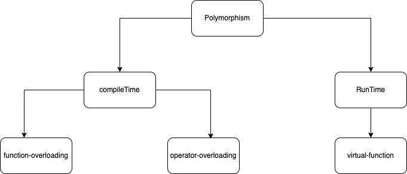
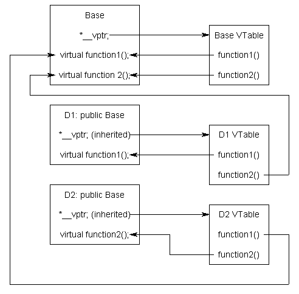
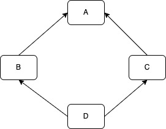

## `virtual` function ##

- `virtual` function is a member function that you expect to be redefined in derived class, when you refer to a derived class object using a pointer or a reference to the base class you can call a `virtual` function for that object and execute the derived class's version of the function.

- `virtual` function ensure that the correct function is called for an object regardless of the type of reference or pointer used for function call. Function are declared with the `virtual` keyword in base class. The resolving of function call is done at run-time.

- If there are member function with same name in base class and derived class then `virtual` function gives programmer capability to call member function of different class by a same function call depending upon different context.

- If we want to access the member function of the derived class by using base class pointer then we have to define that member function as `virtual` in the base class otherwise it will always call the member of base class.


- Virtual function cannot be 
    - Static function
    - constructor
    - friend function
- Prototype in base and derived class must be identical or else it is considered as function overloading.
- We can have virtual destructor.
- While base pointer can point to any type of derived class object the reverse is not true means we cannot use a pointer to  a derived class to access an object of the base class type.
- If virtual function is defined in base class it need not be necessarily defined in derived class in such case always base class function will be invoked.
- Constructor cannot be virtual because at the time when constructor is invoked the v-table would not be available in the memory.
- Virtual destructor are declared in base class to ensure its called in reverse order of inheritance, and if base class is having virtual function then it recommended to define virtual destructor.
- `early-binding` means object is bounded to its function call at compile time. `late-binding` means object is bounded to its function call at runtime so it is also called `dynamic-binding`.
- A virtual function can be a friend function of another class.
- Virtual functions should be accessed using a pointer or reference of base class type to achieve runtime polymorphism.


## `v-pointer` and `v-table` ##
- Whenever programmer adds virtual function `v-table` is constructed for the class. The `v-table` consists of address of the virtual function for that class.
- The class having a virtual function the size of object will be increased by a `v-pointer` size.
- The `v-table` is used for resolving the address of virtual function this is how dynamic binding is resolved during a virtual function call.
- `v-table` is a lookup table of function pointer used to dynamically bind the virtual function to object at runtime. It is not inherited to be used directly by the programmer and as such there is not standard way to access it.
- `v-table` is setup by the compiler at compile time.
- `v-table` is created even for a class which is having a virtual base class.
- `v-table` stores `nullptr` for pure virtual functions.

```cpp
class Base
{
public:
    virtual void function1() {};
    virtual void function2() {};
};

class D1: public virtual Base
{
public:
    void function1() override {};
};

class D2: public virtual Base
{
public:
    void function2() override {};
};
```


## Limitations of Virtual Functions ##
- Slower: The function call takes slightly longer due to the virtual mechanism and makes it more difficult for the compiler to optimize because it does not know exactly which function is going to be called at compile time.
- Difficult to Debug: In a complex system, virtual functions can make it a little more difficult to figure out where a function is being called from.

## private `virtual` function ##
- Virtual function can be private and can be overridden by derived class.
```cpp
class base{
private:
    virtual void fun(){cout <<"base-fun()";}
    friend int main(); // --------(1)
};

class derived:public base{
private:
    void fun(){cout <<"derived-fun()";}
};

int main(){
    base *ptr = new derived();
    ptr->fun(); // o/p derived-fun()
    return 0;
}
``` 
- If we remove line(1) then we get the compilation error.

## Base-Derived access mode for virtual function ##

```cpp
//Example 1
class Base{
public:
    void fun(){
        cout <<"Base";
    }
};

class Derived:public Base{
public:
    void fun(){
        cout <<"Derived";
    }
};

int main(){
    Base *ptr = new Derived();
    ptr->fun();
    return 0; 
}
//Output: Base
```

```cpp
//Example 2
class Base{
public:
    virtual void fun(){
        cout <<"Base";
    }
};

class Derived:public Base{
public:
    void fun(){
        cout <<"Derived";
    }
};

int main(){
    Base *ptr = new Derived();
    ptr->fun();
    return 0; 
}
//Output: Derived
```

```cpp
//Example 3
class Base{
private:
    void fun(){
        cout <<"Base";
    }
};

class Derived:public Base{
public:
    void fun(){
        cout <<"Derived";
    }
};

int main(){
    Base *ptr = new Derived();
    ptr->fun();
    return 0; 
}
//Output: Error Base::fun() is private
```

```cpp
//Example 4
class Base{
private:
    virtual void fun(){
        cout <<"Base";
    }
};

class Derived:public Base{
public:
    void fun(){
        cout <<"Derived";
    }
};

int main(){
    Base *ptr = new Derived();
    ptr->fun();
    return 0; 
}
// Output: Error Base::fun() is private
// but it can work if friend int main() is defined inside 
// base class and then output: Derived
```
## `inline` and `virtual` function ##
- Virtual functions are used to achieve runtime polymorphism but inline is meant for compile time. By default all the function defined inside the class are implicitly or automatically as inline except virtual function.
- inline is a request to the compiler its compiler choices to make the function as inline or not.
- Whenever virtual function is called using base class reference or pointer the it cannot be inline because it will be resolved at runtime.
- But whenever virtual function is called using base class object (without reference or pointer) of that class then it can be inlined because compiler knows the exact class of the object at compile time.
```cpp
class Base{
    public: 
        virtual void fun(){
            cout <<"Base";
        }
};
class Derived:public Base{
public:
    void fun (){
        cout << "Derived";
    }
};

int main(){
    Base b;
    b.fun(); // here virtual function is inline

    Base *ptr = new Derived();
    ptr->fun(); // here virtual function is not inline

    return 0;
}
```
## `pure virtual` function ##
- A pure virtual function or abstract function in c++ is virtual function for which we don't have implementation we only declare it. A pure virtual function is declared by assigning `0` in declaration.
```cpp
class Test{
    virtual void myFunc() = 0; // pure virtual
}
```
- It is used for defining interface and abstract class
- If we don't override pure virtual function in derived class then derived class also becomes abstract class.
- destructor can be pure virtual function in base class but the function body also needs to be defined.

## virtual base class ##
In this design all the public or protected member of class A will become public or protected twice for class D via class B and class C so it shows the ambiguity this can be avoided by virtual base class. This is also called diamond issue.

```cpp
class A{};

class B:public A{};

class C:public C{};

class D:public B, public C{};

// only one copy of A will be inherited
```

## `override` keyword c++11 ##
- There may be mistake when a programmer override a function in the derived class. So to overcome that c++11 has come up with keyword `override` it will make the compiler to check if there is a same signature function available in the base class.
```cpp
class Base{
public:
    virtual void func(){cout <<"Base";}
};

class Derived:public Base{
public:
    // did mistake by putting argument
    virtual void func(int a){cout <<"Derived";}
};
int main(){
    Base b;
    Derived d;
    cout << "compiled successfully";
    return 0;
}
// o/p: compiled successfully
```

```cpp
class Base{
public:
    virtual void func(){cout <<"Base";}
};

class Derived:public Base{
public:
    // did mistake by putting argument
    virtual void func(int a) override 
    {
        cout <<"Derived";
    }
};
int main(){
    Base b;
    Derived d;
    cout << "compiled successfully";
}
// error: void Derived::func(int) marked `overridden`
// but does not override void func(int a)
```

## `final` specifier ##
- Final is a specifier not a keyword in c++ but in java its keyword.
- Sometime you do not want to allow derived class to  override by base class function.
```cpp
class Base{
public:
    virtual void my_func() final{
        cout <<"my_func() Base:";
    }
};

class Derived:public Base{
public:
    void my_func(){
        cout <<"my_func() Derived:";
    }
};

int main(){
    Derived d;
    Base &b = d;
    b.my_func();
    return 0;
}
//output: error: overriding final function virtual void Base::my_func()
```
- Class or struct also can be defined with final for preventing inheritance of class or struct.
```cpp
class Base final{

};
class Derived :public Base{

};
int main(){
    Derived d; //error
    return 0;
}
```
- Java use final keyword before function and class name but C++ uses after function and class name.

## Interface class ##
- When we create an interface that means we are basically creating a set of methods without any implementation.
- It will have all the function defined as pure-virtual function.
- Advantage is that it enforces certain hierarchies for all the sub classes, we cannot create instance of this class it is just a pattern.
```cpp
class MyInterface{
public:
    virtual ~MyInterface(){}
    virtual void method1()=0;
    virtual void method2()=0;
};
```
- The class that can be used to instantiate object is called a concreate class
- In window programming interface are fundamental in com inface a com component exports only interfaces. This helps defining an ABI (application binary interface) that make it possible to build a com component in c++ and use it in visual basic, with interface you have decoupling b/w client and server code.

## Abstract class ##
- If the class have at least one pure virtual function then it is called abstract class. It cannot be instantiated. The advantage of this class is it enforce certain functionality for the sub class which are going to inherit the abstract class.
- Apart from virtual function it can have some implementation all the interface classes are abstract class but vice-versa is not true.
```cpp
class myAbstarctClass{
    public: 
    virtual ~myAbstarctClass(){};
    virtual func_1(){};
    virtual func_2(){};
    virtual func_3() = 0; // It makes class abstract
};
```
## Difference b/w Interface and Abstract  ##
|               Interface                  |            Abstract                    |
| ---------------------------------------- | -------------------------------------- |
| A class may inherit several interfaces  | A class may inherit only one abstract class |
| Interface cannot provide any code it is just a signature of functions | An abstract class can provide complete code, default code or just a details that has to be overridden     |
| Interface cannot have modifier everything is assumed as public    | abstract can have modifier for functions and properties    |
| if we add new method in interface then it needs to be define in all the derived classes| if we add a new method in abstract class then need not to be define the derived class  |

## Object slicing in C++ ##
Object slicing happens when a derived class object is assigned to a base class object then the additional attribute of the derived class object are sliced off from the base class object.
It can happen when object are directly passed as an argument to a function.

```cpp
class Base{
    public: 
        int x,y;
};

class Derived{
    public:
        int z,w;
};
int main(){
    Base b;
    Derived d;
    b = d; // Object slicing: z,w of d object are sliced off
}
```
- We can avoid unexpected behaviour with the use of pointer or reference.
