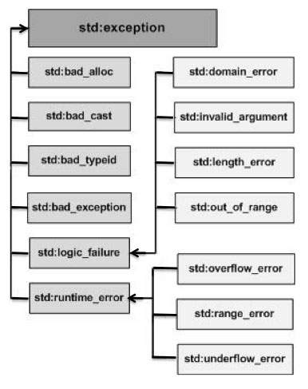

## Exception ##
- One of the advantage of c++ over c is exception handling exceptions are runtime anomalies or abnormal conditions that a program encounters during its execution. There are two type of exceptions
    - synchronous
    - Asynchronous (eg. which are beyond the program control disc feature etc.)
### keywords ###
- `try`
    - represents a block of code that can throw an exception.
- `catch`
    - represents a block of code which is executed when a particular exception is thrown
- `throw`
    - used to throw the exception also used to list the exceptions that a function throws but does not handle itself.
### Why exception handling ###
- The main benefit of using exceptions is that it allows you to separate the error handling code from the normal code, making it more readable and maintainable. .
- Function/method can handle only those error which they choose to handle.
- Grouping of error types in c++ both basic types and objects can be thrown as exception. We can create a hierarchy of exception objects group exception objects in namespace or classes categorize them according to types.
- in distributed or sperate lib developers can define there exception which could be thrown in particular situation and caller can alway put try-catch block on the call of the lib function or on API call.

## Examples ##
- following is the simple example to show exception handling in c++. The output of the program explain flow of execution if try/catch blocks

```cpp
int main(){
    int x = -1;
    cout << "before try" <<endl;
    try{
        cout << "inside try" << endl ;
        if(x < 0){
            throw x
        }
    }catch(int x){
        cout << "inside catch" << endl ;
        cout << "x:"<< x << endl;
    }
    cout << "after try" <<endl;
    return 0;
}
//output
before try
inside try
inside catch
x:-1
after try
```
- there is a special catch block call catch-all `catch(...)` that can be used to catch all type of exceptions for eg. in the following program an `int` is thrown as an exception but there is no catch block for int so catch(...) block will be executed.

```cpp
int main(){
    try{
        throw 10;
    }catch(char expt){
        cout <<"catch char" << endl;
    }catch(...){
        cout <<"undefined exception" << endl;
    }
    return 0;
}
//output
//undefined exception
```
- implicit type conversion doesn't happens for particular types for Eg.
```cpp
int main(){
    try{
        throw `a`;
    }catch(char expt){
        cout <<"catch char" << endl;
    }catch(...){
        cout <<"default exception" << endl;
    }
    return 0;
}
//output
//default exception
```
- If exception is thrown and not caught anywhere then program terminates abnormally. For e.g. in the following program a `char` is thrown but there is no catch block to catch a `char`.
```cpp
int main(){
    try{
        throw `a`;
    }catch(int x){
        cout << "catch" <<endl;
    }
    return 0;
}
//output:
terminate called after throwing an instance of `char`
``` 
- We can change this abnormal termination behaviour by writing out own exception function.
-  A derived class exception should be caught before a base class exception.
- C++ library has a standard exception class which is a base class for all standard exceptions. All object thrown by components of the standard library are derived from this class. Therefore all the standard exception can be caught by catching this type.
- Unlike java in c++ call exceptions are unchecked. Compiler doesn't check whether an exception is caught or not. For e.g. in C++ it is not necessary to specify all uncaught exceptions in a function declaration. For e.g. the following program compiles fine but ideally signature of func() should list unchecked exceptions.
```cpp
void func(int * ptr, int x) throw (int *, int); //---(1)
void func(int*ptr, int x){ // -----(2)
    if(ptr == nullptr){
        throw ptr;
    }
    if (x == 0){
        throw x;
    }
}
int main(){
    try{
        func(nullptr,0);
    }catch(...){
        cout <<"exception from func()";
    }
    return 0;
}
// output: the line 1 is recommended  
``` 
- `Nested try-catch` block: 
```cpp
int main(){
    try{
        try{
            throw 20;
        }
        catch(int i){
            cout << "handled partially" << endl;
            throw;
        }
    }catch(int n){
        cout << "handled remaining" << endl;
    }
    return 0;
}
//output
handled partially
handled remaining
```
- When an exception is thrown all the objects created inside the enclosing try block are destructed before control is transferred to catch block.

```cpp
class test{
    public:
        test(){cout << "constructor" <<endl;}
        ~test(){cout << "destructor" <<endl;}
};
int main(){
    try{
        test t1;
        throw 10;
    }catch(int i){
        cout << "inside catch" << endl;
    }
}
//output:
constructor
destructor
inside catch
```
## catching base and derived class as exceptions ##
- If both base and derived class are caught as exceptions then catch block of derived class must appear before base class.
- if we put base class first then derived class catch block will never be reachable.

```cpp
class base{};
class derived:public base{};

int main(){
    derived d;
    try{
        throw d;
    }catch (base b){
        cout << "caught base exception";
    }
    catch (derived d){
        cout << "caught derived exception";
    }
    return 0;
}

//output:
caught base exception
```
- If we change the order then both the code will be reachable
```cpp
class base{};
class derived:public base{};

int main(){
    derived d;
    try{
        throw d;
    }
    catch (derived d){
        cout << "caught derived exception";
    }
    catch (base b){
        cout << "caught base exception";
    }
    return 0;
}

//output:
caught derived exception
```

## Standard exception class ##
- Base class for for standard exception is class `exception` all object thrown by component of standard library are drived from this class, therefore all standard exception can be caught by catching this type by reference. It is declared as
```cpp
class exception{
public:
    exception() throw ();                 //Constructor
    exception(cosnt exception &) throw(); //Constructor
    exception & operator = (const exception &) throw(); // operator =
    virtual ~exception() throw(); //destructor
    virtual const char * what() const throw();   
};

class polymorphic{
    try{
        polymorphic *pb = 0;
        typeid(*pb);
    }catch(std::exception & ex){
        std::cerr << "exception caught:" <<e.what() << endl;
    }
    return 0;
};
//output
exception caught:std bad_typeid  
```

## exception handling with constructor ##
- Exception handling can also be implemented using constructor, though we cannot return any value from the constructor but with the help of `try` and `catch` block we can

```cpp
class demo{
    int num;
public:
    demo(int x){
        try{
            if(x == 0)
                throw "0 is not allowed";
            num = x;
            show();
        }catch (const char * ex){
            cout << "exception caught:" << ex << endl;
        }
    }
    
    void show(){
        cout << "num = " << num << endl;
    }
};
int main(){
    demo(0); // exception caught: 0 is not allowed
    demo(1); //num = 1
}
```
## exception handling using inheritance ##
- In case of inheritance object thrown by derived class is caught by the first catch block
```cpp
class demo1{};
class demo2:public demo1{};
int main(){
    for (int i = 0; i <= 2; i++){
        try{
            if(i == 1)
                throw demo1();
            else
                throw demo2();
        }catch(demo1 d1){
            cout << "exception demo1 class" << endl;
        }catch(demo2 d2){
            cout << "exception demo2 class"<< endl;
        }
    }
}
//output
exception demo1 class
exception demo2 class
```

## define new exception ##
- You can define your own exception by inheritance and overriding exception class functionality.
```cpp
struct myException : public exception{
    const char* what() const throw(){
        return "my exception";
    }
};
int main(){
    try{
        throw myException();
    }catch(myException & ex){
        std::cout << ex.what() << endl;
    }catch(std::exception & ex){
        std::cout << "other exception";
    }
}
// output
// my exception
```

## C++ Standard Exceptions ##
- C++ provides a list of standard exceptions defined in <exception> which we can use in our programs. These are arranged in a parent-child class hierarchy shown below −


- Exception & Description
    - `std::exception` An exception and parent class of all the standard C++ exceptions.
    - `std::bad_alloc` This can be thrown by new.
    - `std::bad_cast` This can be thrown by dynamic_cast.
    - `std::bad_exception` This is useful device to handle unexpected exceptions in a C++ program.
    - `std::bad_typeid` This can be thrown by typeid.
    - `std::logic_error`An exception that theoretically can be detected by reading the code.
    - `std::domain_error` This is an exception thrown when a mathematically invalid domain is used.
    - `std::invalid_argument`This is thrown due to invalid arguments.
    - `std::length_error` This is thrown when a too big std::string is created.
    - `std::out_of_range` This can be thrown by the 'at' method, for example a std::vector and std::bitset<>::operator[]().
    - `std::runtime_error`An exception that theoretically cannot be detected by reading the code.
    - `std::overflow_error` This is thrown if a mathematical overflow occurs.
    - `std::range_error` This is occurred when you try to store a value which is out of range.
    - `std::underflow_error` This is thrown if a mathematical underflow occurs.

## `noexcept` c++11 ##
- `noexcept` exists in two form since c++11 as a specifier and as an operator
### `as specifier` ###
- by declaring a function a method or a lamda function as noexcept you can specify that these does not throw an exception and if they throw you donot care and let the program just crash.
```cpp
void fun1() noexcept;        // does not throw
void func2() noexcept(true); // does not throw
void func3() throw();        // does not throw
void func4() noexcept(false);// it may throw 
```
- `noexcept` is equal to `noexcept(true)` and so it also equivalent to throw() but was deprecated and will be removed from c++ 20;
- the `noexcept`is part of function type but cannot be used for a function overloading.
- Advantage
    - If a function is specified as `noexcept` then it can be safely used in a non throwing function.
    - It is an optimization opportunity for compiler `noexcept` may not call `std::unexpected` and may not unwind stack.
- Each function in C++ is either non-throwing or potentially throwing means
    - function may use a function which may throw.
    - the function is declared without no-except specification.
    - function uses as dynamic-cast to a reference type.
- Following six member function which are implicitly non-throwing
    - Default constructor and destructor
    - move and copy constructor
    - move and copy assignment operator
- When you try to throw the exception from non-throwing function in that case `std::terminate` is called. The `std::terminate` calls the currently installed `std::terminate_handler` which calls `std::abort` by default. The result is an abnormal program termination.

### as operator ###
- The `noexcept` operator checks at compile time if an expression does not throw an exception.
- The `noexcept` operator does not evaluate the expression. It can be used in a `noexcept` specifier of a function template to declare that the function may throw exception depending on the current type.
```cpp
class noExceptCopy{
public:
    std::array<int,5> array{1,2,3,4,5};
};

class NonNoExceptCopy{
public:
    std::vector<int> Vec{1,2,3,4,5};
};

template <typename T>
T copy(T const & src) noexcept (noexcept (T src))
{
    return src;
}

int main(){
    noExceptCopy m_noExceptCopy;
    NonNoExceptCopy m_NonNoExceptCopy;

    cout << "noExceptCopy:" << noExceptCopy(copy(m_noExceptCopy)) <<endl;
    cout << "NonNoExceptCopy:" << NonNoExceptCopy(copy(m_NonNoExceptCopy)) <<endl;
}
```
- Instead of throwing exception the new expression can be called with `std::nothrow` option it will return 0 on failure.

```cpp
int main(){
    int *ptr = new(std::nothrow) int [10]();
    if(ptr == nullptr){
        //allocation failed
    }else{
        // for successful allocation
    }
    return 0;
}
```

    

