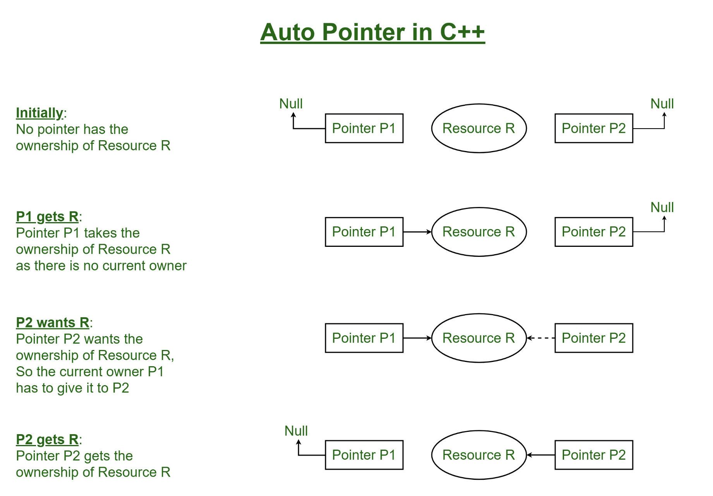

## auto-ptr ##
- It is a smart pointer that manages an object obtained via new expression and deletes that object when `auto-ptr` is destroyed.
- It stores a pointer to a single allocated object which ensures that when it goes out of scope the object it points to must get automatically destroys.
- It is based on exclusive ownership model i.e. two pointer of the same type cannot pointer to the same resource at the sometime.
- Copying or assigning of pointer changes the ownership i.e. source pointer has to give ownership to the destination pointer.


```cpp
class test{
public:
    void show(){
        cout << "test::show()" << endl;
    }
};
int main(){
    auto_ptr<test> p1(new test);
    p1->show();
    
    cout <<p1.get() << endl; // prints p1 address

    auto_ptr<test> p2(p1); // it makes copy constructor and makes p1 empty

    cout << p1.get() << endl; // prints nullptr

    cout << p2.get() << endl; // print same address which was of p1

    return 0;
}
//output
test::show()
0x1b42c20
test::show()
0          
0x1b42c20
```
- Copying of auto_ptr to another auto_ptr changes the ownership and empty the first pointer.
- It support strict ownership so that only one pointer point to one resource.
- These pointer cannot be used in STL container due to in ability to be copied.

## Limitation ##
- An `auto-ptr` cannot point to an array when deleting a pointer to an array we must use delete[] to ensure that destructor are called for all objects in the array but `auto_ptr` uses delete.
- It cannot be used with the STL container element. An STL container may make copies of its elements so you cannot guarantee’s that `auto_ptr` will remain after the algorithm processing the containers elements finishes.
- `shared_ptr` and `weak_ptr` these smart pointers are not meant to replace `auto-ptr`. Instead they provide additional options with different functionality.


