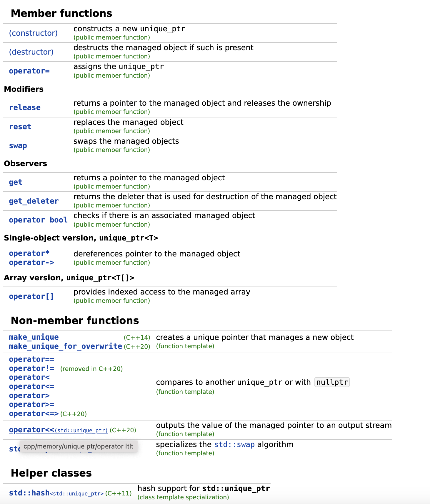

## Unique_ptr ##
- std::unique_ptr was developed in c++11 as replacement for auto_ptr 
- unique_ptr is a new facility with similar functionality but with imposed security which is having no fake copy assignment.
- Its having added feature like deleters and support for array.
- It does not fake the copy assignment as it is done by auto_ptr rather it uses move assignment for copying one ptr to another ptr.
- It also keeps single owner when one pointer moves to another pointer.
- It is added feature (deleters) and support for arrays.
- It does not allows direct copy of one pointer to another pointer.
```cpp
unique_ptr<A> p1 (new A);
// Error cannot copy unique_ptr
unique_ptr<A> p2 = p1;

// Works resorce new stored in p1
unique_ptr<A> p2 = move(p1);
```
```cpp
class A {
public:
    void show() { cout << "A::show()" << endl; }
};
  
int main()
{
    shared_ptr<A> p1(new A);
    cout << p1.get() << endl;
    p1->show();
    shared_ptr<A> p2(p1);
    p2->show();
    cout << p1.get() << endl;
    cout << p2.get() << endl;
  
    // Returns the number of shared_ptr objects
    // referring to the same managed object.
    cout << p1.use_count() << endl;
    cout << p2.use_count() << endl;
  
    // Relinquishes ownership of p1 on the object
    // and pointer becomes NULL
    p1.reset();
    cout << p1.get() << endl;
    cout << p2.use_count() << endl;
    cout << p2.get() << endl;
  
    return 0;
}
```
```cpp
//output
0x625010
A::show()
A::show()
0x625010
0x625010
2
2
0
1
0x625010
```

### unique_ptr is having two components ###
- `A stored pointer` The pointer to the object it manages this is set an construction can be allocated by an assignment operator or by calling member reset and can be individually accessed for reading using member get or release.
- `A stored deleter` A callable object that take an argument of the same type as the stored pointer and is called to delete the managed object. It is set on construction can be altered by an assignment operation and can be individually accessed using `get_deleter`.
- `unique_ptr` objects replicate a limited pointer functionality by providing access to its managed object through operators arithmetic’s and only support move assignment (disabling copy assignment).

    

### implement own unique_ptr ###
```cpp
#include <iostream>
using namespace std;
// only one pointee to the object is allowed
// copy of the pointer is not allowed
// only pointer can move from one to other
template <typename T> class UniquePtr {
private:
  T *ptr;

public:
  explicit UniquePtr(T *ptr = nullptr) : ptr(ptr) {
    cout << "constructor" << endl;
  }
  ~UniquePtr() { cout << "destructor" << endl; }

  T *getPtr() { return ptr; }

  T *operator->() { return ptr; }
  T &operator*() { return *ptr; }

  UniquePtr(UniquePtr<T> &&uptr) noexcept {
    cout << "move constructor" << endl;
    ptr = std::move(uptr.ptr);
    uptr.ptr = nullptr;
  }

  UniquePtr<T> &operator=(UniquePtr<T> &&uptr) noexcept {
    cout << "Assignment move Operator" << std::endl;
    if (this == &uptr)
      return *this;
    ptr = std::move(uptr.ptr);
    uptr.ptr = nullptr;
    return *this;
  }

  UniquePtr(const UniquePtr<T> &ptr) = delete; // delete copy

  UniquePtr<T> &
  operator=(const UniquePtr<T> &&ptr) = delete; // delete assignment
};
int main() {
  UniquePtr<int> ptr1(new int(10));
  cout << "value = " << *ptr1 << endl;
  cout << "ptr1 = " << ptr1.getPtr() << endl;

  UniquePtr<int> ptr2;
  ptr2 = std::move(ptr1); // Assignment move Operator

  cout << "ptr1 = " << ptr1.getPtr() << endl;
  cout << "ptr2 = " << ptr2.getPtr() << endl;

  UniquePtr<int> ptr3(std::move(ptr2)); // move constructor

  cout << "ptr1 = " << ptr1.getPtr() << ",value = " << *ptr1 << endl;
  cout << "ptr2 = " << ptr2.getPtr() << endl;
  cout << "ptr3 = " << ptr3.getPtr() << endl;

  return 0;
}
```


