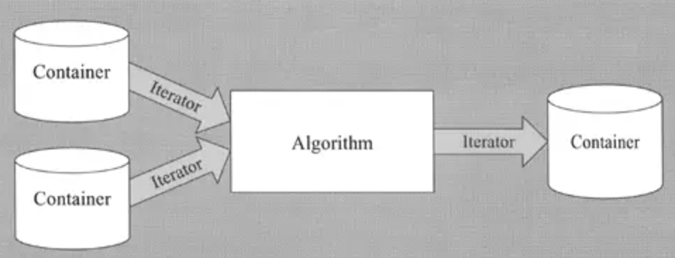

## STL Library ##
- The Standard Template Library (STL) is a set of C++ template classes to provide common programming data structures and functions such as lists, stacks, arrays, etc. It is a library of container classes, algorithms, and iterators. 
- STL has 4 components:
    - Algorithms
    - Containers
    - Functors
    - Iterators

### Algorithms ###
Algorithm works on iterator not on container like sorting, searching etc.
- sorting
- searching
- Important STL algorithm
- useful array algorithm
- partition operation

### Iterator ###
Iterators are classes which works on container classes like traversing through container

### Containers ###
Container are storage of data like vector, list, map, array, queue, sets.
    
    

- `Sequence Conatainer`
    - vector
    - list
    - deque
    - array
    - forward_list (c++11 onwords)
- `Assosiative container`: implemented using `BST` Search `O(log n)` and all are `sorted`
    - set
    - multiset
    - map
    - multimap 
- `Unordered assosiative container`: implemented using `Hash-table` Search `O(1)` and all are `not sorted`
    - unordered_set      (c++11)
    - unordered_multiset (c++11)
    - unordered_map      (c++11)
    - unordered_multimap (c++11)
- `Adapter`: Provide a different interface for sequential container
    - stack
    - queue
    - priority-queue
- `Numeric`
    - valarray class

### Functors ###
The STL includes classes that overload the function call operator. Instances of such classes are called function objects or functors. Functors allow the working of the associated function to be customized with the help of parameters to be passed.

### Reaons to use STL ###
- Code is reused not to re-invent concept again.
- These are fast and use less resources morden compiler are tuned to optimize for c++ standard library code.
- These are accurate and less buggy.

### Disadvantages ### 

- `Learning curve`: The STL can be difficult to learn, especially for beginners, due to its complex syntax and use of advanced features like iterators and function objects.
- `Lack of control`: When using the STL, you have to rely on the implementation provided by the library, which can limit your control over certain aspects of your code.
- `Performance`: In some cases, using the STL can result in slower execution times compared to custom code, especially when dealing with small amounts of data.