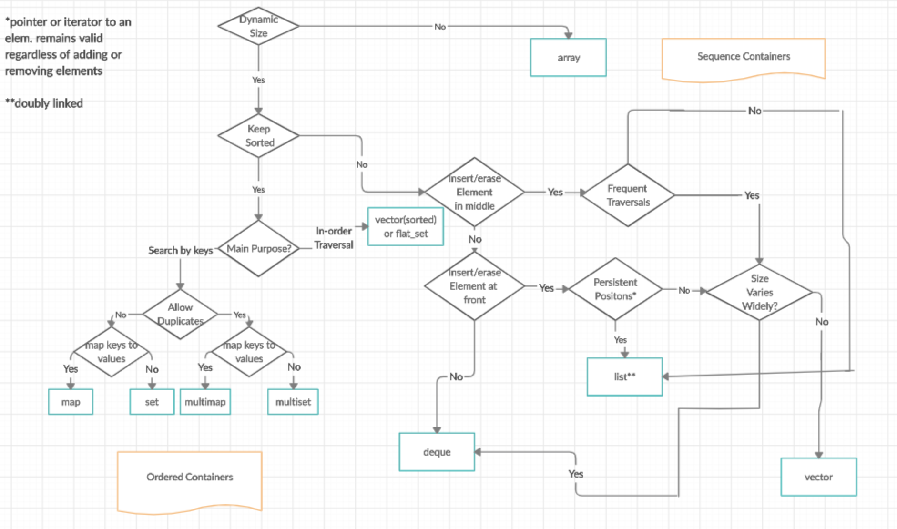
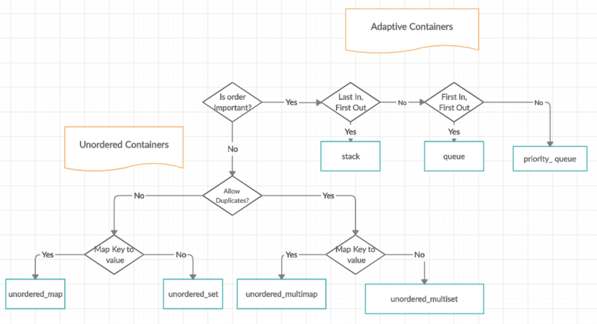

## STL Library ##
- The Standard Template Library (STL) is a set of C++ template classes to provide common programming data structures and functions such as lists, stacks, arrays, etc. It is a library of container classes, algorithms, and iterators. 
- STL has 4 components:
    - Algorithms
    - Containers
    - Functors
    - Iterators

### Algorithms ###
Algorithm works on iterator not on container like sorting, searching etc.
- sorting
- searching
- Important STL algorithm
- useful array algorithm
- partition operation

### Iterator ###
Iterators are classes which works on container classes like traversing through container

### Containers ###
Container are storage of data like vector, list, map, array, queue, sets.
    
    

- `Sequence Conatainer`
    - vector
    - list
    - deque
    - array
    - forward_list (c++11 onwords)
- `Assosiative container`: implemented using `BST` Search `O(log n)` and all are `sorted`
    - set
    - multiset
    - map
    - multimap 
- `Unordered assosiative container`: implemented using `Hash-table` Search `O(1)` and all are `not sorted`
    - unordered_set      (c++11)
    - unordered_multiset (c++11)
    - unordered_map      (c++11)
    - unordered_multimap (c++11)
- `Adapter`: Provide a different interface for sequential container
    - stack
    - queue
    - priority-queue
- `Numeric`
    - valarray class

### Functors ###
The STL includes classes that overload the function call operator. Instances of such classes are called function objects or functors. Functors allow the working of the associated function to be customized with the help of parameters to be passed.

### Reaons to use STL ###
- Code is reused not to re-invent concept again.
- These are fast and use less resources morden compiler are tuned to optimize for c++ standard library code.
- These are accurate and less buggy.

### Disadvantages ### 

- `Learning curve`: The STL can be difficult to learn, especially for beginners, due to its complex syntax and use of advanced features like iterators and function objects.
- `Lack of control`: When using the STL, you have to rely on the implementation provided by the library, which can limit your control over certain aspects of your code.
- `Performance`: In some cases, using the STL can result in slower execution times compared to custom code, especially when dealing with small amounts of data.


### Data Structure and API calls
```cpp 
Vector	
    push_back	vec.push_back(10);
	pop_back	vec.pop_back();
	size	    int size = vec.size();
	empty	    bool isEmpty = vec.empty();
	clear	    vec.clear();
	operator[]	int element = vec[index];

List	
    push_back	lst.push_back(10);
	push_front	lst.push_front(20);
	pop_back	lst.pop_back();
	pop_front	lst.pop_front();
	size	    int size = lst.size();
	empty	    bool isEmpty = lst.empty();
	begin	    auto it = lst.begin();
    
Set	
    insert	s.insert(10);
	erase	s.erase(10);
	find	auto it = s.find(10);
	size	int size = s.size();
	empty	bool isEmpty = s.empty();
	clear	s.clear();

Map	
    operator[]	m["key"] = 10;
	insert	m.insert(make_pair("key", 10));
	erase	m.erase("key");
	find	auto it = m.find("key");
	size	int size = m.size();
	empty	bool isEmpty = m.empty();
	clear	m.clear();

Queue	
    push	q.push(10);
	pop	    q.pop();
	front	int frontElement = q.front();
	back	int backElement = q.back();
	size	int size = q.size();
	empty	bool isEmpty = q.empty();

Deque	
    push_back	dq.push_back(10);
	push_front	dq.push_front(20);
	pop_back	dq.pop_back();
	pop_front	dq.pop_front();
	size	    int size = dq.size();
	empty	    bool isEmpty = dq.empty();
	front	    int frontElement = dq.front();
	back	    int backElement = dq.back();

Stack	
    push	stk.push(10);
	pop	    stk.pop();
	top	    int topElement = stk.top();
	size	int size = stk.size();
	empty	bool isEmpty = stk.empty();

Priority Queue	
    push	pq.push(10);
	pop	    pq.pop();
	top	    int topElement = pq.top();
	size	int size = pq.size();
	empty	bool isEmpty = pq.empty();

Dynamic Array	
    []	int* arr = new int[size];
		int value = arr[0];
		delete[] arr;
```
### Commonly used algorithms on container

```cpp
// 1 std::sort - Sorts the elements in a range.
std::sort(vec.begin(), vec.end());

// 2. std::stable_sort - Sorts the elements in a range preserving the relative order of equal elements.
std::stable_sort(vec.begin(), vec.end());

//3. std::reverse - Reverses the elements in a range.
std::reverse(vec.begin(), vec.end());

//4. std::rotate - Rotates the elements in a range.
std::rotate(vec.begin(), vec.begin() + k, vec.end());

//5. std::find - Finds the first occurrence of a value in a range.
auto it = std::find(vec.begin(), vec.end(), value);

//6. std::binary_search - Checks if a value exists in a sorted range.
bool found = std::binary_search(vec.begin(), vec.end(), value);

//7. std::count - Counts the occurrences of a value in a range.
int count = std::count(vec.begin(), vec.end(), value);

//8. std::count_if - Counts the occurrences of elements satisfying a condition in a range.
int count = std::count_if(vec.begin(), vec.end(), [](int x) { return x % 2 == 0; });

//9. std::accumulate - Computes the sum of elements in a range.
int sum = std::accumulate(vec.begin(), vec.end(), 0);

//10. std::min_element - Finds the smallest element in a range.
auto min_it = std::min_element(vec.begin(), vec.end());

//11. std::max_element - Finds the largest element in a range.
auto max_it = std::max_element(vec.begin(), vec.end());

//12. std::clamp - Clamps a value between a minimum and maximum bound.
int clamped = std::clamp(value, min_val, max_val);

//13. std::find_if - Finds the first element satisfying a condition in a range.
auto it = std::find_if(vec.begin(), vec.end(), [](int x) { return x % 2 == 0; });

//14. std::find_if_not - Finds the first element not satisfying a condition in a range.
auto it = std::find_if_not(vec.begin(), vec.end(), [](int x) { return x % 2 == 0; });

//15. std::find_end - Finds the last subsequence in a range.
auto it = std::find_end(vec.begin(), vec.end(), subseq.begin(), subseq.end());

//16. std::search - Finds the first occurrence of a subsequence in a range.
auto it = std::search(vec.begin(), vec.end(), subseq.begin(), subseq.end());

//17. std::adjacent_find - Finds the first occurrence of two adjacent equal elements in a range.
auto it = std::adjacent_find(vec.begin(), vec.end());

//18. std::search_n - Finds the first occurrence of n consecutive equal elements in a range.
auto it = std::search_n(vec.begin(), vec.end(), count, value);

//19. std::replace - Replaces all occurrences of a value in a range with another value.
std::replace(vec.begin(), vec.end(), old_val, new_val);

//20. std::replace_if - Replaces elements in a range satisfying a condition with another value.
std::replace_if(vec.begin(), vec.end(), [](int x) { return x < 0; }, 0);

//21. std::copy - Copies elements from one range to another.
std::copy(vec.begin(), vec.end(), std::back_inserter(newVec));

//22. std::move - Moves elements from one range to another.
std::move(vec.begin(), vec.end(), dest.begin());

//23. std::transform - Applies a function to each element in a range and stores the result in another range.
std::transform(vec.begin(), vec.end(), result.begin(), [](int x) { return x * 2; });

//24. std::generate - Generates values for each element in a range using a generator function.
std::generate(vec.begin(), vec.end(), []() { return rand() % 100; });

//25. std::generate_n - Generates values for a specified number of elements using a generator function.
std::generate_n(std::back_inserter(vec), count, []() { return rand() % 100; });

//26. std::remove - Removes all occurrences of a value from a range.
vec.erase(std::remove(vec.begin(), vec.end(), value), vec.end());

//27. std::unique - Removes consecutive duplicate elements from a range.
vec.erase(std::unique(vec.begin(), vec.end()), vec.end());

//28. std::partition - Partitions a range into two groups based on a condition.
auto partition_it = std::partition(vec.begin(), vec.end(), [](int x) { return x % 2 == 0; });

//29. std::next_permutation - Generates the next lexicographically greater permutation of a range.
std::next_permutation(vec.begin(), vec.end());

//30. std::prev_permutation - Generates the next lexicographically smaller permutation of a range.
std::prev_permutation(vec.begin(), vec.end());

//31. std::random_shuffle - Randomly shuffles the elements in a range.
std::random_shuffle(vec.begin(), vec.end());

//32. std::shuffle - Randomly shuffles the elements in a range using a specified random number generator.
std::shuffle(vec.begin(), vec.end(), std::mt19937{std::random_device{}()});

//33. std::includes - Checks if a range includes another range.
bool included = std::includes(vec.begin(), vec.end(), subseq.begin(), subseq.end());

//34 std::merge - Merges two sorted ranges into one sorted range.
std::merge(vec1.begin(), vec1.end(), vec2.begin(), vec2.end(), std::back_inserter(merged));

//35. std::set_intersection - Computes the intersection of two sorted ranges.
std::set_intersection(vec1.begin(), vec1.end(), vec2.begin(), vec2.end(), std::back_inserter(intersect));

//36. std::set_union - Computes the union of two sorted ranges.
std::set_union(vec1.begin(), vec1.end(), vec2.begin(), vec2.end(), std::back_inserter(uni));

//37. std::set_difference - Computes the difference of two sorted ranges.
std::set_difference(vec1.begin(), vec1.end(), vec2.begin(), vec2.end(), std::back_inserter(diff));

//38. std::set_symmetric_difference - Computes the symmetric difference of two sorted ranges.
std::set_symmetric_difference(vec1.begin(), vec1.end(), vec2.begin(), vec2.end(), std::back_inserter(sym_diff));

//39. std::equal - Checks if two ranges are equal.
bool equal = std::equal(vec1.begin(), vec1.end(), vec2.begin(), vec2.end());

//40. std::lexicographical_compare - Compares two ranges lexicographically.
bool lex_comp = std::lexicographical_compare(vec1.begin(), vec1.end(), vec2.begin(), vec2.end());

//41. std::is_permutation - Checks if one range is a permutation of another.
bool perm = std::is_permutation(vec1.begin(), vec1.end(), vec2.begin());

//42. std::nth_element - Partially sorts a range such that the nth element is in its sorted position.
std::nth_element(vec.begin(), vec.begin() + n, vec.end());

//43. std::partial_sort - Partially sorts a range such that the first n elements are in sorted order.
std::partial_sort(vec.begin(), vec.begin() + n, vec.end());

//44. std::partition_point - Finds the partition point in a partitioned range.
auto partition_point = std::partition_point(vec.begin(), vec.end(), [](int x) { return x < k; });

//45. std::is_sorted - Checks if a range is sorted.
bool sorted = std::is_sorted(vec.begin(), vec.end());

//46. std::is_heap - Checks if a range is a heap.
bool is_heap = std::is_heap(vec.begin(), vec.end());

//47. std::is_partitioned - Checks if a range is partitioned according to a condition.
bool partitioned = std::is_partitioned(vec.begin(), vec.end(), [](int x) { return x % 2 == 0; });

//48. std::is_permutation - Checks if one range is a permutation of another.
bool perm = std::is_permutation(vec1.begin(), vec1.end(), vec2.begin());

//49. std::is_sorted_until - Finds the largest sorted subrange in a range.
auto sorted_until = std::is_sorted_until(vec.begin(), vec.end());

//50. std::search - Finds the first occurrence of a subsequence in a range.
auto it = std::search(vec.begin(), vec.end(), subseq.begin(), subseq.end());

```


### time complexity of various containers
https://www.geeksforgeeks.org/analysis-of-time-and-space-complexity-of-stl-containers/