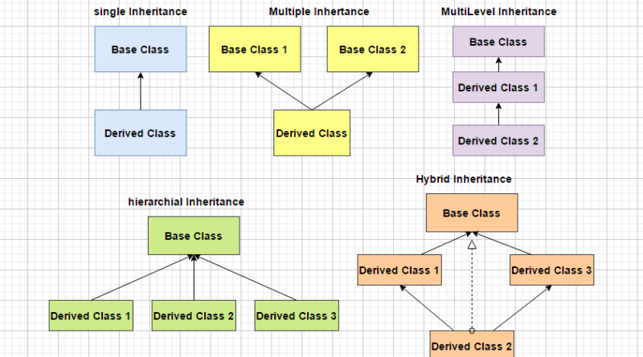
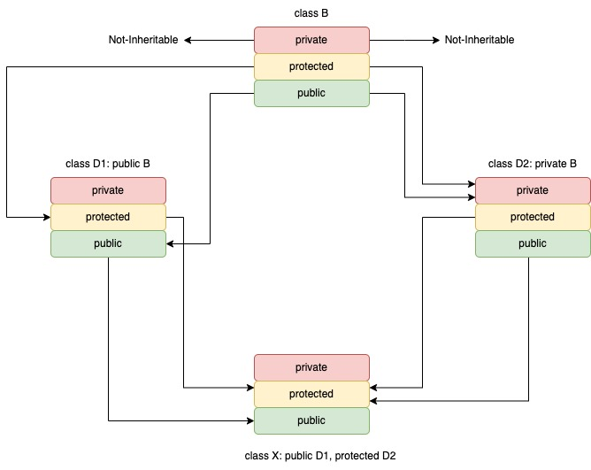

## Inheritance ##
- The mechnism of deriving a new class from the old class is called as `inheritance` or derivation. The old class is called `base-class` and new class is called `derived-class`.
- A `derived-class` with one `base-class` is called a `single-inheritance` and one with several is called `multiple-inheritance`.
- One class may be inherited by more than one class is known as hirachical `inheritance`.
- The mechanism of deriving a class from another class is known as multilevel `inheritance`.



- For creating a subclass from the base or super class we need to follow the below procedure
 
```cpp
class subClass_name: access_mode baseClass_name{
    // body of subclass
}
```
- Access mode
    - private:
    - protected
    - public

- Derived class can never inherite the private data members. So inheritance will not be full it would be partial if in case base calss holds the data member in private access mode.


