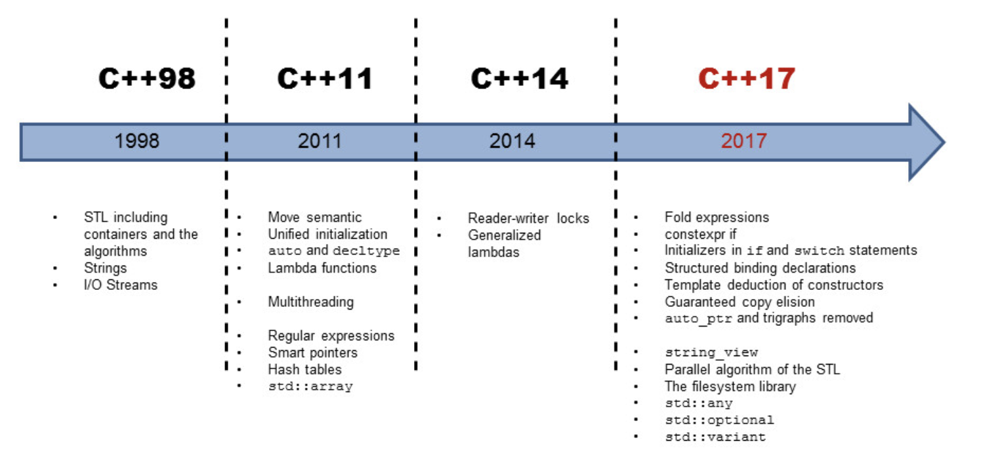

https://www.linkedin.com/pulse/c17-whats-new-core-language-rainer-grimm/ 

### C++11 (2011):
Introduced several major features like 
- lambda expressions, 
- auto keyword, 
- range-based for loops, 
- smart pointers (std::unique_ptr, std::shared_ptr, std::weak_ptr), 
- constexpr keyword for compile-time evaluation, 
- nullptr keyword, 
- static_assert for compile-time assertions, 
- and rvalue references (move semantics).
- Added support for multithreading with the std::thread library and related utilities in <thread> and <mutex> headers.
- Enhanced standard library with features like std::unordered_map, std::unordered_set, regular expressions (std::regex), and more.

### C++14 (2014):
Focused primarily on bug fixes and minor enhancements over C++11 rather than introducing significant new language features.
- Introduced features like generic lambdas (lambda expressions with auto parameters), 
- relaxed constexpr restrictions, 
- variable templates, 
- std::make_unique for uniformity with std::make_shared, 
- improvements to std::tuple, and 
- std::exchange for safe value.

### C++17 (2017):
- Introduced several new language features and library improvements.
- Language features include inline variables, 
- if statements with initializer, 
- structured bindings, 
- constexpr if, 
- fold expressions,  
- auto template deduction for constructors.
- Library improvements include `std::optional` and `std::variant`, parallel algorithms (`std::execution`),
- std::filesystem for file system operations, 
- std::string_view for efficient string handling, and more.

### C++20 (2020)
- Major Features: 
    - Concepts, 
    - ranges library, 
    - coroutines, 
    - modules, 
    - designated initializers, 
    - std::span, 
    - calendar and 
    - time zone support (<chrono>), 
    - std::format, and 
    - std::jthread.
- Library Additions: 
    - Concepts library, 
    - ranges library (<ranges>), 
    - std::span, 
    - std::format, 
    - std::jthread, 
    - std::stop_source, 
    - std::stop_token, and 
    - improvements to existing libraries.