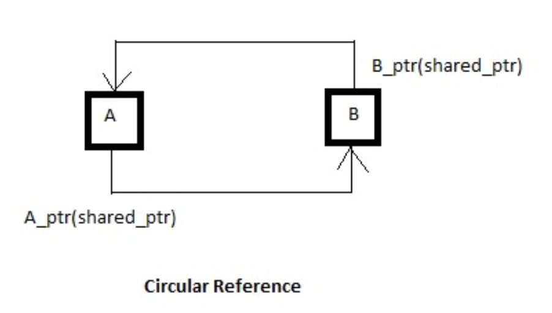
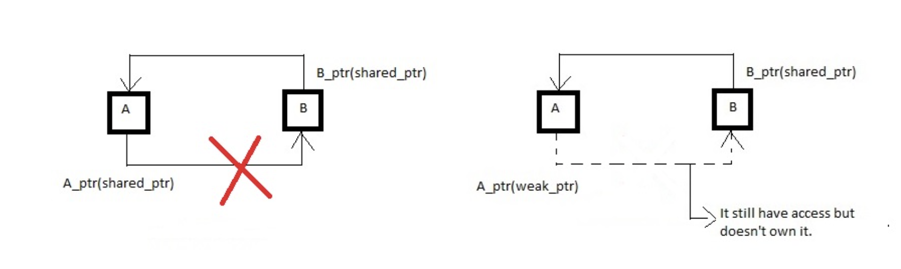

## shared_ptr ##
- It is a container for raw pointer . It is a reference counting ownership model i.e. maintained the reference count of its contained pointer in co-operation with all copies of the `shared-ptr`.
- Counter is incremented with each time a new pointer pointes to the resource and decremented when destructor of the object is called.
- We should use `shared-ptr` when we want to assign raw pointer to multiple owners.
- It should be used when you want to share the ownership of resource.
- the object you call shared_from_this on must be owned by a shared_ptr object
### Reference counting ###
- It is technique of storing the number of references pointers or handles to a resource such as an object, block of memory, disk space or other resource.
- A object referenced by the contained raw pointer will not be destroyed until reference counter is greater than zero i.e. until all the copies of shared_ptr has been deleted.

```cpp
class A {
public:
    void show() { cout << "A::show()" << endl; }
};
  
int main()
{
    shared_ptr<A> p1(new A);
    cout << p1.get() << endl;   // 0x625010
    p1->show();                 // A::show()
    shared_ptr<A> p2(p1);
    p2->show();                 // A::show()

    cout << p1.get() << endl;   // 0x625010
    cout << p2.get() << endl;   // 0x625010
  
    // Returns the number of shared_ptr objects
    // referring to the same managed object.
    cout << p1.use_count() << endl;  // 2
    cout << p2.use_count() << endl;  // 2
  
    // Relinquishes ownership of p1 on the object
    // and pointer becomes NULL
    p1.reset();
    cout << p1.get() << endl;        // 0 
    cout << p2.use_count() << endl;  // 1
    cout << p2.get() << endl;        // 0x625010
  
    return 0;
}
```
## Example ##
- `shared_ptr` rational operation
```cpp
int main(){
    shared_ptr<int> a, b, c, d;
    a = make_shared<int> (10);
    b = make_shared<int> (20);
    c = b;

    cout << "a==b :" << (a==b) << endl; //false
    cout << "b==c :" << (b==c) << endl; // true
    cout << "c==d :" << (c==d) << endl; // false

    cout << "a!=nullptr :" << (a!=nullptr) << endl; //true
    cout << "b!=nullptr :" << (b!=nullptr) << endl; //true
    cout << "c!=nullptr :" << (c!=nullptr) << endl; //true
    cout << "d!=nullptr :" << (d!=nullptr) << endl; //false

    return 0;
}
```
- `shared_ptr::owner_before`
```cpp
int main(){
    int *p = new int(10);
    std::shared_ptr<int> a (new int(20));
    std::shared_ptr<int> b (a,p); // alias constructor

    cout << "comparing a and b " <<endl;
    cout << "value based:" <<(!(a < b) && !(b < a)) << endl;
    cout << "owner based:" <<(!a.owner_before(b) &&  !b.owner_before(a)) << endl;
}
```
```cpp
//output
comparing a and b
value based:false
owner based:true
```
- `shared_ptr::reset`
```cpp
int main(){
    std::shared_ptr <int> sp; // empty
    sp.reset(new int); // take ownership of pointer
    *sp = 10;
    sp.reset(new int); // deletes managed object, acquire new pointer
    *sp = 20;
    sp.reset(); // deletes managed object
    return 0;
}
```
- `shared_ptr::swap`
```cpp
int main(){
    shared_ptr<int> foo (new int(10));
    shared_ptr<int> bar (new int(20));
    foo.swap(bar);

    cout << "foo:" << *foo << endl;
    cout << "bar:" << *bar << endl;

    return 0;
}
```
- `shared_ptr::make_shared`
```cpp
int main(){
    shared_ptr <int> Var1 = make_shared <int> (10);
    shared_ptr <int> Var2 (new <int> (10));

    auto Var3 = make_shared<int> (20);
    auto Var4 = make_shared<pair<int,int>> (30,40);

    cout << *Var1 << endl; // 10
    cout << *Var2 << endl; // 10
    cout << *Var3 << endl; // 20
    cout << Var4->first << Var4->second << endl; // 30 40
    return 0;
}
```
## cycle dependency problem with shared_ptr ##
- Let’s consider a scenario where we have two classes A and B, and both have pointers to other classes. So, it’s always like A is pointing to B and B is pointing to A. Hence, use_count will never reach zero and they never get deleted.


- This is the reason we use weak pointers(weak_ptr) as they are not reference counted. So, the class in which weak_ptr is declared doesn’t have a stronghold over it i.e. the ownership isn’t shared, but they can have access to these objects.

- So, in the case of shared_ptr because of cyclic dependency use_count never reaches zero which is prevented by using weak_ptr, which removes this problem by declaring A_ptr as weak_ptr, thus class A does not own it, only has access to it and we also need to check the validity of object as it may go out of scope. In general, it is a design issue.

### implement own share_ptr ###
```cpp
#include <cstddef>
#include <iostream>
// more than one pointer to same object
// reference counting model is used
using namespace std;
template <typename T> class SharedPtr {
  class counter {
    int ct{0};

  public:
    counter() = default;
    int getCt() { return ct; }
    void operator++() { ct++; }
    void operator++(int) { ct++; }
    void operator--() { ct--; }
    void operator--(int) { ct--; }
  };

private:
  T *ptr;
  counter *cnt;

public:
  // Constuctor
  explicit SharedPtr(T *ptr = nullptr) : ptr(ptr) {
    cnt = new counter();
    if (ptr) {
      (*cnt)++;
    }
  }

  // copy constructor
  SharedPtr(const SharedPtr<T> &sh_ptr) {
    std::cout << "copy called" << std::endl;
    this->ptr = sh_ptr.ptr;
    cnt = sh_ptr.cnt;
    (*cnt)++;
  }
  // move constructor
  SharedPtr(SharedPtr<T> &&sh_ptr) {
    std::cout << "move called" << std::endl;
    if (this->ptr != sh_ptr.ptr) {
      this->ptr = sh_ptr.ptr;
      cnt = sh_ptr.cnt;
      sh_ptr.ptr = nullptr;
      sh_ptr.cnt = 0;
    }
  }

  // destructor
  ~SharedPtr() {
    (*cnt)--;
    if (cnt->getCt() == 0) {
      delete cnt;
      delete ptr;
    }
  }

  int getRefCnt() { return cnt->getCt(); }
  T *getPtr() { return ptr; }
  T *operator->() { return ptr; }
  T &operator*() { return *ptr; }
};

int main() {
  SharedPtr<int> shptr1(new int(5));
  cout << "shptr1 = " << shptr1.getPtr() << ",ref cnt = " << shptr1.getRefCnt()
       << endl;

  SharedPtr<int> shptr2(move(shptr1));
  cout << "shptr2 = " << shptr2.getPtr() << ",ref cnt = " << shptr2.getRefCnt()
       << endl;
  if (!shptr1.getPtr()) {
    cout << "shptr1 is null " << endl;
  }

  SharedPtr<int> shptr3(shptr2);
  cout << "shptr3 = " << shptr3.getPtr() << ",ref cnt = " << shptr3.getRefCnt()
       << ",value = " << *shptr3 << endl;
  cout << "shptr2 = " << shptr3.getPtr() << ",ref cnt = " << shptr2.getRefCnt()
       << endl;

  return 0;
}
```

## Getting shared_ptr Objects In Member Functions
- The following code like this won't work correctly:
```cpp
int *ip = new int;
shared_ptr<int> sp1(ip);
shared_ptr<int> sp2(ip);
```

- Neither of the two shared_ptr objects knows about the other, so both will try to release the resource when they are destroyed. That usually leads to problems. Similarly, if a member function needs a shared_ptr object that owns the object that it's being called on, it can't just create an object on the fly:

```cpp
struct S {
shared_ptr<S> dangerous() {
  return shared_ptr<S>(this);   // don't do this!
  }
};

int main() {
  shared_ptr<S> sp1(new S);
  shared_ptr<S> sp2 = sp1->dangerous();
  return 0;
}
```

- This code has the same problem as the earlier example, although in a more subtle form. When it is constructed, the `shared_ptr` object `sp1` owns the newly allocated resource. The code inside the member function `S::dangerous` doesn't know about that shared_ptr object, so the shared_ptr object that it returns is distinct from sp1. Copying the new shared_ptr object to sp2 doesn't help; when sp2 goes out of scope, it will release the resource, and when sp1 goes out of scope, it will release the resource again.

- The way to avoid this problem is to use the class template enable_shared_from_this [6]. The template takes one template type argument, which is the name of the class that defines the managed resource. That class must, in turn, be derived publicly from the template; like this:

```cpp
struct S : enable_shared_from_this<S> {
  shared_ptr<S> dangerous() {
  return shared_from_this();
  }
};

int main()  {
shared_ptr<S> sp1(new S);
shared_ptr<S> sp2 = sp->dangerous();    // not dangerous

return 0;
}
```

- The member function S::dangerous is no longer dangerous. When you do this, keep in mind that the object you call shared_from_this on must be owned by a shared_ptr object. This won't work:

```cpp
int main() {
  S *p = new S;
  shared_ptr<S> sp2 = p->dangerous();     // don't do this
}
```
- Listing 6 (available at http://www.cuj.com/code/) has a synopsis of the template class enable_shared_from_this. 
The protected members provide ordinary construction and copy semantics, while preventing creation of standalone enable_shared_from_this objects. The two public member functions return shared_ptr objects with appropriate const qualifications 

