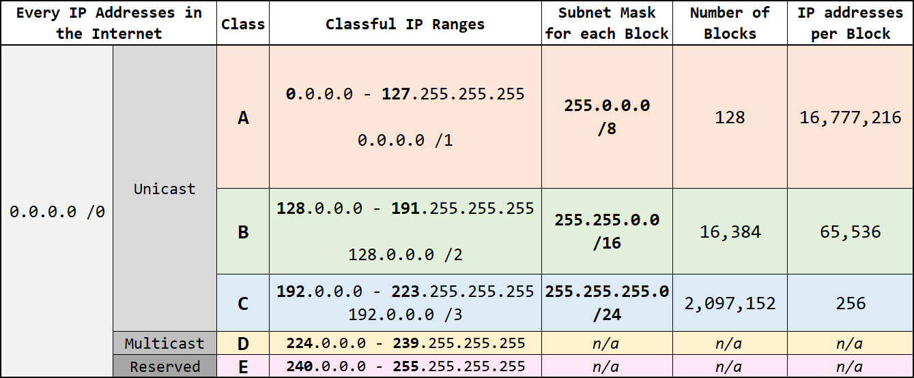
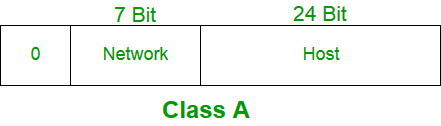
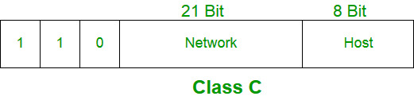
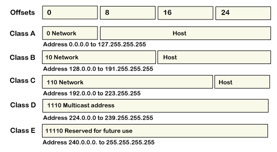
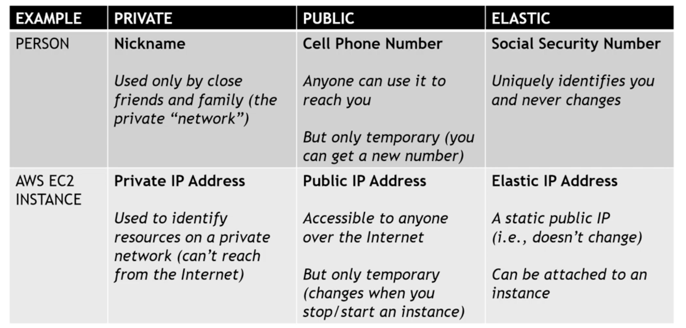

## Classful vs Classless vs CIDR vs FLSM vs VLSM

### classful

## class A

## class B

## class C

## class D

## class E

## IP address formate

## public,private elastic ip address

### Q&A
https://www.geeksforgeeks.org/top-50-ip-addressing-interview-questions-and-answers/