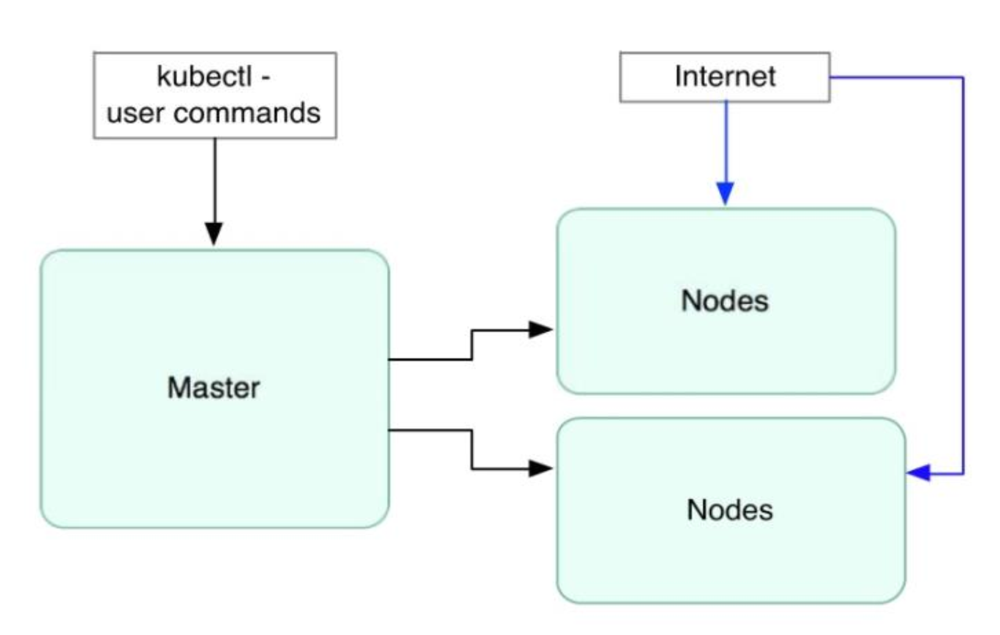
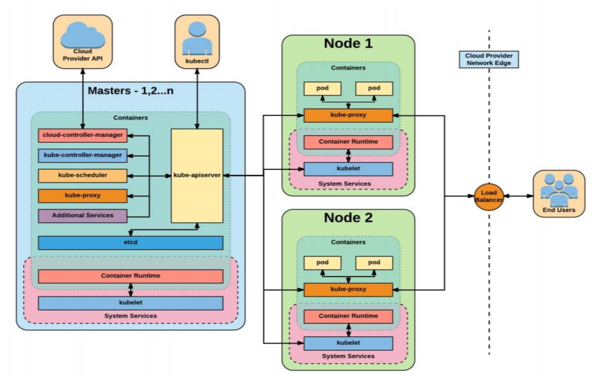
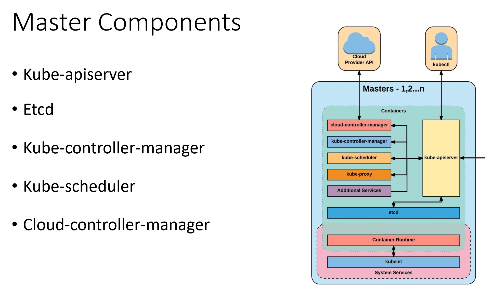
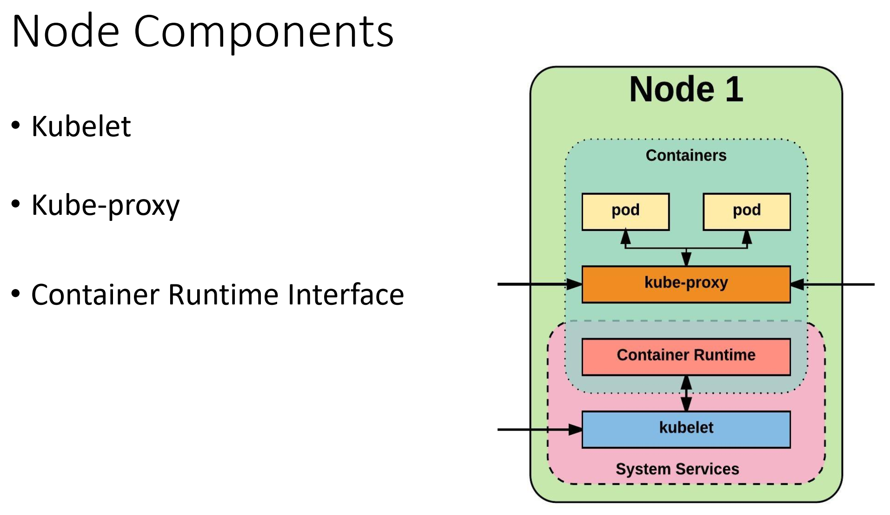
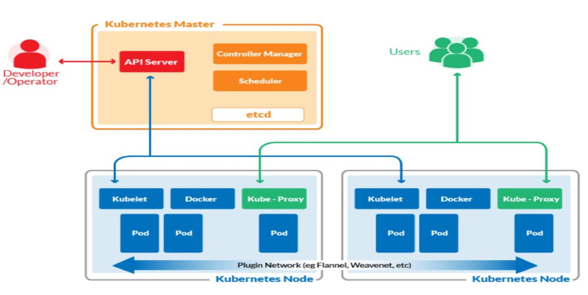

## Kubernetes Architecture

### 1. Kubernetes High Level architecture

### 2. Kubernetes Internal architecture

### 3. Kubernetes Master

### 3.1 Kube-apiserver
- Exposes REST interface into the
kubernetes control plane and Data
Store.
- All clients, including Nodes, Users
and other applications interact with
kubernetes strictly through the API
Server.
- Acting as the gatekeeper to the
cluster by handling:
    - Authentication and Authorization
    - Request validation
    - Mutation and Admission control

### 3.2 etcd
- Etcd acts as the `Cluster Data Store`
- Provides a strong, consistent and highly available `key-value store` used for `Persisting Cluster State`.

### 3.3 kube-controller-manager
- Primary daemon that manages all `core component` control loops
- Monitors the `cluster state` via the apiserver and steers the cluster towards the desired state

### 3.4 kube-scheduler
- Evaluates workload requirements and attempts to `find` matching resource.
- These requirements can include:
    - Hardware requirements
    - Affinity/Anti-affinity
    - Any other custom resource requirements.

### 3.5 cloud-controller-manager
Provides `cloud-provider` specific knowledge and integration capability into the core control loop of Kubernetes

### 4. Kubernetes Node

### 4.1 kubelet
- Acts as the node agent responsible for managing pod lifecycle on its host.
- Kubelet understands YAML/JSON container manifests that it can read from several sources:
    - File path
    - HTTP Endpoint
    - Etcd watch acting on any changes
### 4.2 kube-proxy
- Manages the network rules on each node and performs connection forwarding or load balancing for
- Kubernetes cluster services.
    - Available proxy modes:
    - Userspaces
    - Iptables
    - ipvs
### 4.3 Container Runtime
- With respect to Kubernetes, a container runtime is a CRI (Container Runtime Interface) compatible application that
executes and manages containers.
    - Containerd (Docker)
    - Cri-o
    - Rkt
## 5. Communication
