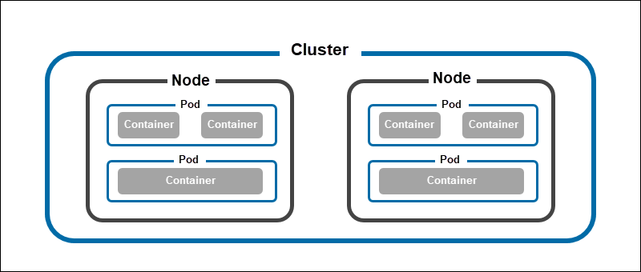
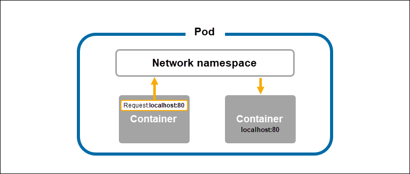

## Kubernetes POD, Controller, Template, Networking

### 1. POD
- Pods are the smallest unit of objects that can be deployed on Kubernetes, Kubernetes packages one or more containers into a higher-level structure called a pod. Pod runs one level higher than the container.
- A POD always runs on a Node but they share a few resources which can be Shared Volumes, Cluster Unique IP, and Info about how to run each container.  All containers in the pod are going to be scheduled on an equivalent node.
- A pod encapsulates one or more applications. Pods are ephemeral by nature, if a pod (or the node it executes on) fails, Kubernetes can automatically create a new replica of that pod to continue operations.
- Pods include one or more containers (such as Docker containers).
- In cloud computing, a pod is a high-level structure and the tiniest execution object in Kubernetes. These pods are temporary. If one pod fails, Kubernetes simultaneously models a copy so that the work keeps going on.


### 2. What does a Pod do?
Pods represent the processes running on a cluster. By limiting pods to a single process, Kubernetes can report on the health of each process running in the cluster. Pods have:

- a unique IP address (which allows them to communicate with each other)
- persistent storage volumes (as required)
- configuration information that determine how a container should run.

Although most pods contain a single container, many will have a few containers that work closely together to execute a desired function.

Kubernetes individual pods have their own designated Internet Protocol (IP) address, making pod-to-pod communication easier. Each pod has its own persistent storage volumes. Besides, every Kubernetes pod contains unique configuration data that dictates precisely how a specific container should operate.

### 3. Pod model types
- `One-container-per-pod` Pods in Kubernetes most often host a single container that provides all the necessary dependencies for an application to run. Single container pods are simple to create and offer a way for Kubernetes to control individual containers indirectly.

- `Multi-container pods` Multi-container pods host containers that depend on each other and share the same resources. Inside such pods, containers can establish simple network connections and access the same storage volumes. Since they are all in the same pod, Kubernetes treats them as a single unit and simplifies their management.

### 4. Benefits of a pod
- Productivity improvement
- Scalability
- Efficiency improvement
- Container abstraction
- Resource sharing.
- Load balancing
- Health monitoring

### 5. What are the benefits of a pod
- When pods contain multiple containers, communications, and data sharing between them is simplified. Since all containers in a pod share the same network namespace, they can locate each other and communicate via localhost. 

- Pods can communicate with each other by using another pods IP address or by referencing a resource that resides in another pod.

- Pods can include containers that run when the pod is started, say to perform initiation required before the application containers run. Additionally, pods simplify scalability, enabling replica pods to be created and shut down automatically based on changes in demand.

### 6. Pods vs. Containers. 
- A container packs all the necessary libraries, dependencies, and other resources necessary for an application to function independently. 
- On the other hand, a pod creates a wrapper with dependencies that allow Kubernetes to manage application containers.

### 7. Pods vs. Nodes. 
- A node in Kubernetes is a concept that refers to bare metal or virtual machines that are responsible for hosting pods. 
- A single node can run multiple container pods. While each pod must have a node to run on, not all nodes host pods. 
- The master node features a control plane that controls pod scheduling, while pods reside on worker nodes.

### 8. Pods vs. Cluster. 
- A Kubernetes cluster is a group of nodes with at least one master node (high-availability clusters require more than one master) and up to 5000 worker nodes. 
- Clusters enable pod scheduling on various nodes with different configurations and operating systems.

### 9. Lifecycle
The state of a pod at any given stage in its lifecycle is called the pod phase. There are five possible pod phases:

- `Pending` - When a pod shows the pending status, it means that Kubernetes accepted it and that the containers that make it up are currently being prepared for running.

- `Running` - The running status signifies that Kubernetes completed the container setup and assigned the pod to a node. At least one container must be starting, restarting, or running for the status to be displayed.

- `Succeeded` - Once a pod completes a task (e.g., carrying out a job-related operation), it terminates with the Succeeded status. This means that it stopped working and will not restart.

- `Failed` - The failed status informs the user that one or more containers in the pod terminated with a non-zero status (i.e., with an error)

- `Unknown` - The unknown pod status usually indicates a problem with the connection to the node on which the pod is running.

### 10. Logs
- Kubernetes collects logs from the containers running within a pod. 
- Users can configure Kubernetes to rotate container logs and manage the logging directory automatically. The logs can be retrieved using a dedicated Kubernetes API feature, accessible via the `kubectl logs` command.

### 11. Controllers
- Controllers are Kubernetes objects that create pods, monitor their health and number, and perform management actions. This includes restarting and terminating pods, creating new pod replicas, etc.
- The daemon called Controller Manager is in charge of managing controllers. It uses control loops to monitor the cluster state and communicates with the API server to make the necessary changes.

The following is the list of the six most important Kubernetes controllers:

- `ReplicaSet`. Creates a set of pods to run the same workload.
- `Deployment`. Creates a configured ReplicaSet and provides additional update and rollback configurations.
- `DaemonSet`. Controls which nodes are in charge of running a pod.
- `StatefulSet`. Manages stateful applications and creates persistent storage and pods whose names persist across restarts.
- `Job`. Creates pods that successfully terminate after they finish a task.
- `CronJob`. A CronJob helps schedule Jobs.

### 11. Templates
- In their YAML configurations, Kubernetes controllers feature specifications called pod templates.
- Templates describe which containers and volumes a pod should run. Controllers use templates whenever they need to create new pods.
- Users update pod configuration by changing the parameters specified in the PodTemplate field of a controller.

### 12. Networking
- Each pod in a Kubernetes cluster receives a unique cluster IP address. 
- The containers within that pod share this address, alongside the network namespace and ports. This setup enables them to communicate using localhost.
- If a container from one pod wants to communicate with a container from another pod in the cluster, it needs to use IP networking.
- Pods feature a virtual ethernet connection that connects to the virtual ethernet device on the node and creates a tunnel for the pod network inside the node.


### 13. Storage
Pod data is stored in volumes, storage directories accessible by all the containers within the pod. There are two main types of storage volumes:

- `Persistent volumes` persist across pod failures. The volumes' lifecycle is managed by the PersistentVolume subsystem, and it is independent of the lifecycle of the related pods.
- `Ephemeral volumes` are destroyed alongside the pod that used them.

### 14. Working with Kubernetes Pods
Users interact with pods using `kubectl`, a set of commands for controlling Kubernetes clusters by forwarding HTTP requests to the API.
#### 14.1 Pod OS
- Users can set the operating system a pod should run on. Currently, Linux and Windows are the only two supported operating systems.

#### 14.2 Create Pods Directly
- While creating pods directly from the command line is useful for testing purposes, it is not a recommended practice.

- To manually create a pod, use the kubectl run command:

    `kubectl run [pod-name] --image=[container-image] --restart=Never`

#### 14.3 Deploy Pods
- To create pods from the YAML file, use the kubectl create command:

    `kubectl create -f [yaml-file]`
```yaml
apiVersion: apps/v1
kind: Deployment
metadata:
  name: nginx
spec:
  selector:
    matchLabels:
      app: nginx
  replicas: 5
  template:
    metadata:
      labels:
        app: nginx
    spec:
      containers:
      - name: nginx
        image: nginx:latest
        ports:
        - containerPort: 80
```

#### 14.4 Update or Replace Pods
Some pod specifications, such as metadata and names, are immutable after Kubernetes creates a pod. To make changes, you need to modify the pod template and create new pods with the desired characteristics.

#### 14.5 List Pods
- kubectl get pod

#### 14.6 Restart Pods
There is no direct way to restart a pod in Kubernetes using kubectl. However, there are three workarounds available:

- `Rolling restart` is the fastest available method. Kubernetes performs a step-by-step shutdown and restart of each container in a deployment.
- `Changing an environment variable` forces pods to restart and synchronize with the changes.
- `Scaling` the replicas to zero, then back to the desired number.

#### 14.7 Delete Pods
Kubernetes automatically deletes pods after they complete their lifecycle. Each pod that gets deleted receives 30 seconds to terminate gracefully.

`kubectl delete -f [yaml-file]`

#### 14.8 View Pod log
The kubectl logs command allows the user to see the logs for a specific pod.

`kubectl logs [pod-name]`

#### 14.9 Assign Pods to Nodes
Kubernetes automatically decides which nodes will host which pods based on the specification provided on creating the workload resource. However, there are two ways a user can influence the choice of a node:

- Using the `nodeSelector` field in the YAML file allows you to select specific nodes.
- Creating a `DaemonSet` resource provides a way to overcome the scheduling limitations and ensure a specific app gets deployed on all the cluster nodes.

#### 14.10 Monitor Pods
Collecting data from individual pods is useful for getting a clear picture of the cluster's health. The essential pod data to monitor include:

- `Total pod instances`. This parameter helps ensure high availability.
- `The actual number of pod instances vs. the expected number of pod instances`. Helps in creating resource redistribution tactics.
- `Pod deployment health`. Identifies misconfigurations and problems with the distribution of pods to nodes.

### 15. Reference
https://phoenixnap.com/kb/kubernetes-pod 