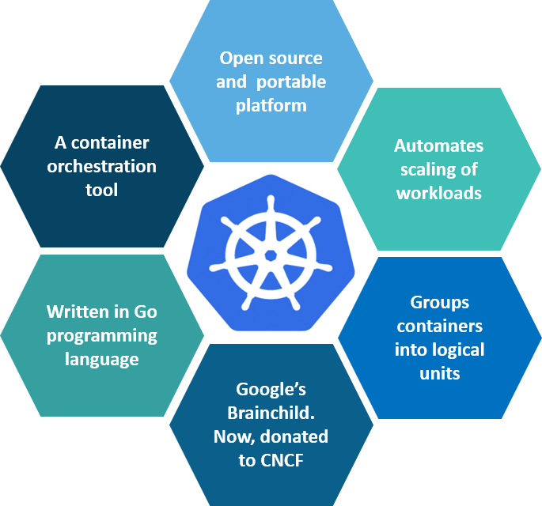
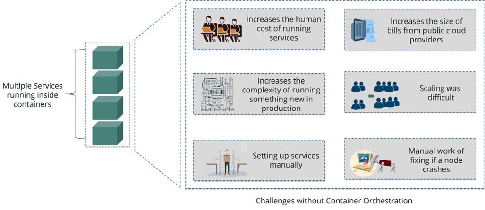
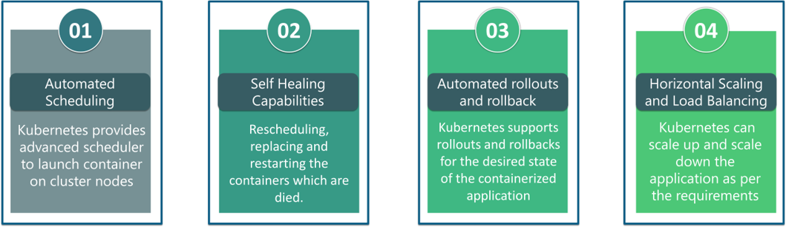
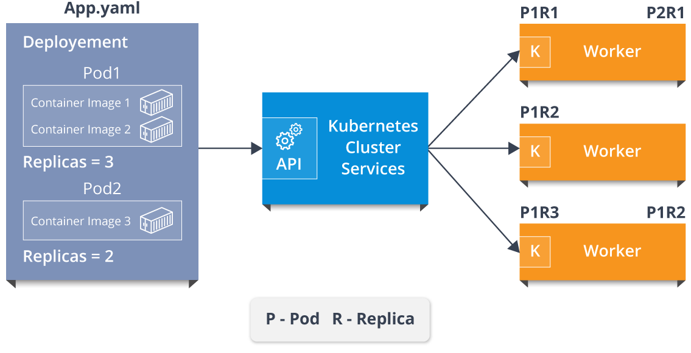
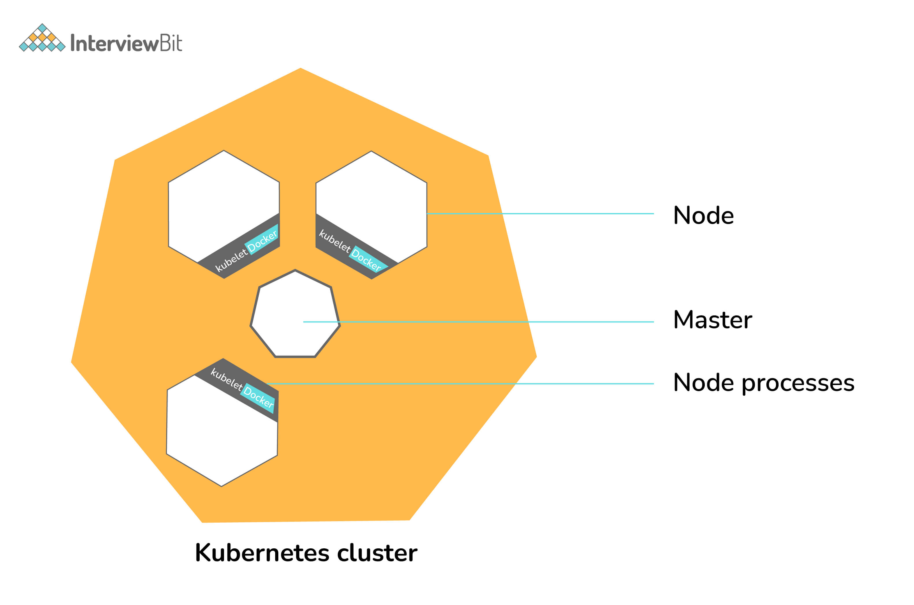
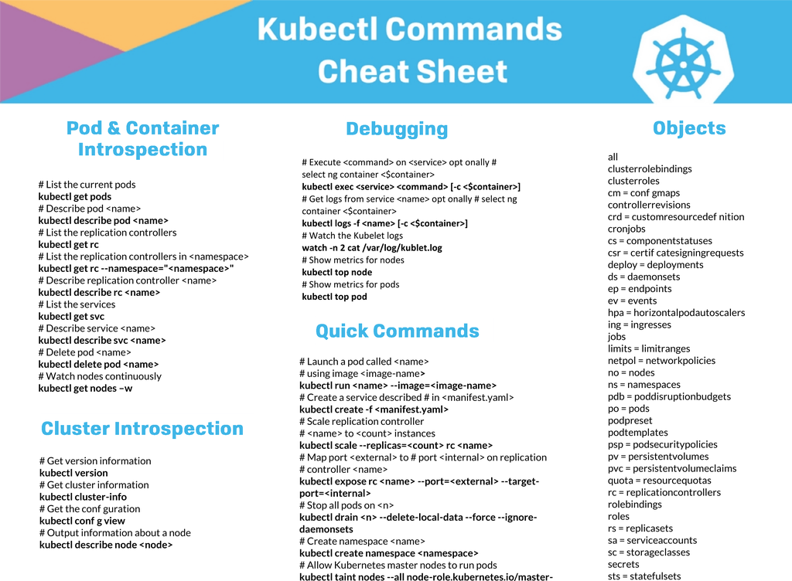

## Kubernetes

### What is Kubernetes
- Kubernetes is an open-source container management tool that holds the responsibilities of container deployment, scaling & descaling of containers & load balancing.
- we can say that Kubernetes is not a containerization platform, but it is a multi-container management solution. 

### How is Kubernetes related to Docker
- Docker provides the lifecycle management of containers and a Docker image builds the runtime containers. But, since these individual containers have to communicate, Kubernetes is used.
- Docker builds the containers and these containers communicate with each other via Kubernetes. So, containers running on multiple hosts can be manually linked and orchestrated using Kubernetes.

### Container Orchestration
- container orchestration means all the services in individual containers working together to fulfill the needs of a single server
- Consider a scenario where you have 5-6 microservices for an application. Now, these microservices are put in individual containers, but won’t be able to communicate without container orchestration.

### Features

### Clusters in Kubernetes
you can see in the diagram, the deployment file will have all the configurations required to be fed into the cluster services. Now, the deployment file will be fed to the API and then it will be up to the cluster services to figure out how to schedule these pods in the environment and make sure that the right number of pods are running

So, the API which sits in front of services, the worker nodes & the Kubelet process that the nodes run, all together make up the Kubernetes Cluster

### kubectl commands
- https://kubernetes.io/docs/reference/generated/kubectl/kubectl-commands 

### Reference
- https://www.edureka.co/blog/interview-questions/kubernetes-interview-questions/#two
- https://www.section.io/engineering-education/how-kubernetes-pods-work/
- https://www.vmware.com/in/topics/glossary/content/kubernetes-pods.html#:~:text=A%20pod%20is%20the%20smallest,that%20pod%20to%20continue%20operations. 

