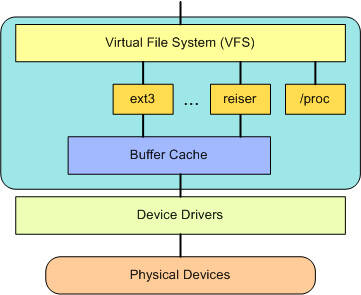
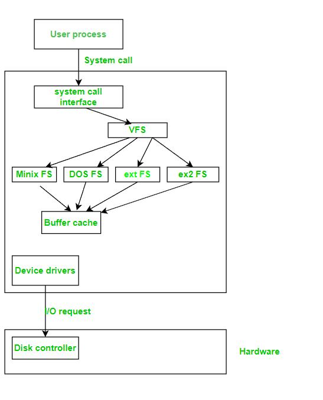
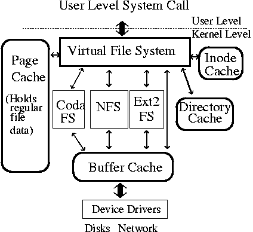

## Linux VFS
- The virtual file system is one of the best features of Linux that makes Linux an operating system of choice.

- The virtual file system (VFS) is an interesting aspect of the Linux kernel because it provides a common interface abstraction for file systems. The VFS provides a switching layer between the SCI and the file systems supported by the kernel

- The Virtual File System (also known as the Virtual Filesystem Switch) is the software layer in the kernel that provides the filesystem interface to userspace programs. It also provides an abstraction within the kernel which allows different filesystem implementations to coexist.

- VFS has the capability of conceiving features and behavior of any file system regardless of processor type memory format as well as hardware.

- The userspace command cat /proc/filesystems can be used to inspect the linked list of known filesystem types that the VFS keeps.

- Filesystem types are unregistered and registered in the kernel through these functions in include/linux/fs.h: 

At the top of the VFS is a common API abstraction of functions such as open, close, read, and write. At the bottom of the VFS are the file system abstractions that define how the upper-layer functions are implemented. These are plug-ins for the given file system (of which over 50 exist). You can find the file system sources in ./linux/fs.

Below the file system layer is the buffer cache, which provides a common set of functions to the file system layer (independent of any particular file system). This caching layer optimizes access to the physical devices by keeping data around for a short time (or speculatively read ahead so that the data is available when needed). Below the buffer cache are the device drivers, which implement the interface for the particular physical device.

## Actions performed by VFS

`As shown in the diagram:`

The user process initiates the execution of the system call with the help of the VFS method. VFS interprets this stimulus into an appropriate internal file system call which in turn activates the concerned mapping function of the specified file system.

In the case of an operating system that demands structural changes, all required constructs are created dynamically to meet the requirements. Ex: In FAT-compatible systems, directories are not treated as files so such characteristics are dynamically created since they cannot be mapped. The target file system is then activated to take control so that results can be delivered to the user of the system.

As seen in the above diagram actions and reactions are observed as a role of VFS:

The user initiates a file-oriented system call.
- Kernel calls function in VFS.
- Execution of file system independent manipulation and initiation of target file system call.
- mapping of calls from VFS to the target file system.
- The target file system converts the request into device driver execution.
- Appropriate action is completed as per the guidance of the device driver function and the results are obtained.
- Since VFS objects are implemented as C data structures. Every object is attached with data and pointers.

## More on VFS
- the Virtual File System (VFS) layer [1] provides a uniform interface for the kernel to deal with various I/O requests and specifies a standard interface that each file system must support. 
- Through this layer, one kernel can mount several different types of file systems (e.g. EXT2FS, ISO9660FS, NFS, ...) into the same tree structure. 
- Arguably, the most important service the VFS layer provides is a uniform I/O data cache.
- Linux maintains four caches of I/O data: 
    - `page cache`: It combines virtual memory and file data. 
    - `i-node cache`: It keeps recently accessed file i-nodes 
    - `buffer cache`: The buffer cache interfaces with block devices, and caches recently used meta-data disk blocks. 
    - `directory cache`: The directory cache (d-cache) keeps in memory a tree that represents a portion of the file system's directory structure. This tree maps a file's path name to an i-node structure and speeds up file path name look up. The basic element of the d-cache is a structure called the d-entry.

