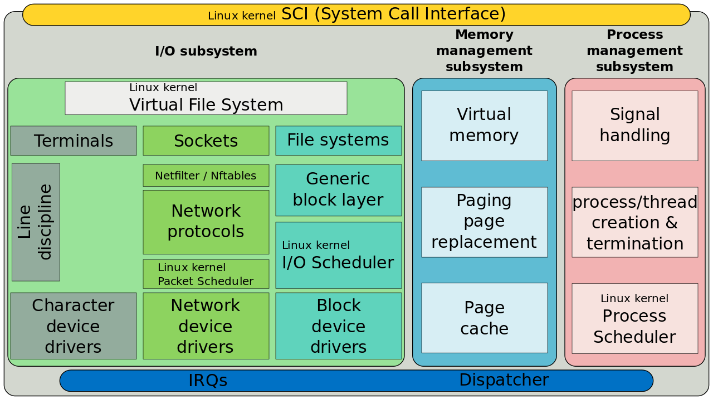
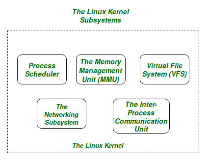
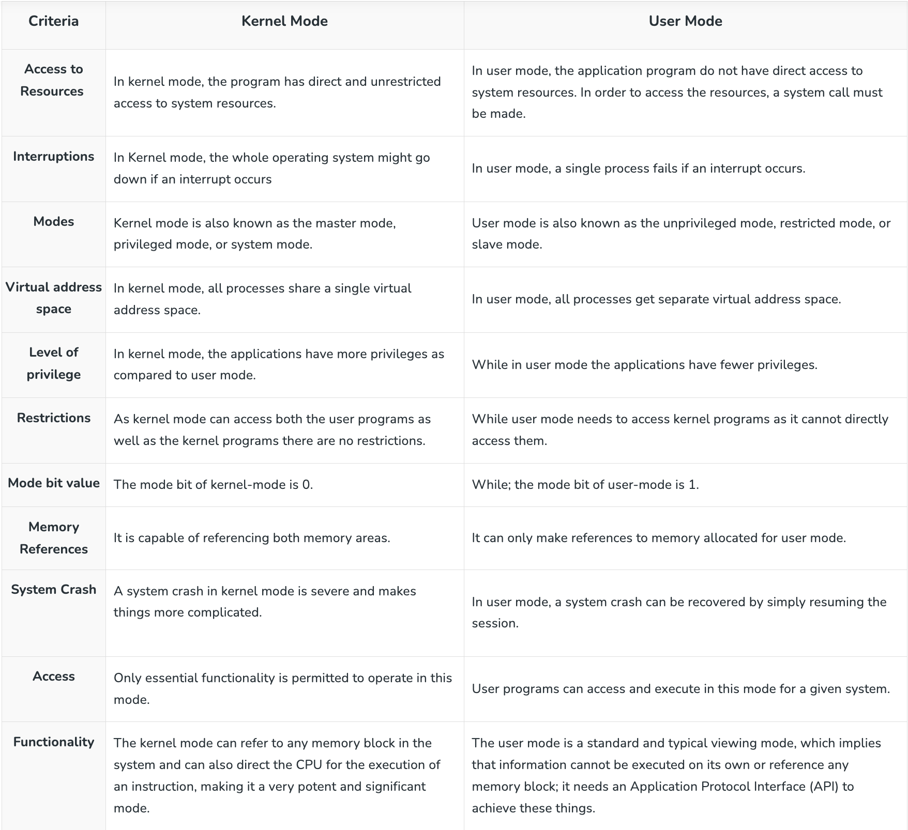
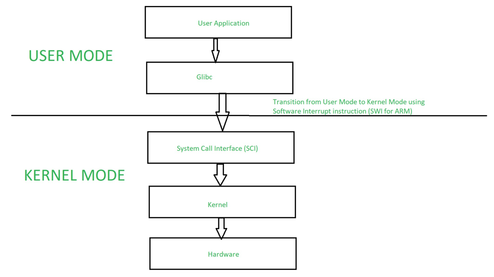
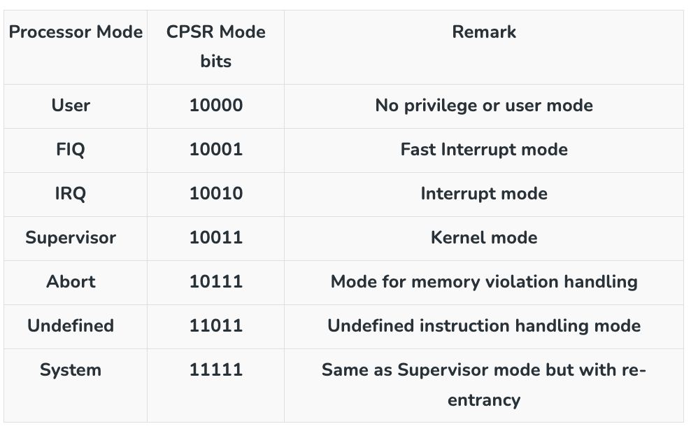

## Linux Kernal
Linux Kernel is the heart of Linux operating systems. It is an open-source (source code that can be used by anyone freely) software that is most popular and widely used in the industry as well as on a personal use basis.

## Kernal Subsystems
The Core Subsystems of the Linux Kernel are as follows:

- `The Process Scheduler` :This kernel subsystem is responsible for fairly distributing the CPU time among all the processes running on the system simultaneously.
- `The Memory Management Unit (MMU)`: This kernel sub-unit is responsible for proper distribution of the memory resources among the various processes running on the system. The MMU does more than just simply provide separate virtual address spaces for each of the processes.
- `The Virtual File System (VFS)`:This subsystem is responsible for providing a unified interface to access stored data across different filesystems and physical storage media.
- `The Networking Unit` :The Networking Unit subsystem in the Linux kernel is an essential component located within the kernel space. It plays a crucial role in facilitating communication between hosts, even if they are not directly connected. In X-Windows, the network subsystem is used for client-server communication, allowing applications to connect over a network. The Linux Kernel's networking stack handles incoming packets, processing them from Layer 2 (data link layer) up to the network layer.
- `Inter-Process Communication Unit`: The inter-process communication (IPC) unit facilitates communication and data sharing between distinct operating system processes or threads. Linux supports a number of Inter-Process Communication (IPC) mechanisms. Signals and pipes are two of them, but Linux also supports the System V IPC mechanisms, which are named after the Unix TM release in which they were initially introduced.

## User mode and Kernel mode

- In modern operating systems, software runs in two distinct modes: user mode and kernel mode. User mode is a restricted mode that limits the software’s access to system resources, while kernel mode is a privileged mode that allows software to access system resources and perform privileged operations.
- When a user-level application needs to perform an operation that requires kernel mode access, such as accessing hardware devices or modifying system settings, it must make a system call to the operating system kernel. The operating system switches the processor from user mode to kernel mode to execute the system call, and then switches back to user mode once the operation is complete.
- This switching between user mode and kernel mode is known as mode switching or context switching. Mode switching involves saving the current context of the processor in memory, switching to the new mode, and loading the new context into the processor. This process can be time-consuming and resource-intensive, as it involves switching between different privilege levels and saving and restoring processor state.
User mode is a restricted mode that limits access to system resources, while kernel mode is a privileged mode that allows access to system resources.

- User mode applications must make system calls to access kernel mode resources or perform privileged operations.
- Mode switching involves saving the current context of the processor, switching to the new mode, and loading the new context into the processor.
- Mode switching can be time-consuming and resource-intensive, and can impact system performance.
- Modern operating systems use various techniques to minimize mode switching, such as caching kernel mode data in user mode, and using hardware support for virtualization and context switching.

### Steps of context switch
To go into Kernel mode, an application process.

- Calls the Glibc library function.
- Glibc library knows the proper way of calling System Call for different architectures. It setup passing arguments as per architecture’s Application Binary Interface (ABI) to prepare for System Call entry.
- Now Glibc calls SWI instruction (Software Interrupt instruction for ARM), which puts processor into Supervisor mode by updating Mode bits of CPSR register and jumps to vector address 0x08.
- Till now process execution was in User mode. After SWI instruction execution, the process is allowed to execute kernel code. Memory Management Unit (MMU) will now allow kernel Virtual memory access and execution, for this process.
- From Vector address 0x08, process execution loads and jumps to SW Interrupt handler routine, which is vector_swi() for ARM.
- In vector_swi(), System Call Number (SCNO) is extracted from SWI instruction and execution jumps to system call function using SCNO as index in system call table sys_call_table.
- After System Call execution, in return path, user space registers are restored before starting execution in User Mode.

### ARM Modes
To support kernel mode and user mode, processor must have hardware support for different privilege modes. For example ARM processor supports seven different modes.

## KVM
- Linux's most recent advancement is its usage as an operating system for other operating systems (known as a hypervisor). 
- This is made feasible through a kernel modification known as Kernel-based Virtual Machine (KVM). 
- The KVM modification adds a new user-space interface, allowing alternative operating systems to operate on top of a KVM-enabled kernel. This advancement enables not only the virtualization of additional instances of Linux but also the virtualization of Windows.

## System call interface
- The SCI is a thin layer that provides the means to perform function calls from user space into the kernel. 
- This interface can be architecture dependent, even within the same processor family. 
- The SCI is actually an interesting function-call multiplexing and demultiplexing service. You can find the SCI implementation in ./linux/kernel, as well as architecture-dependent portions in ./linux/arch.