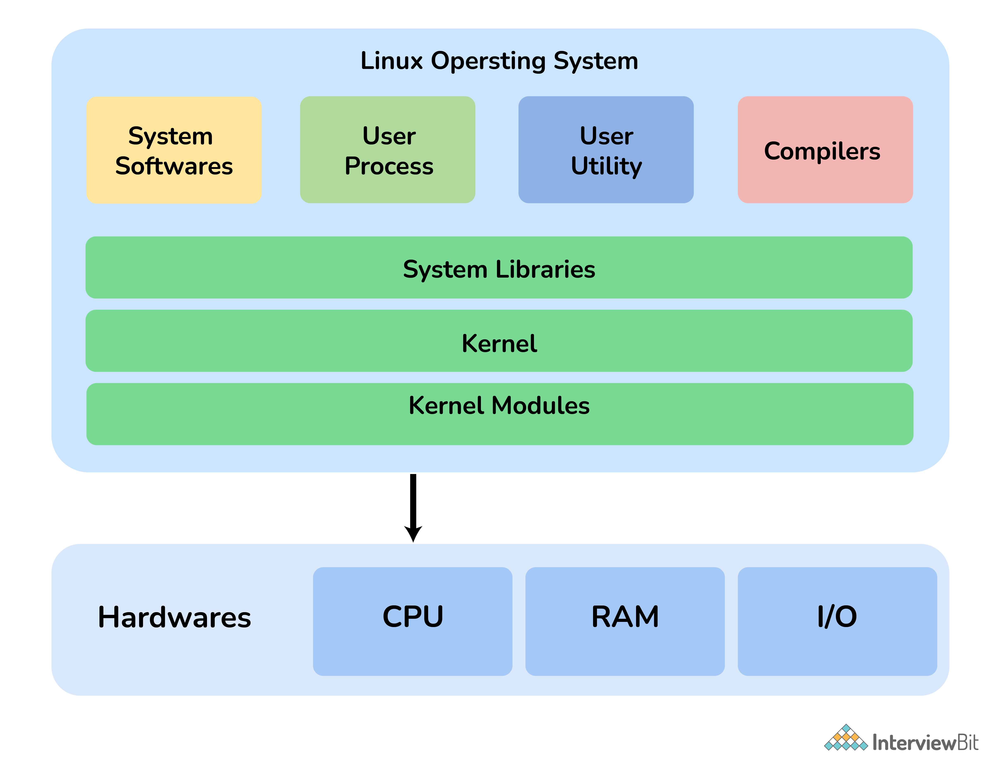
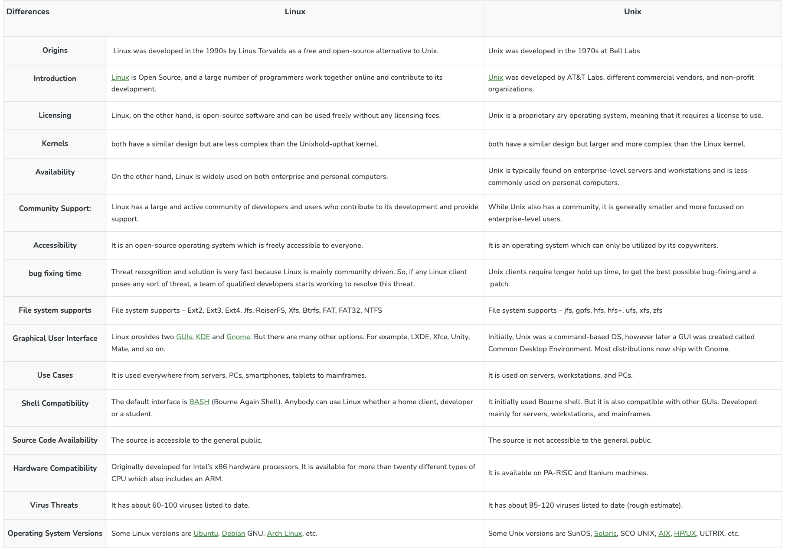

## Linux
- Linux is a Unix-like open-source computer operating system (OS) that directly manages hardware and resources of a system such as CPU, memory, and storage, and manages the communication between software and hardware
- It was first released on 5 October 1991 by Linus Torvalds for computers
- and is considered more secure and faster than Windows.
- It is more secure than other operating systems because it uses security auditing and password authentication features.
- It is freely distributable and is generally built around Linux Kernel.
- Also, Linux executes on many embedded systems, i.e., devices whose OS is typically designed into the firmware and is extremely customized to the system.
- it can be installed in mobiles, laptops, computers, notebooks, etc. Flavors of Linux OS include Ubuntu, Debian, SUSE Linux, Gentoo, etc. 
 

## Name of Linux distributor
There are various Linux distros but the following are the most commonly used:
- Ubuntu
- Debian
- CentOS
- Fedora
- RedHat

## components
Linux Operating System has primarily three components

- `Kernel` − Kernel is the core part of Linux. It is responsible for all major activities of this operating system. It consists of various modules and it interacts directly with the underlying hardware. Kernel provides the required abstraction to hide low level hardware details to system or application programs.

- `System Library` − System libraries are special functions or programs using which application programs or system utilities accesses Kernel's features. These libraries implement most of the functionalities of the operating system and do not requires kernel module's code access rights.

- `System Utility` − System Utility programs are responsible to do specialized, individual level tasks.
    
   

## Architecture

The following illustration shows the architecture of a Linux system −
.jpg)

The architecture of a Linux System consists of the following layers −

- Hardware layer − Hardware consists of all peripheral devices (RAM/ HDD/ CPU etc).

- Kernel − It is the core component of Operating System, interacts directly with hardware, provides low level services to upper layer components.

- Shell − An interface to kernel, hiding complexity of kernel's functions from users. The shell takes commands from the user and executes kernel's functions.

- Utilities − Utility programs that provide the user most of the functionalities of an operating systems.

## Basic Features
Following are some of the important features of Linux Operating System.

- `Portable` − Portability means software can works on different types of hardware in same way. Linux kernel and application programs supports their installation on any kind of hardware platform.

- `Open Source` − Linux source code is freely available and it is community based development project. Multiple teams work in collaboration to enhance the capability of Linux operating system and it is continuously evolving.

- `Multi-User` − Linux is a multiuser system means multiple users can access system resources like memory/ ram/ application programs at same time.

- `Multiprogramming` − Linux is a multiprogramming system means multiple applications can run at same time.

- `Hierarchical File System` − Linux provides a standard file structure in which system files/ user files are arranged.

- `Shell` − Linux provides a special interpreter program which can be used to execute commands of the operating system. It can be used to do various types of operations, call application programs. etc.

- `Security` − Linux provides user security using authentication features like password protection/ controlled access to specific files/ encryption of data.

## Linux vs Window

