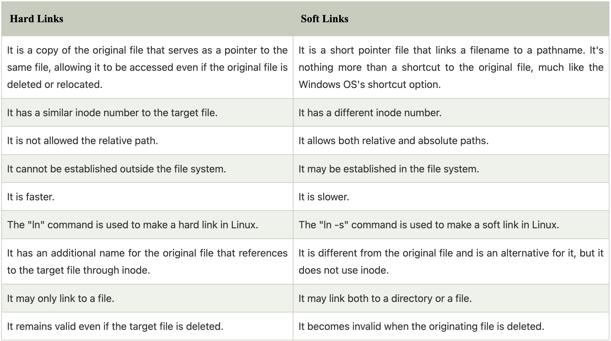
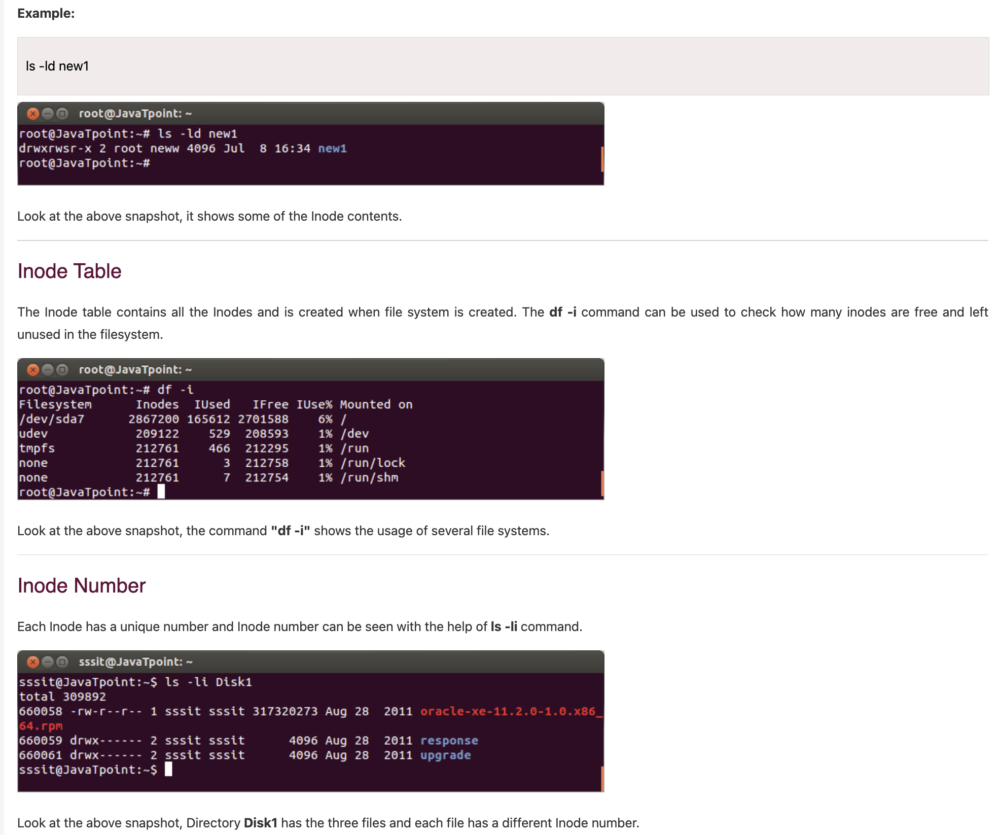
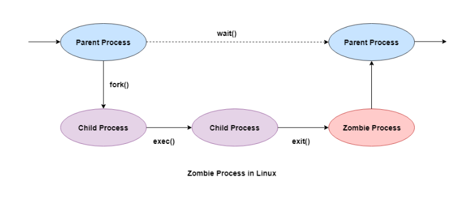

## Linux Queustions
https://www.geeksforgeeks.org/linux-interview-questions/

### Hard link vs soft link
The primary difference between these links is that a hard link directly references the file. In contrast, a soft link is a name-based reference to a file.

- `Hard Link:`A hard link is an additional name for the original file that references to the target file through inode.
A hard link remains valid even if the target file is deleted. 
- `Soft Link or Symbolic links:` It is different from the original file and is an alternative for it, but it does not use inode. Soft link becomes invalid when the originating file is deleted 

### create soft link
Symbolic links, symlink, or soft links are shortcuts to files and directories. Users can create the symbolic link in Linux through the’ ln’ command. The general command to create a symbolic link is as follows:

`ln -s <existing_source file> <optional_symbolic link>`

### LILO
LILO, i.e., Linux Loader and is a Linux Boot loader. It loads the Linux operating system into memory and starts the execution. Most operating systems like Windows and macOS come with a bootloader. While in Linux, you need to install a separate boot loader, and LILO is one of the Linux boot loaders.
- It can boot operating systems from floppy disks, hard disks, and it does not depend on a specific file system. 
- Lilo handles some tasks such as locate the kernel, identify other supporting programs, load memory and starts the kernel. - The configuration file of lilo is located at “/etc/lilo.conf”. Lilo reads this configuration file and it tells Lilo where it should place the bootloader.

### GRUB VS LILO

1) Lilo stands for Linux Loader and GRUB stands for Grand Unified Bootloader.

2) LILO has no interactive command interface, whereas GRUB has a more powerful command interface.

3) LILO does not support booting from a network, whereas GRUB does.

4) GRUB is a boot loader which can be used in Linux, DOS, and other operating systems whereas Lilo is a boot loader for Linux.

5) Lilo has a simpler interface so it is easy to use whereas GRUB is more complicated to use.

6) Lilo is the old default bootloader and GRUB is the new default boot loader.

### Linux shell
In Linux, five Shells are used:

- `csh (C Shell)`: This shell offers job control and spell checking and is similar to C syntax.
- `ksh (Korn Shell)`: A high-level shell for programmi  ng languages.
- `ssh (Z Shell)`: This shell has a unique nature, such as closing comments, startup files, file name generating, and observing logout/login watching.
- `bash (Bourne Again Shell)`: This is the default shell for Linux.
- `Fish (Friendly Interactive Shell)`: This shell provides auto-suggestion, web-based configuration, etc.

### Linux Inodes
- The inode (index node) is a data structure in a Unix-style file system that describes a file-system object such as a file or a directory. 
- An Inode number is a uniquely existing number for all the files in Linux and all Unix type systems.
- When a file is created on a system, a file name and Inode number is assigned to it.
- Generally, to access a file, a user uses the file name but internally file name is first mapped with respective Inode number stored in a table.
- Inode doesn't contain the file name. Reason for this is to maintain hard-links for the files. When all the other information is separated from the file name then only we can have various file names pointing to the same Inode.

### Linux process 
In Linux, there are mainly three common kinds of processes which are as follows:

- Batch : The batch process is submitted through a processes queue and is not related to the command line. These processes are well suited to perform recurring operations if the usage of the system is low.
- Interactive: The interactive process is interactively executed by the user on the command line.
- Daemon: The daemon is identified by a system like those processes whose parent process contains a PID of one.

### Inode Contents
An Inode is a data structure containing metadata about the files.

Following contents are stored in the Inode from a file:

- User ID of file
- Group ID of file
- Device ID
- File size
- Date of creation
- Permission
- Owner of the file
- File protection flag
- Link counter to determine number of hard links

### Difference between a process and a daemon in Linux
- A process is an executing instance of a program. It can be a foreground process that interacts with the user or a background process started by a user or another process.
- A daemon is a background process that runs independently of user sessions. It is typically started at system boot time and performs system tasks or provides services. Daemons often have no user interaction and continue running even when users log out.

### Zombie process
- https://www.tutorialspoint.com/what-is-zombie-process-in-linux
- https://www.geeksforgeeks.org/zombie-processes-prevention/
- https://www.javatpoint.com/what-is-zombie-process
- A zombie process is a process whose execution is completed but it still has an entry in the process table. 
- Zombie processes usually occur for child processes, as the parent process still needs to read its child’s exit status. Once this is done using the `wait` system call, the zombie process is eliminated from the process table. This is known as reaping the zombie process.

### Orphan Process
- Zombie processes should not be confused with orphan processes. An orphan process is a process that is still executing, but whose parent has died. When the parent dies, the orphaned child process is adopted by init (process ID 1). 
- When orphan processes die, they do not remain as zombie processes; instead, they are waited on by init. The result is that a process that is both a zombie and an orphan will be reaped automatically.

### Daemon Process
- A daemon process is a background process that is not under the direct control of the user. This process is usually started when the system is bootstrapped and it terminated with the system shut down.

- Usually the parent process of the daemon process is the init process. This is because the init process usually adopts the daemon process after the parent process forks the daemon process and terminates.

- `int becomeDeamon(int flags)` that perfoms the seteps in order to turn the caller process into a deamon.

- `service --status-all` OR `systemctl | grep daemon`command can list all running deamon process in system. 

The daemon process names normally end with a d. Some of the examples of daemon processes in Unix are −

- `crond`
This is a job scheduler that runs jobs in the background.

- `syslogd`
This is the system logger that implements the system logging facility and collects system messages.

- `httpd`
This is the web server daemon process that handles the Hypertext Transfer Protocol.

- `dhcpd`
This daemon configures the TCP/IP information for users dynamically.