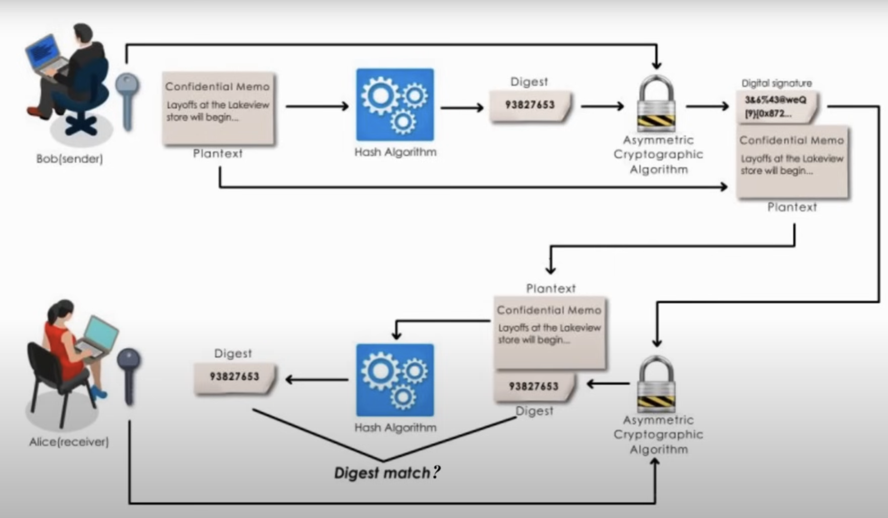

Digital certificates and digital signatures are both cryptographic mechanisms used in securing online communications, but they serve different purposes:

### Digital Certificates:

- A digital certificate is a digital document issued by a trusted Certificate Authority (CA).
It contains information about the identity of the certificate holder (e.g., individual, organization, or website), along with their public key.
- Digital certificates are used primarily for authentication and encryption purposes in secure communication protocols like TLS/SSL.
- They help verify the identity of parties involved in a communication and establish secure connections.
Digital Signatures:

### A digital signature 
Itis a cryptographic technique used to verify the authenticity and integrity of digital messages or documents.

- It involves the use of a private key to create a unique digital signature for a message or document.
- The signature is then attached to the message or document, along with the signer's public key.
- Recipients can use the signer's public key to verify the signature and ensure that the message or document has not been altered or tampered with.
- Digital signatures are often used in electronic transactions, document signing, and ensuring the integrity of data transmitted over insecure channels.

In summary, digital certificates are used to establish trust and authenticate the identities of parties involved in communication, while digital signatures are used to ensure the authenticity and integrity of digital messages or documents. Both mechanisms play critical roles in securing online transactions and communications.

