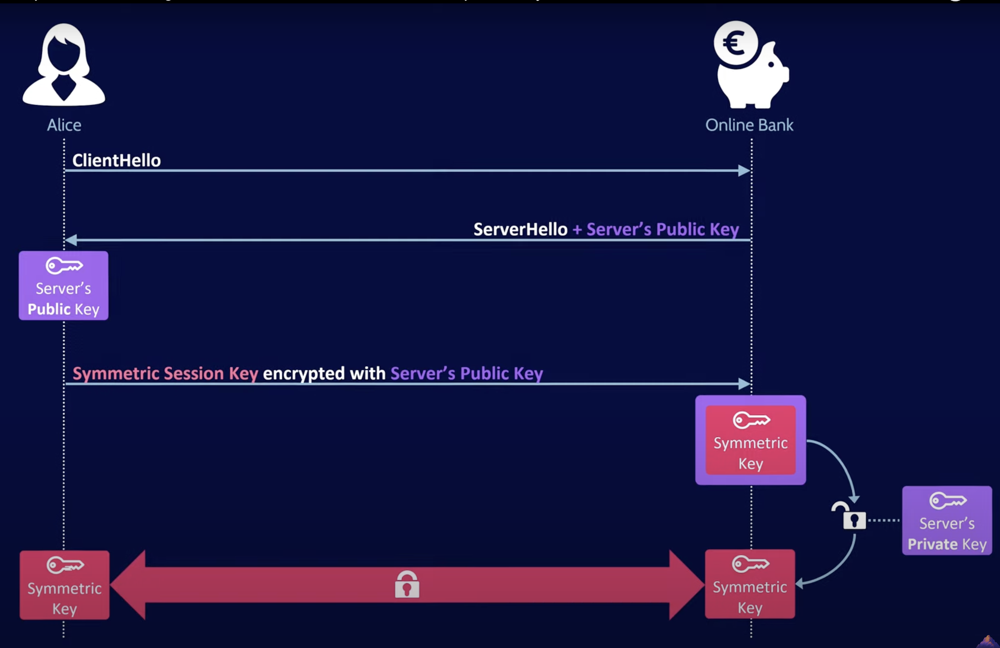
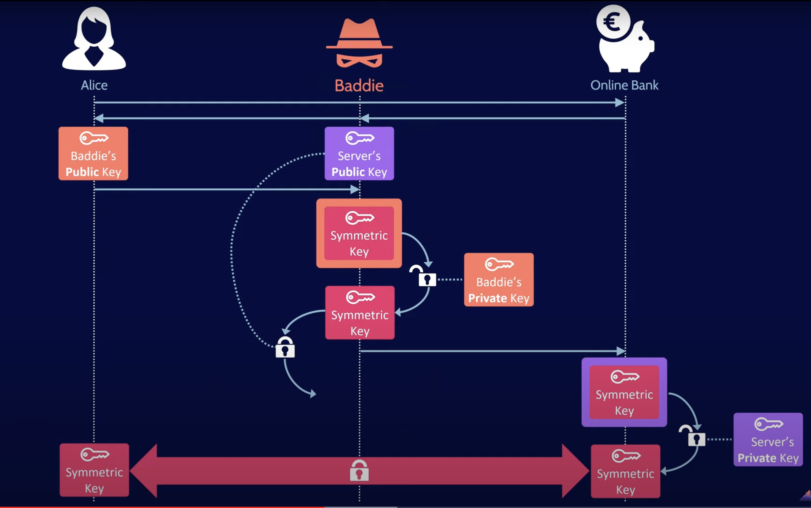
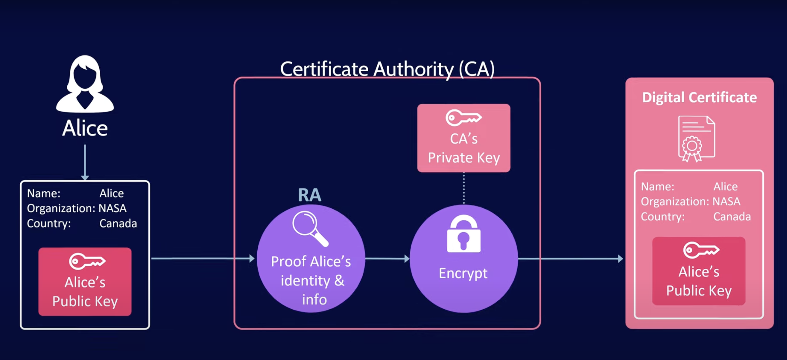
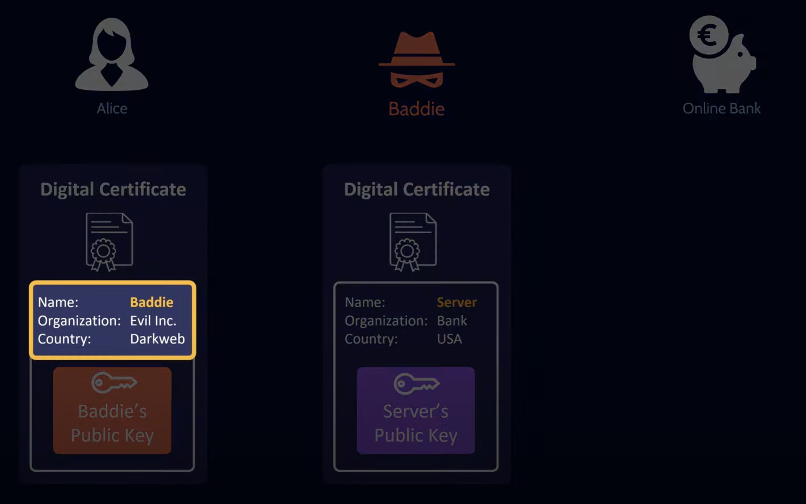
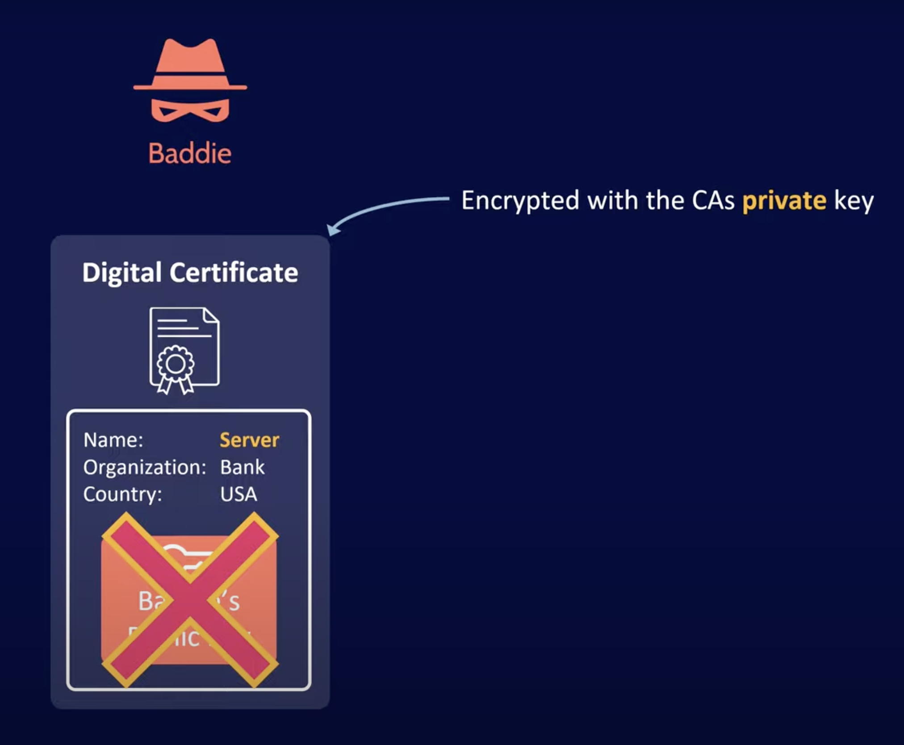

### Digital Certificate
- A digital certificate, also known as a public key certificate, is used to cryptographically link ownership of a public key with the entity that owns it. Digital certificates are for sharing public keys to be used for encryption and authentication.

- It is a digital document used to authenticate the identity of an entity, such as a person, organization, or website, in online transactions or communications. It is issued by a trusted third-party organization known as a Certificate Authority (CA).

- The distribution, authentication and revocation of digital certificates are the primary functions of the public key infrastructure (PKI), the system that distributes and authenticates public keys.

- All major web browsers and web servers use digital certificates to provide assurance that unauthorized actors have not modified published content and to share keys for encrypting and decrypting web content. 

