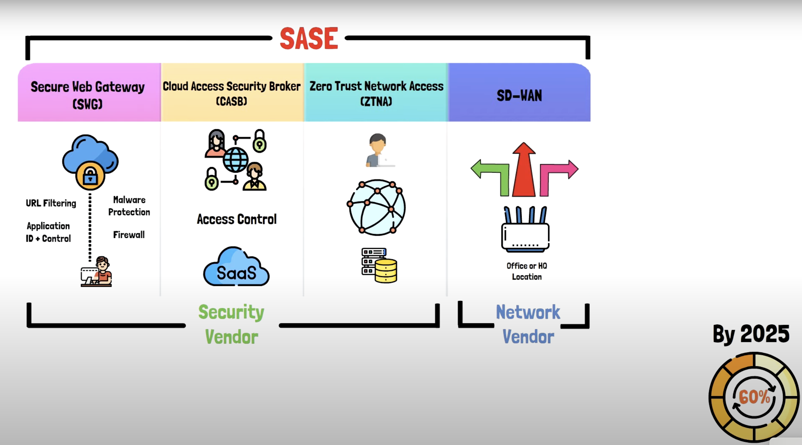
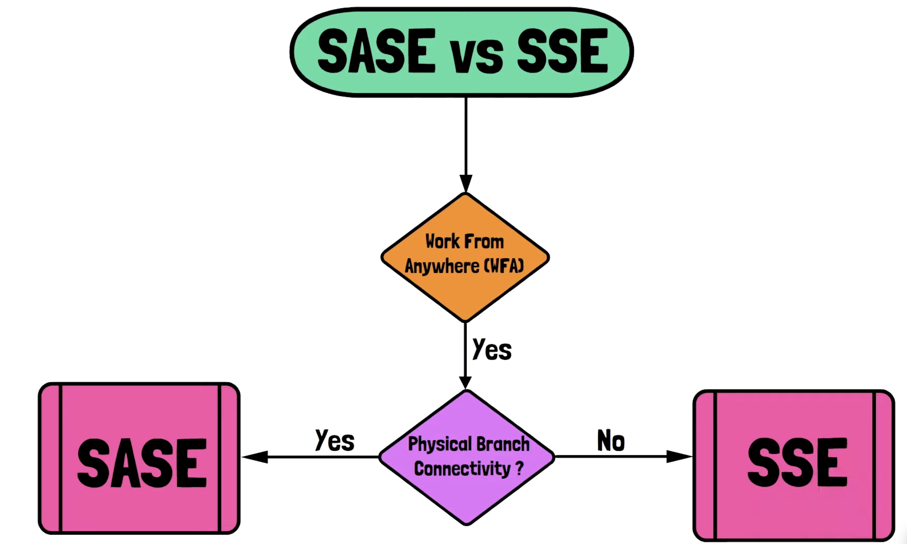

## Secure Access Service Edge
It is made of 4 technologies on high level
- Security
    - Secure web gateway (SWG)
    - Cloud access security broker (CASB)
    - Zero trust network access (ZTNA)
- Network
    - Software defined wide area network (SDWAN)

### Secure gateway access (SGA)

Secure gateway access refers to the controlled and secure entry point into a network or system from external sources, such as remote users, devices, or other networks. It typically involves the use of gateways, such as VPN (Virtual Private Network) gateways or application gateways, to establish secure connections and enforce access policies.

Here's how secure gateway access works:

- `Authentication`: Before gaining access to the network or system, users or devices are required to authenticate their identity. This is typically done through username/password credentials, digital certificates, or multi-factor authentication methods.

- `Encryption`: Once authenticated, the communication between the user/device and the gateway is encrypted to ensure confidentiality and protect data from interception or eavesdropping. This is commonly achieved using protocols like SSL/TLS for web-based communication or IPsec for VPN connections.

- `Access Control`: Access control policies are enforced by the gateway to determine what resources or services the user/device is allowed to access. These policies may be based on user roles, group memberships, device posture, or other factors.

- `Traffic Inspection`: In some cases, secure gateways perform traffic inspection to detect and prevent security threats, such as malware, viruses, or unauthorized access attempts. This may involve deep packet inspection, intrusion detection/prevention systems (IDS/IPS), or application-layer filtering.

- `Logging and Auditing`: Secure gateways typically log access events, authentication attempts, and other security-related activities for audit and compliance purposes. This information can be used for monitoring, analysis, and forensic investigation in the event of security incidents.\

Examples of secure gateway access solutions include:

- `VPN gateways`: Provide secure remote access to the corporate network for remote users or branch offices.
- `SSL/TLS VPNs`: Enable secure access to specific applications or services over the internet without requiring a full VPN client installation.
- `Web application firewalls (WAFs)`: Protect web applications from common web-based attacks, such as SQL injection or cross-site scripting (XSS).
- `Secure email gateways`: Scan email traffic for spam, phishing attempts, and malicious attachments before delivering them to the recipient's inbox.

### what is firewall as service
Firewall-as-a-Service (FWaaS) is a cloud-based security service that provides firewall functionality as a managed service. Instead of deploying and managing physical firewall appliances or software-based firewalls on-premises, organizations can leverage FWaaS offerings from cloud service providers to protect their network infrastructure and applications in the cloud.

Here's an overview of Firewall-as-a-Service:

- `Cloud-Based Solution`: FWaaS operates in the cloud, where the firewall functionality is provided and managed by a third-party cloud service provider. Users access and configure the firewall service through a web-based management interface or API.

- `Managed Service`: With FWaaS, the cloud service provider is responsible for the deployment, configuration, monitoring, and maintenance of the firewall infrastructure. This relieves organizations of the burden of managing and maintaining physical firewall appliances or software-based firewalls on-premises.

- `Scalability`: FWaaS offers scalability and elasticity, allowing organizations to easily scale their firewall capacity up or down based on changing needs and network traffic patterns. Cloud-based firewalls can handle dynamic workloads and accommodate fluctuations in traffic volume more effectively than traditional firewalls.

- `Security Features`: FWaaS typically offers a range of security features and capabilities similar to traditional firewalls, including packet filtering, stateful inspection, intrusion detection and prevention, application control, VPN connectivity, and more. Advanced security functionalities may also be available, such as threat intelligence integration, sandboxing, and cloud-based security analytics.

- `Integration with Cloud Services`: FWaaS can seamlessly integrate with other cloud services and platforms, allowing organizations to enforce consistent security policies across their entire cloud infrastructure. This integration enables organizations to extend their security posture to cloud environments while maintaining centralized management and visibility.

- `Subscription-Based Model`: FWaaS is often offered on a subscription basis, where organizations pay for the firewall service based on usage, features, and support levels. This pay-as-you-go model provides cost predictability and flexibility, as organizations only pay for the resources and features they need.

Overall, Firewall-as-a-Service provides organizations with a flexible, scalable, and cost-effective solution for securing their cloud-based applications and infrastructure, while offloading the management and maintenance overhead to a trusted cloud service provider.

### What is ZTNA

ZTNA stands for Zero Trust Network Access, which is a security model and framework designed to enhance network security by adopting a "never trust, always verify" approach. Unlike traditional network security models that rely on perimeter-based defenses, ZTNA assumes that threats may exist both inside and outside the network perimeter. Therefore, it emphasizes verifying the identity and security posture of all users, devices, and applications attempting to access network resources, regardless of their location.

Key principles of Zero Trust Network Access include:

- `Identity-Centric Security`: ZTNA focuses on authenticating and authorizing users and devices based on their identity attributes, such as user roles, group memberships, and device posture. Access decisions are made dynamically and contextually, considering factors such as user location, device health, and security policies.

- `Least Privilege Access`: ZTNA follows the principle of least privilege, granting users and devices access only to the resources and applications they need to perform their specific tasks. Access permissions are granular and based on the principle of minimal trust.

- `Micro-Segmentation`: ZTNA advocates for network segmentation at a granular level, dividing the network into smaller, isolated segments based on application, workload, or user context. This helps contain potential security breaches and limit the lateral movement of attackers within the network.

- `Continuous Monitoring and Risk Assessment`: ZTNA employs continuous monitoring and risk assessment mechanisms to detect and respond to security threats in real-time. This includes monitoring user behavior, device health, network traffic, and application usage to identify anomalies and potential security incidents.

- `Encryption and Secure Connectivity:` ZTNA relies on strong encryption and secure communication protocols to protect data in transit and ensure the confidentiality and integrity of network traffic. This includes using protocols like TLS (Transport Layer Security) for secure communication and VPNs (Virtual Private Networks) for encrypted remote access.

Overall, Zero Trust Network Access aims to provide comprehensive and adaptive security controls that protect network resources from unauthorized access, insider threats, and external attacks. By adopting a Zero Trust approach, organizations can enhance their security posture, mitigate risk, and improve visibility and control over their network environments.