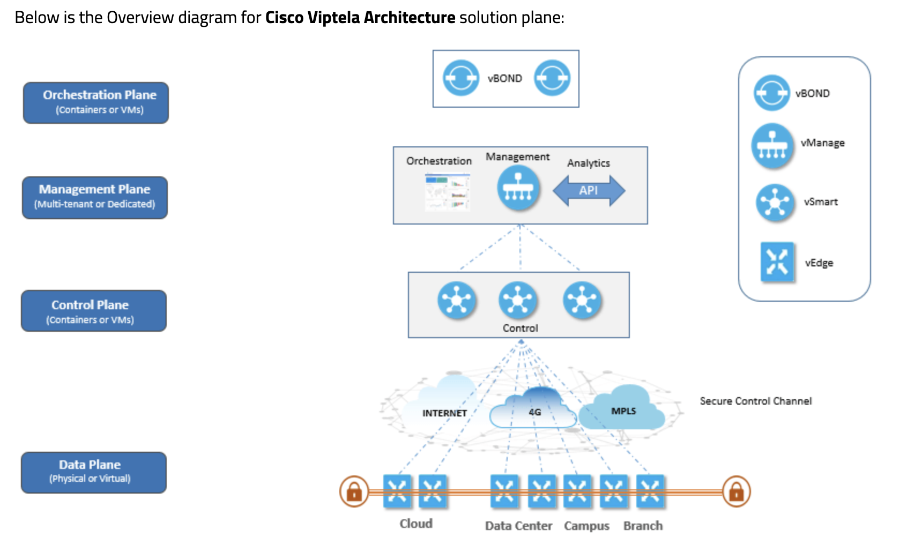

### SDWAN

- SD-WAN, or Software-Defined Wide Area Networking, is a technology that simplifies the management and operation of a wide area network (WAN) by decoupling the networking hardware from its control mechanism. It allows network administrators to use software to control the connectivity, management, and services between data centers, branch offices, and cloud environments.

### Key features of SD-WAN include:

- `Centralized Management`: SD-WAN solutions provide a centralized interface or controller to manage the entire network, allowing administrators to configure and monitor network devices and policies from a single location.

- `Dynamic Path Selection:` SD-WAN intelligently routes traffic across multiple network paths (such as MPLS, broadband internet, or LTE) based on real-time conditions like link quality, latency, and congestion. This dynamic path selection helps optimize application performance and reliability.

- `Application-Based Routing:` SD-WAN can prioritize traffic based on the specific requirements of different applications. It can identify and classify applications running on the network, and apply policies to ensure critical applications receive the necessary bandwidth and quality of service (QoS).

- `Security:` SD-WAN solutions often include built-in security features such as encryption, firewall, and intrusion prevention capabilities to protect data transmitted over the network. Some SD-WAN platforms integrate with third-party security tools and cloud-based security services.

- `Cost Savings:` By leveraging cheaper internet connections alongside traditional MPLS links, SD-WAN can reduce WAN costs while maintaining performance and reliability. It can also streamline network management tasks, reducing operational overhead.

- `Scalability and Flexibility:` SD-WAN architectures are designed to scale with the organization's needs. They can easily accommodate changes in network traffic patterns, new branch locations, or cloud deployments without requiring extensive manual configuration.

Overall, SD-WAN offers organizations greater agility, reliability, and cost-effectiveness compared to traditional WAN technologies. It has become increasingly popular as businesses seek to modernize their network infrastructure to support digital transformation initiatives, cloud adoption, and the growing demand for remote access and distributed workforces.

### Openflow protocol 
- The OpenFlow protocol is a standardized communication interface that allows the control plane to interact with the forwarding plane of network devices such as switches and routers. 
- It enables centralized control of the network infrastructure, making it more programmable, flexible, and adaptable to changing network conditions.

### OSPF and BGP in SDWAN
Yes, SD-WAN (Software-Defined Wide Area Network) solutions can utilize both OSPF (Open Shortest Path First) and BGP (Border Gateway Protocol) protocols, depending on the requirements and design of the network.

#### OSPF in SD-WAN:

- OSPF can be used within the SD-WAN overlay network to facilitate routing and connectivity between SD-WAN edge devices (often referred to as SD-WAN edges or SD-WAN appliances).
Within the SD-WAN overlay network, OSPF can be used to establish dynamic routing and determine the best paths for traffic between SD-WAN edges.
- OSPF can also be used to exchange routing information between SD-WAN edges and the rest of the network infrastructure, including data centers or branch offices that may not be part of the SD-WAN deployment.

#### BGP in SD-WAN:

- BGP is commonly used in SD-WAN deployments to exchange routing information with external networks, such as internet service providers (ISPs) or other autonomous systems (ASes).
- SD-WAN edge devices may use BGP to establish connections with external networks, advertise routes to remote sites or data centers, and optimize traffic routing based on policies and performance metrics.
- BGP can also be used to provide redundancy and failover capabilities in SD-WAN deployments, allowing SD-WAN edges to dynamically reroute traffic in case of link failures or network outages.

In summary, SD-WAN solutions can leverage both OSPF and BGP protocols to achieve dynamic routing, optimize traffic flow, and ensure connectivity between SD-WAN edges and external networks. The choice between OSPF and BGP, as well as their specific configurations, will depend on the requirements of the SD-WAN deployment, the underlying network infrastructure, and the desired network policies and objectives.