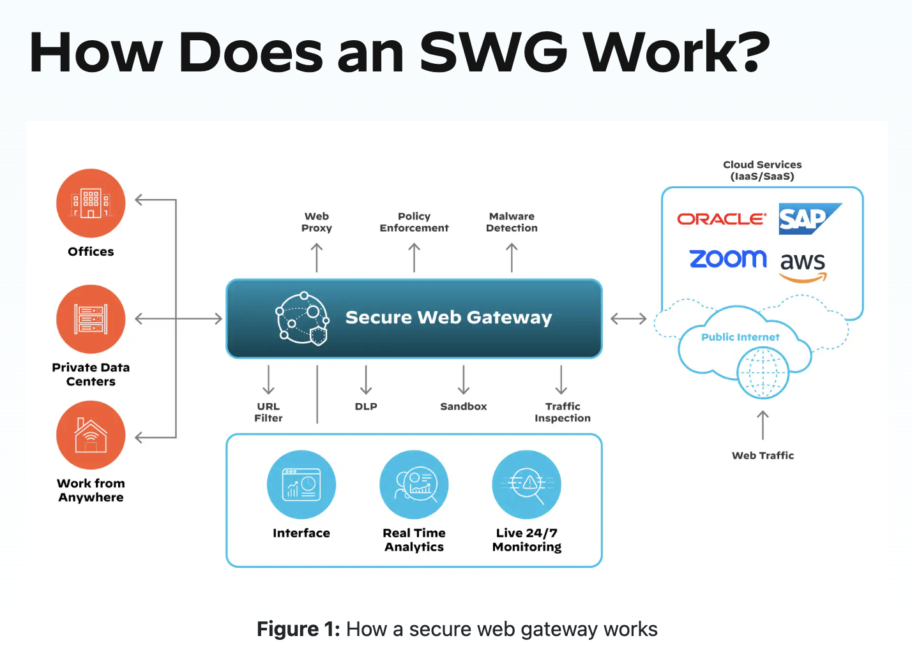
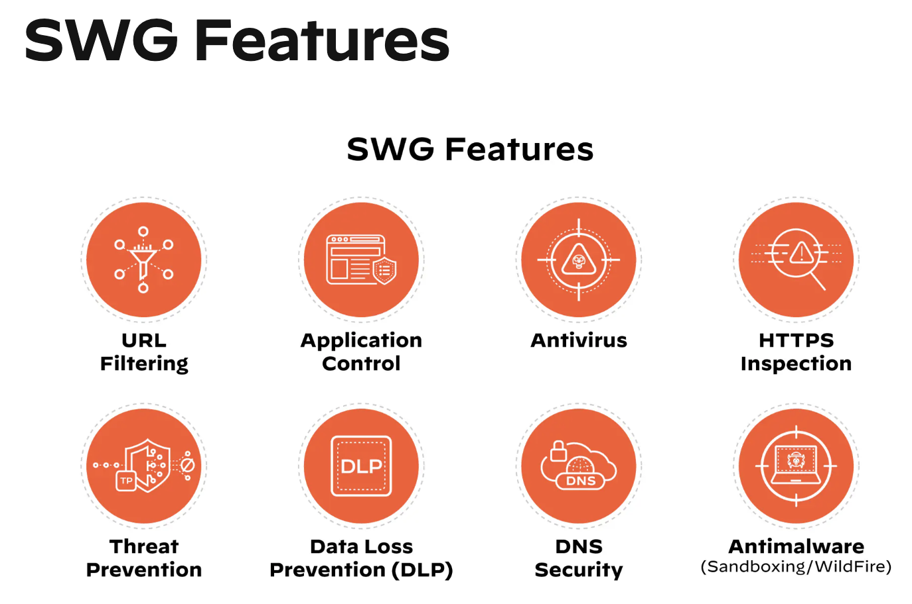

### Secure web gateway
A secure web gateway (SWG) is an on-premises or cloud-delivered network security technology that filters internet traffic and enforces corporate and regulatory policy compliance.

SWG typically stands for Secure Web Gateway. It's a security solution used to monitor and control inbound and outbound web traffic to protect against threats such as 
- malware, 
- ransomware, 
- phishing, and 
- data exfiltration. 

SWGs often include features like URL filtering, SSL inspection, application control, and antivirus scanning to enforce security policies and prevent unauthorized access or malicious activity on corporate networks.

### SWG Features

To support the key functions laid out above, an effective SWG includes capabilities like:
- `URL filtering `to block or allow user access to websites according to policy
- `Application control` to enforce policy on the usage of web-based apps and cloud services
- `TLS/SSL inspection` capabilities to discover threats hiding in encrypted traffic
- `Advanced threat protection`, including anti-malware, antivirus, and anti-phishing measures
- `Data loss prevention (DLP)` to prevent loss or leakage of sensitive data
- `Bandwidth controls` to prevent certain sites or apps from consuming excess bandwidth
- `Remote user protection` to secure users operating outside the network perimeter
- `Policy management` tools to help administrators set and enforce security policies

### What Are the Benefits of a SWG?
An effective SWG enables you to:
- Restrict or block access to risky or malicious websites and web-based apps
- Protect against ransomware, other malware, and phishing in real time
- Enforce compliance with company, industry, or government regulatory policies
- Support hybrid work models with fast, seamless, and secure connections to web-based resources and SaaS apps

### Implementing a Secure Web Gateway (SWG) typically involves several components and steps:
- `Proxy Server`: The proxy server intercepts web requests from users and forwards them to the internet. It acts as an intermediary between users and web servers, allowing inspection and filtering of web traffic.

- `URL Filtering`: SWGs use URL filtering to block access to malicious or inappropriate websites based on predefined URL categories or blacklists. They can also enforce policies based on the content of web pages.

- `SSL Inspection`: SWGs decrypt and inspect encrypted HTTPS traffic to detect and block threats hidden within SSL/TLS-encrypted connections. This involves intercepting SSL/TLS traffic, decrypting it, inspecting the content, and then re-encrypting it before forwarding it to the destination.

- `Antivirus and Malware Protection`: SWGs include antivirus and anti-malware capabilities to scan web traffic for known malware signatures and behaviors. They can quarantine or block access to malicious content to prevent infections.

- `Application Control`: SWGs can control access to web-based applications and services by enforcing policies based on application categories, usage, or user roles. They can allow or block access to specific applications to improve productivity and security.

- `Data Loss Prevention` (DLP): Some SWGs offer DLP features to prevent sensitive data from leaving the organization through web channels. They can inspect web traffic for sensitive information such as credit card numbers or intellectual property and enforce policies to prevent data leaks.

- `Reporting and Logging`: SWGs provide reporting and logging capabilities to monitor web traffic, security events, and policy violations. They generate logs and reports that help administrators analyze web usage patterns, identify security incidents, and ensure compliance with security policies.

- `Integration with Identity and Access Management` (IAM): SWGs often integrate with IAM solutions such as LDAP or Active Directory to enforce access controls based on user identities and roles. This allows organizations to apply different policies to different user groups.

- `Scalability and High Availability`: SWGs should be designed for scalability and high availability to handle large volumes of web traffic and ensure uninterrupted service. They may include load balancing, clustering, and failover mechanisms to distribute traffic and maintain uptime.

Implementing an SWG involves deploying and configuring these components according to the organization's security requirements and policies. It also requires ongoing monitoring, maintenance, and updates to adapt to evolving threats and protect against emerging risks.

### Is Secure Web Gateway a Firewall?
Firewalls and SWGs perform similar tasks, but they’re not one and the same. Firewalls review the contents of incoming packets and compare their findings against a signature of known threats at the network level only. SWGs operate at the application level, and they can block or allow connections or keywords according to an organization’s web use policy.

### Is a Web Gateway a Proxy?
Web gateways and proxies have key differences. A proxy server and a gateway both route traffic from a network to the internet, but a proxy server filters which connections are allowed, while a gateway doesn't do any filtering. In this sense, a gateway more closely resembles a door to get to the internet, and a proxy server a wall that bars the inside of the network from being exposed to the internet.

### Is a SWG a VPN?
Secure web gateways (SWGs) and virtual private networks (VPNs) both have roles in securing traffic, but they are far from the same technology. SWGs primarily focus on protecting users and devices by preventing web-based threats and enforcing an organization’s web policies, whereas VPNs provide encrypted, private connections over public networks to support remote work, bypass geographical web content restrictions, etc.