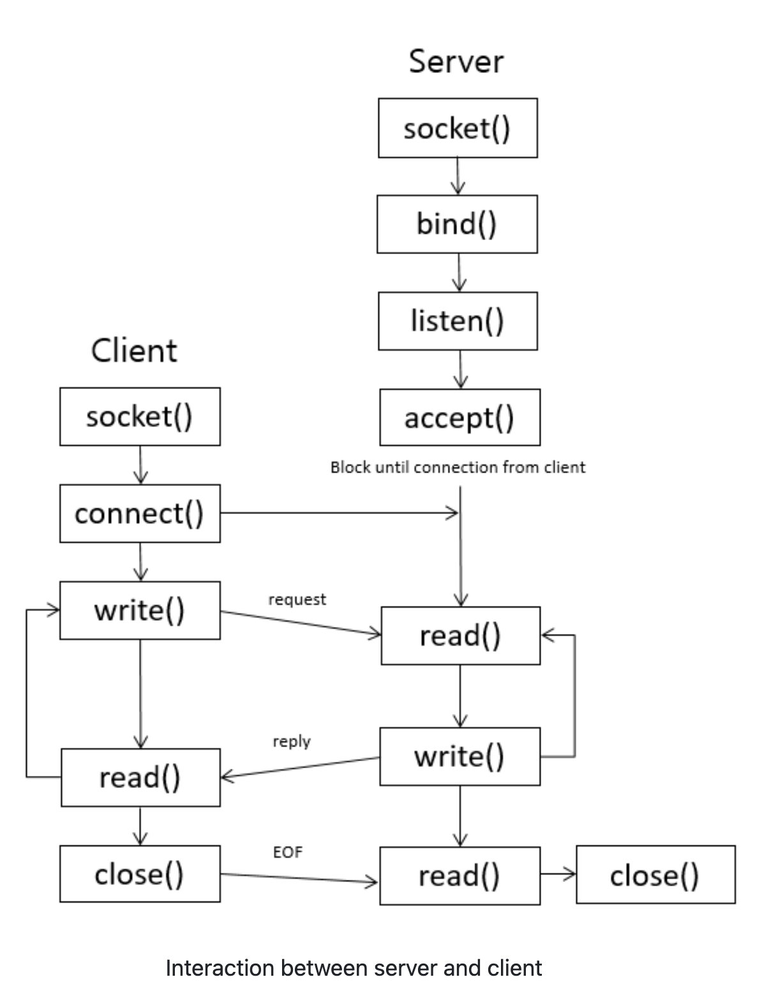

### What is Socket
- With socket, two different processes can communicate each other
- Socket is nothing but a file by using that 2 process running on 2 different or same networks communicated with each other
- Its a Layer 4 communication created using IP and Port number combination.
- You can just imagine that two different processes have files (socket) and the they read received data from socket and write to socket for sending data to network
- So, socket has file descriptor, which is just an integer to identify opened file
### Types
- Stream Sockets (TCP based)
- Datagram Sockets (UDP based)
### communication 


### 1. Structure
- `sockaddr` : generic socket address structure
- `sockaddr_in` : one type of sockaddr, it represents port number IP address
- `in_addr` : structure used in abote sockaddr_in
- `hostent` : contains information related to host

```cpp
struct sockaddr {
    // represents an address family, most of cases AF_INET)
    unsigned short     sa_family;
    
    // 14 bytes of protocol specific address, for the internet
    // family, port number IP address (sockaddr_in) is used
    char               sa_data[14]; 
}

struct sockaddr_in {
    short int              sin_family;   // AF_INET
    unsigned short int     sin_port;     // 16-bit port number
    struct in_addr         sin_addr;     // 32-bit IP address
    unsigned char          sin_zero[8];  
}

struct in_addr {
    unsigned long s_addr;
}

struct hostent {
    char *h_name;       // e.g. unist.ac.kr
    char **h_aliases;   // list of host name alias
    int h_addrtype;     // AF_INET
    int h_length;       // length of ip address 
    char **h_addr_list; // points to structure in_addr
    #define h_addr h_addr_list[0]
};

```
### 2. Network Byte Orders
To make machines with different byte order communicate each other, Internet protocol specify a canonical byte order convention for data transmitted over the network. This is called Network Byte Order. for eg. Little Endian, Big Endian
- `sin_port` `sin_addr` of `sockaddr_in` should be set with this Network Byte Order.
```cpp
htons() : Host to Network Short
htonl() : Host to Network Long
ntohl() : Network to Host Long
ntohs() : Network to Host Short
```

### 3. IP Address Function
-  int inet_aton(const char *strptr, struct in_addr *addrptr)
-  in_addr_t inet_addr(const char *strptr)
-  char *inet_ntoa(struct in_addr inaddr)
```cpp
#include <arpa/inet.h>
int retval;
struct in_addr addrptr
memset(&addrptr, '\0', sizeof(addrptr));
retval = inet_aton("68.178.157.132", &addrptr);

#include <arpa/inet.h>
struct sockaddr_in dest;
memset(&dest, '\0', sizeof(dest));
dest.sin_addr.s_addr = inet_addr("68.178.157.132");

#include <arpa/inet.h>
char *ip;
ip = inet_ntoa(dest.sin_addr);
printf("IP Address is : %s\n", ip);
```

### 4. Socket Functions 

```cpp
#include <sys/types.h>
#include <sys/socket.h>
// For TCP

/*
- family : AF_INET, AF_INET6, AF_LOCAL, AF_ROUTE, AF_KEY
- type : SOCK_STREAM (TCP), SOCK_DGRAM (UDP), SOCK_SEQPACKET, SOCK_RAW
- protocol : IPPROTO_TCP, IPPROTO_UDP, IPPROTO_SCTP, (0 : system default)
This function returns socket descriptor, so you can use it for another functions
*/

int socket (int family, int type, int protocol);

/*
sockfd : socket descriptor returned by the socket function
serv_addr : sockaddr that contains destination IP address and port
addrlen : set it to sizeof(struct sockaddr)
*/
int connect(int sockfd, struct sockaddr *serv_addr, int addrlen);

/*
my_addr : sockaddr that contains local IP address and port
*/
int bind(int sockfd, struct sockaddr *my_addr,int addrlen);

/*
converts unconnected socket to passive socket (kernel should accept incoming connection request directed to this socket)
backlog : maximum number of connections the kernel should queue for this socket
*/
int listen(int sockfd,int backlog);

/*
returns the next completed connection from the front of the completed connection queue
cliaddr : sockaddr struct that contains client IP address and port
addrlen : set it to sizeof (struct sockaddr)
*/
int accept (int sockfd, struct sockaddr *cliaddr, socklen_t *addrlen)

/*
for sending data
*/
int send(int sockfd, const void *msg, int len, int flags);
/*
buf : buffer to read the information into
len : It is the maximum length of the buffer
flags : set it to 0
*/
int recv(int sockfd, void *buf, int len, unsigned int flags);
int close( int sockfd );

// For UDP sendto and recvfrom functions are used instead of send recv
int sendto(int sockfd, const void *msg, int len, unsigned int flags, const struct sockaddr *to, int tolen);
int recvfrom(int sockfd, void *buf, int len, unsigned int flags struct sockaddr *from, int *fromlen);

```

### Client Code Example

```cpp
#include <stdio.h>
#include <stdlib.h>

#include <netdb.h>
#include <netinet/in.h>

#include <string.h>

int main(int argc, char *argv[]) {
    int sockfd, portno, n;
    struct sockaddr_in serv_addr;

    struct hostent *server;

    char buffer[256];
    portno = 5001;

    // 1. create socket and get file descriptor
    sockfd = socket(AF_INET, SOCK_STREAM, 0);

    server = gethostbyname("127.0.0.1");

    if (server == NULL) {
        fprintf(stderr,"ERROR, no such host\n");
        exit(0);
    }

    bzero((char *) &serv_addr, sizeof(serv_addr));
    serv_addr.sin_family = AF_INET;
    bcopy((char *)server->h_addr, (char *)&serv_addr.sin_addr.s_addr, server->h_length);
    serv_addr.sin_port = htons(portno);


    // 2. connect to server with server address which is set above (serv_addr)

    if (connect(sockfd, (struct sockaddr *)&serv_addr, sizeof(serv_addr)) < 0) {
        perror("ERROR while connecting");
        exit(1);
    }

    // inside this while loop, implement communicating with read/write or send/recv function
    while (1) {
        printf("What do you want to say? ");
        bzero(buffer,256);
        scanf("%s", buffer);

        // 3 send some data to server
        n = write(sockfd,buffer,strlen(buffer));

        if (n < 0){
            perror("ERROR while writing to socket");
            exit(1);
        }

        bzero(buffer,256);

        // 4 receive some data from server
        n = read(sockfd, buffer, 255);

        if (n < 0){
            perror("ERROR while reading from socket");
            exit(1);
        }
        printf("server replied: %s \n", buffer);

        // escape this loop, if the server sends message "quit"
        if (!bcmp(buffer, "quit", 4))
            break;
    }
    return 0;
}
```

### Single Server Code Example
```cpp
#include <stdio.h>
#include <stdlib.h>

#include <netdb.h>
#include <netinet/in.h>

#include <string.h>

int main( int argc, char *argv[] ) {
    int sockfd, newsockfd, portno, clilen;
    char buffer[256];
    struct sockaddr_in serv_addr, cli_addr;
    int  n;

    /* Initialize socket structure */
    bzero((char *) &serv_addr, sizeof(serv_addr));
    portno = 5001;

    // 1. create socket and get file descriptor
    sockfd = socket(AF_INET, SOCK_STREAM, 0);

    serv_addr.sin_family = AF_INET;
    serv_addr.sin_addr.s_addr = INADDR_ANY;
    serv_addr.sin_port = htons(portno);

    clilen = sizeof(cli_addr);

    // 2. bind the host address using bind() call
    if (bind(sockfd, (struct sockaddr *)&serv_addr, sizeof(serv_addr)) < 0){
        perror("ERROR on binding\n");
        exit(1);
    }

    // 3. start listening for the clients,
    // here process will go in sleep mode and will wait for the incoming connection
    listen(sockfd, 5);

    // 4. accept actual connection from the client
    newsockfd = accept(sockfd, (struct sockaddr *)&cli_addr, &clilen);

    // inside this while loop, implemented communication with read/write or send/recv function
    printf("start");
    while (1) {
        bzero(buffer,256);
        // 5. read data from client 
        n = read(newsockfd, buffer, 255);

        if (n < 0){
            perror("ERROR in reading from socket");
            exit(1);
        }

        printf("client said: %s \n", buffer);

        // 5. Write data to client 
        n = write(newsockfd, buffer, strlen(buffer));

        if (n < 0){
            perror("ERROR in writing to socket");
            exit(1);
        }

        // escape this loop, if the client sends message "quit"
        if (!bcmp(buffer, "quit", 4))
            break;
    }
    return 0;
}
```

### Multi client supported server

```cpp
#include <stdio.h>
#include <stdlib.h>

#include <netdb.h>
#include <netinet/in.h>

#include <string.h>
#include <unistd.h>
#include <stdbool.h>
#include <time.h>

void bzero(void *a, size_t n) {
    memset(a, 0, n);
}

void bcopy(const void *src, void *dest, size_t n) {
    memmove(dest, src, n);
}

struct sockaddr_in* init_sockaddr_in(uint16_t port_number) {
    struct sockaddr_in *socket_address = malloc(sizeof(struct sockaddr_in));
    memset(socket_address, 0, sizeof(*socket_address));
    socket_address -> sin_family = AF_INET;
    socket_address -> sin_addr.s_addr = htonl(INADDR_ANY);
    socket_address -> sin_port = htons(port_number);
    return socket_address;
}

char* process_operation(char *input) {
    size_t n = strlen(input) * sizeof(char);
    char *output = malloc(n);
    memcpy(output, input, n);
    return output;
}

int main( int argc, char *argv[] ) {

    const uint16_t port_number = 5001;
    // 1. Socket
    int server_fd = socket(AF_INET, SOCK_STREAM, 0);

    struct sockaddr_in *server_sockaddr = init_sockaddr_in(port_number);
    struct sockaddr_in *client_sockaddr = malloc(sizeof(struct sockaddr_in));
    socklen_t server_socklen = sizeof(*server_sockaddr);
    socklen_t client_socklen = sizeof(*client_sockaddr);

    // 2. bind
    if (bind(server_fd, (const struct sockaddr *) server_sockaddr, server_socklen) < 0)
    {
        printf("Error! Bind has failed\n");
        exit(0);
    }

    // 3. listen
    if (listen(server_fd, 3) < 0)
    {
        printf("Error! Can't listen\n");
        exit(0);
    }


    const size_t buffer_len = 256;
    char *buffer = malloc(buffer_len * sizeof(char));
    char *response = NULL;
    time_t last_operation;
    __pid_t pid = -1;

    while (1) {
        // 4. accept
        int client_fd = accept(server_fd, (struct sockaddr *) &client_sockaddr, &client_socklen);

        pid = fork();

        if (pid == 0) {
            close(server_fd);

            if (client_fd == -1) {
                exit(0);
            }

            printf("Connection with `%d` has been established and delegated to the process %d.\nWaiting for a query...\n", client_fd, getpid());

            last_operation = clock();

            while (1) {
                // 5. read
                read(client_fd, buffer, buffer_len);

                if (buffer == "close") {
                    printf("Process %d: ", getpid());
                    // 7. close
                    close(client_fd);
                    printf("Closing session with `%d`. Bye!\n", client_fd);
                    break;
                }

                if (strlen(buffer) == 0) {
                    clock_t d = clock() - last_operation;
                    double dif = 1.0 * d / CLOCKS_PER_SEC;

                    if (dif > 5.0) {
                        printf("Process %d: ", getpid());
                        close(client_fd);
                        printf("Connection timed out after %.3lf seconds. ", dif);
                        printf("Closing session with `%d`. Bye!\n", client_fd);
                        break;
                    }

                    continue;
                }

                printf("Process %d: ", getpid());
                printf("Received `%s`. Processing... ", buffer);

                free(response);
                response = process_operation(buffer);
                bzero(buffer, buffer_len * sizeof(char));

                // 5. send
                send(client_fd, response, strlen(response), 0);
                printf("Responded with `%s`. Waiting for a new query...\n", response);

                last_operation = clock();
            }
            exit(0);
        }
        else {
            close(client_fd);
        }
    }
}
```