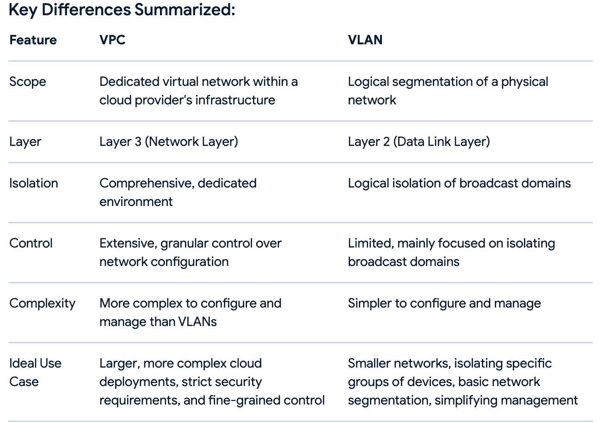

## VCP vs VLAN
- In the context of cloud computing, a Virtual Private Cloud (VPC) is a dedicated, isolated network environment within a public cloud provider's infrastructure, while a VLAN (Virtual Local Area Network) is a layer 2 (data link layer) network segmentation technique that isolates traffic within a single physical network.
- VPCs are more comprehensive and offer a higher level of isolation and control than VLANs, making them suitable for larger, more complex cloud deployments. 

## VPC (Virtual Private Cloud):

- `Comprehensive Isolation`: VPCs provide a dedicated, virtualized network environment within a cloud provider's infrastructure, logically isolating resources from other tenants and the public internet. 

- `Layer 3 Segmentation`: VPCs operate at layer 3 (network layer) of the OSI model, utilizing IP addresses and routing for communication within the VPC. 

- `Granular Control`: VPCs offer fine-grained control over network configuration, including IP address ranges, routing, security groups, and subnetworks, allowing for tailored network designs. 

- `Suitable for`: Larger cloud deployments, complex network configurations, and organizations needing strict control over their cloud resources. 

## VLAN (Virtual Local Area Network):
A virtual local area network or VLAN is a logical grouping of devices connected to a single Ethernet segment. It helps networks by reducing the number of broadcast domains per network device and network subnet. And This allows multiple networks to share the same physical infrastructure without interfering.

- `Layer 2 Segmentation`: VLANs are a layer 2 (data link layer) segmentation technique that logically groups devices on a physical network into multiple broadcast domains. 

- `Simplifies network management`: VLANs can simplify network management by isolating traffic between different groups of devices, improving security and performance. 

- `Suitable for`: Smaller networks, isolating specific groups of devices within a shared physical network, and basic network segmentation needs. 

