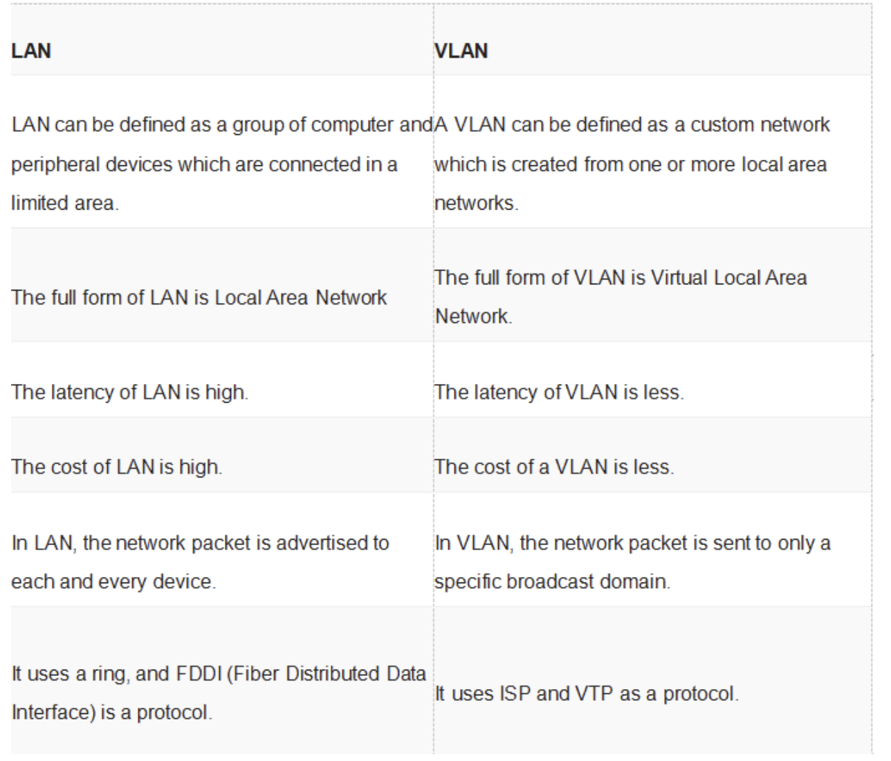

### VLAN
- VLAN stands for Virtual Local Area Network. It is a network technology that allows network administrators to logically segment a single physical network into multiple virtual networks. Each VLAN operates as if it were a separate physical network, even though devices in the same VLAN can be located physically anywhere on the underlying network.
- VLAN is a custom network which is created from one or more local area networks. It enables a group of devices available in multiple networks to be combined into one logical network. The result becomes a virtual LAN that is administered like a physical LAN. The full form of VLAN is defined as Virtual Local Area Network.
- Without VLANs, a broadcast sent from a host can easily reach all network devices. Each and every device will process broadcast received frames. It can increase the CPU overhead on each device and reduce the overall network security.
- VLAN in networking is a virtual extension of LAN. A LAN is a group of computer and peripheral devices which are connected in a limited area such as school, laboratory, home, and office building. It is a widely useful network for sharing resources like files, printers, games, and other applications.

Here are some key points about VLANs:

#### Logical Segmentation: 
VLANs enable the logical segmentation of a single physical network into multiple broadcast domains. Devices within the same VLAN can communicate with each other as if they were connected to the same physical network, while devices in different VLANs cannot communicate directly without the use of routing or other inter-VLAN communication methods.

#### Benefits:
- `Network Segmentation`: VLANs provide a way to segment network traffic, improve network performance, and enhance security by separating different types of traffic or groups of users into distinct VLANs.
- `Broadcast Control`: By dividing a network into VLANs, broadcast traffic is confined within each VLAN, reducing the overall amount of broadcast traffic on the network and improving network efficiency.
- `Security`: VLANs can be used to isolate sensitive or critical network resources, such as servers or administrative devices, from other parts of the network, providing an additional layer of security.

#### Membership:
- Devices are assigned to VLANs based on criteria such as port numbers on switches, MAC addresses, IP addresses, or protocols.
- VLAN membership can be statically configured (static VLANs) or dynamically assigned using protocols such as IEEE 802.1Q VLAN tagging (dynamic VLANs).

#### VLAN Tagging:
- IEEE 802.1Q is the standard protocol used for VLAN tagging. It adds a VLAN tag to Ethernet frames, indicating the VLAN to which the frame belongs.
- VLAN tagging allows devices connected to trunk ports on switches to carry traffic for multiple VLANs over a single physical link.

#### Inter-VLAN Communication:
- Devices in different VLANs cannot communicate directly with each other without routing or other inter-VLAN communication methods.
- Inter-VLAN communication can be achieved using routers, layer 3 switches, or VLAN-aware firewalls to route traffic between VLANs.

#### Types:
- `Standard VLANs`: These are VLANs that are defined based on Layer 2 information, such as MAC addresses or port numbers on switches.
- `Voice VLANs`: Special VLANs designed to carry voice traffic for VoIP (Voice over IP) applications, ensuring quality of service (QoS) for voice traffic.
- `Management VLANs`: VLANs used for managing network devices, such as switches, routers, and access points, separately from user traffic.

Overall, VLANs provide a flexible and scalable way to segment and manage network traffic, improving network performance, security, and manageability in enterprise and service provider networks.

## Characteristics of VLAN
Here are the important characteristics of VLAN:

· Virtual LANs offer structure for making groups of devices, even if their networks are different.

· It increases the broadcast domains possible in a LAN.

· Implementing VLANs reduces the security risks as the number of hosts which are connected to the broadcast domain decreases.

· This is performed by configuring a separate virtual LAN for only the hosts having sensitive information.

· It has a flexible networking model that groups users depending on their departments instead of network location.

· Changing hosts/users on a VLAN is relatively easy. It just needs a new port-level configuration.

· It can reduce congestion by sharing traffic as individual VLAN works as a separate LAN.

· A workstation can be used with full bandwidth at each port.

· Terminal reallocations become easy.

· A VLAN can span multiple switches.

· The link of the trunk can carry traffic for multiple LANs.

### Port-Based VLAN
Port-based VLANs groups virtual local area network by port. In this type of virtual LAN, a switch port can be configured manually to a member of VLAN.

Devices that are connected to this port will belong to the same broadcast domain that is because all other ports are configured with a similar VLAN number.

The challenge of this type of network is to know which ports are appropriate to each VLAN. The VLAN membership can’t be known just by looking at the physical port of a switch. You can determine it by checking the configuration information.

### Protocol Based VLAN
This type of VLAN processes traffic based on a protocol that can be used to define filtering criteria for tags, which are untagged packets.

In this Virtual Local Area Network, the layer-3 protocol is carried by the frame to determine VLAN membership. It works in multi-protocol environments. This method is not practical in a predominately IP based network.

### MAC Based VLAN
MAC Based VLAN allows incoming untagged packets to be assigned virtual LAN and, thereby, classify traffic depending on the packet source address. You define a Mac address to VLAN mapping by configuring mapping the entry in MAC to the VLAN table.

This entry is specified using source Mac address proper VLAN ID. The configurations of tables are shared among all device ports.

## Difference between LAN and VLAN

### Advantages of VLAN
Here are the important pros/benefits of VLAN:

· It solves a broadcast problem.

· VLAN reduces the size of broadcast domains.

· VLAN allows you to add an additional layer of security.

· It can make device management simple and easier.

· You can make a logical grouping of devices by function rather than location.

· It allows you to create groups of logically connected devices that act like they are on their own network.

· You can logically segment networks based on departments, project teams, or functions.

· VLAN helps you to geographically structure your network to support the growing companies.

· Higher performance and reduced latency.

· VLANs provide increased performance.

· Users may work on sensitive information that must not be viewed by other users.

· VLAN removes the physical boundary.

· It lets you easily segment your network.

· It helps you to enhance network security.

· You can keep hosts separated by VLAN.

· You do not require additional hardware and cabling, which helps you to saves costs.

· It has operational advantages because of changing the IP subnet of the user is in software.

· It reduces the number of devices for particular network topology.

· VLAN makes managing physical devices less complex.

### Disadvantages of VLAN
Here are the important cons/ drawbacks of VLAN:

· A packet can leak from one VLAN to other.

· An injected packet may lead to a cyber-attack.

· Threat in a single system may spread a virus through a whole logical network.

· You require an additional router to control the workload in large networks.

· You can face problems in interoperability.

· A VLAN cannot forward network traffic to other VLANs.

### Application/Purpose of VLAN
Here are the important uses of VLAN:

· VLAN is used when you have 200+ devices on your LAN.

· It is helpful when you have a lot of traffic on a LAN.

· VLAN is ideal when a group of users need more security or being slow down by many broadcasts.

· It is used when users are not on one broadcast domain.

· Make a single switch into multiple switches.

### Summary:
· VLAN is defined as a custom network which is created from one or more local area networks.

· VLAN in networking are identified by a number.

· A Valid range is 1-4094. On a VLAN switch, you assign ports with the proper VLAN number.

· Virtual LANs offer structure for making groups of devices, even if their networks are different.

· The main difference between LAN and VLAN is that In LAN, the network packet is advertised to each and every device Whereas in VLAN, the network packet is sent to only a specific broadcast domain.

· The primary advantage of VLAN is that it reduces the size of broadcast domains.

· The drawback of VLAN is that an injected packet may lead to a cyber-attack.

· VLAN is used when you have 200+ devices on your LAN.