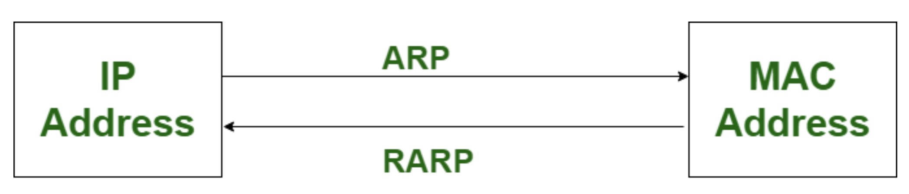

ARP (Address Resolution Protocol) and RARP (Reverse Address Resolution Protocol) are network protocols used to map IP addresses to MAC addresses and vice versa. Here's a brief explanation of each:

### Address Resolution Protocol (ARP):
- ARP is used to find the MAC address of a device (such as a computer or router) on a local network when only its IP address is known.
- When a device wants to send data to another device on the same network, it first checks its ARP cache (a table that maps IP addresses to MAC addresses). If the MAC address is not found in the cache, the device sends out an ARP request packet asking for the MAC address associated with the target IP address.
- The device with the IP address in question then responds to the ARP request with its MAC address, allowing the requesting device to send data to the correct destination.

### Reverse Address Resolution Protocol (RARP):
- RARP is the opposite of ARP. It is used to find the IP address of a device when only its MAC address is known.
- RARP was primarily used in older network configurations where devices needed to obtain an IP address during the boot process, but it has largely been replaced by other methods such as DHCP (Dynamic Host Configuration Protocol).

In summary, ARP is used to resolve IP addresses to MAC addresses, while RARP is used to resolve MAC addresses to IP addresses.

### what are devices are using ARP and RARP protocol
ARP (Address Resolution Protocol) and RARP (Reverse Address Resolution Protocol) are network protocols used by various devices in a network environment. Here's a brief overview of the devices that commonly utilize these protocols:

#### ARP (Address Resolution Protocol):
- `Hosts/End Devices`: Hosts such as computers, laptops, smartphones, and other networked devices use ARP to resolve IP addresses to MAC (Media Access Control) addresses.
- `Routers`: Routers use ARP to build and maintain ARP tables, which map IP addresses to MAC addresses for devices within their local network segments.
- `Switches`: Switches use ARP to learn the MAC addresses of devices connected to their ports, helping them forward network traffic more efficiently within a local network segment.

#### RARP (Reverse Address Resolution Protocol):
- `Diskless Workstations`: Diskless workstations or devices without permanent storage may use RARP to obtain their IP addresses from a server on the network.
- `Legacy Systems`: Some legacy systems or older networking equipment might still support RARP for IP address assignment.
It's important to note that while ARP is widely used in modern networks, RARP has become less common with the adoption of other IP address assignment methods such as DHCP (Dynamic Host Configuration Protocol).