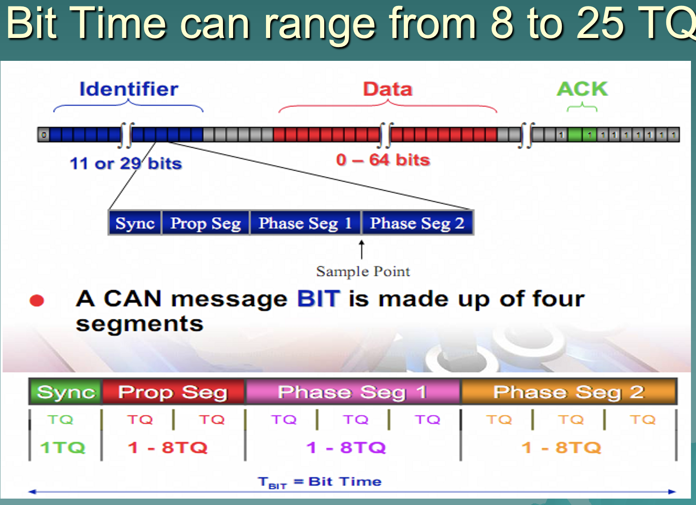
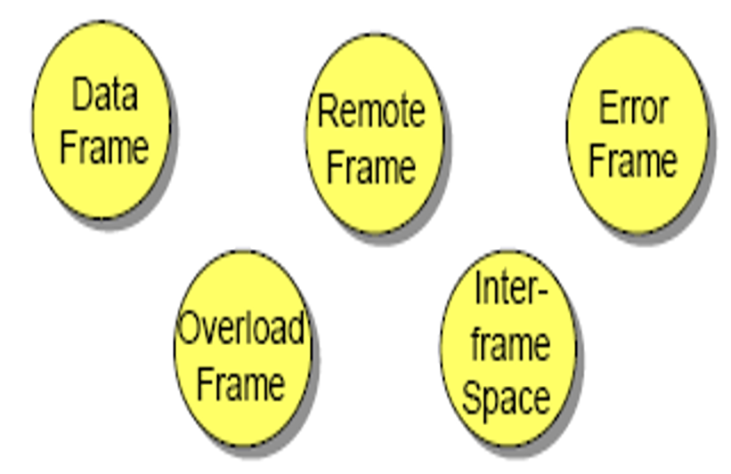
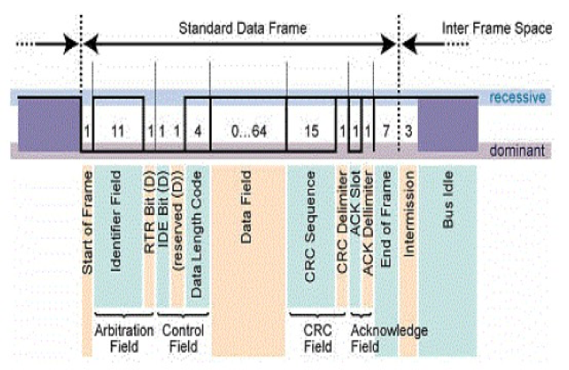
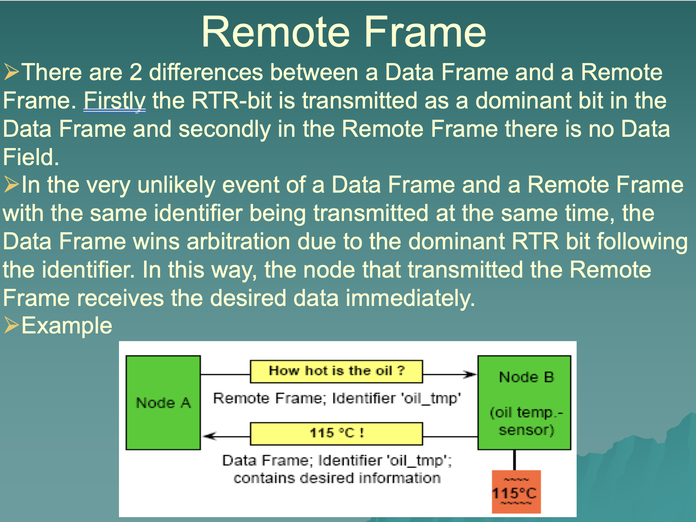
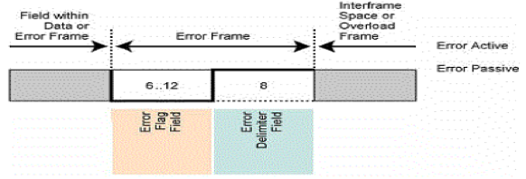
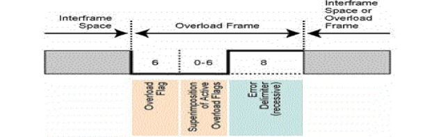
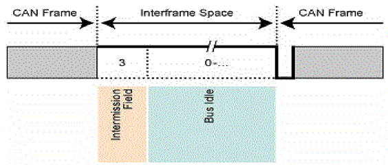
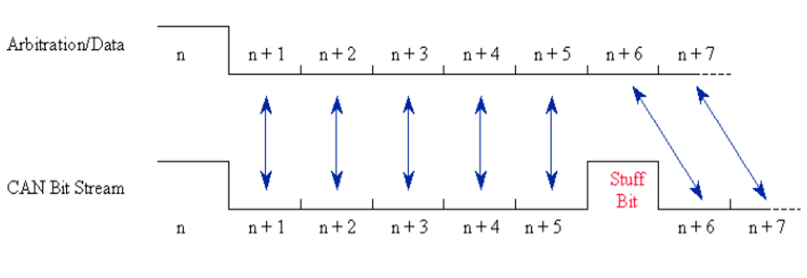
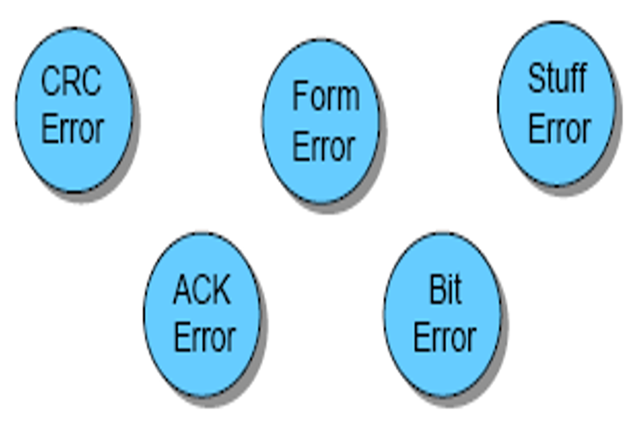
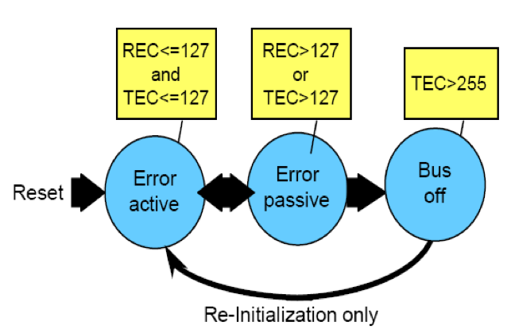

## CAN (Control Area Network ISO 11898) ##
- CAN works on serial bus topology
- The CAN bus is a broadcast type of bus. This means that all nodes can ‘hear’ all transmissions. There is no way to send a message to just a specific node; all nodes will invariably pick up all traffic. The CAN hardware, however, provides local filtering so that each node may react only on the interesting messages.
- `The CAN messages`
CAN uses short messages – the maximum utility load is 94 bits. There is no explicit address in the messages; instead, the messages can be said to be contents-addressed, that is, their contents implicitly determines their address.
- All node must be using the same baud rate.
- System designer must specify the identifier of each node.
- Transmitter will send the message to all receiver.
- It works on physical and data link layer of OSI layer.
- multi-master concept.
- Number of nodes are not limited by protocol.
- No node addressing, message identifier specify content and priority of the message.
- Broadcast and multicast capabilities.
- NRZ encoding + Bit stuffing for synchronization
- Bus access via CSMA/CD
- Dominant bit is 0 is recessive bit is 1
- As soon as one node transmit a dominant bit then bus is in dominant state.
- Only if all the node transmit recessive bit then bus is in recessive state.
- Collision of the message is avoided by bit arbitration.
- Hard synchronization occurs at SOF and resets bit clock
- Re-synchronization occurs at recessive to dominant (1 to 0) edge and adjust the bit clock as necessary.
- CAN 2.0A (11 bit identifier ,2048 ids), CAN 2.0B Active(29 bit identifier, 536 milion) 
### CAN Bit time ###

### Frame Types ###
- Data Frame
- Remote Frame
- Error Frame
- Overload Frame
- Interframe space

### Data Frame ###

### Remote Frmae ###

### Error Frame ###

### Overload Frame ###

### Interframe space ###

### Bit stuffing ###
- If six consecutive bits with the same polarity are detected between Start of Frame and the CRC Delimiter, the bit stuffing rule has been violated. A stuff error occurs and an Error Frame is generated.
- If no error is their then the receiver remove the stuff bit from the frame and is called as “Destuffing”

### Error Detection ###

### Error Handling ###

