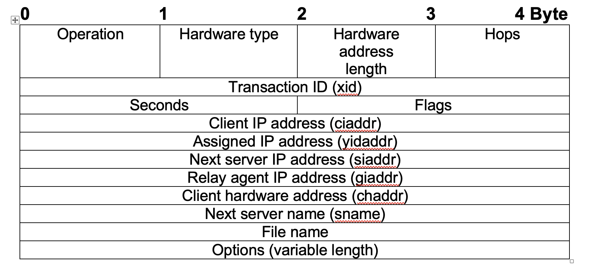
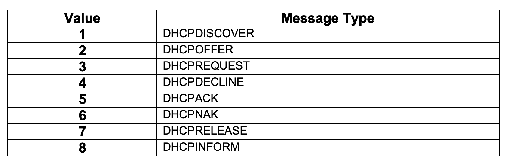

## DHCP ##
DHCP Protocol is called as dynamic host configuration protocol it defined in RFCs 2131 and 2132. It was designed in 1993.
- It is a standard network protocol which is controlled by DHCP server. 
- DHCP protocol is used for dynamic allocation of IP addresses, it can also be used to convey permanent IP address assignments to hosts.
- DHCP is generally used together with network address translation (NAT). NAT separates public (external) and private (internal) IP addresses.
- In networks with a large number of hosts, statically assigning IP addresses and other IP information is looks like impractical.  (DHCP) provides administrators with a mechanism to dynamically allocate IP addresses, rather than manually setting the address on each device.
- It is an extension of BOOTP (Many similarities to BOOTP) same port numbers as BOOTP. DHCP can interoperate with BOOTP clients.

### Overview
- DHCP protocol follows the client–server model. When a computer connects to a network, the DHCP client sends a broadcast query message for requesting the necessary information. The request can be serve by any DHCP server on the network. 
- The DHCP server manage the pool of IP addresses and configuration parameters information about the client. Configuration parameters such as default gateway, domain name, the name servers, and time servers. When server receives a request from the client, then server may respond with specific information to each client for the time period for which the time lease is valid. A client typically queries for this information immediately after booting, and it may ask periodically before the expiration of the information. When a DHCP client refreshes, it initially requests the same parameter values, but the DHCP server may assign a new address based on the assignment policies set by administrators.

### Benefits of DHCP

- `Reliable IP address configuration:`
DHCP minimizes IP address configuration effort which is usual in case of manual configuration. It avoid typo errors, or same address conflicts in network.

- `Reduced network administration`
It provides the Centralized mechanism for handing IP address distribution efficiently for the clients. It eliminates the need of DHCP server on every subnet by using DHCP agent.

### IP address allocation
DHCP server supports three types of IP address allocation which depends upon the Implementation of DHCP server

- `Automatic allocation`
When client sends the request for the IP address the DHCP server permanently assigns an IP address from the IP address range which is defined by the administrator. This seems like dynamic allocation, but in this case the DHCP server keeps a table of past IP address assignments, so that it can choose and assign same IP address to the client which it had previously.

- `Dynamic allocation` During the configuration of DHCP server network administrator reserves a range of IP addresses for DHCP, and each DHCP client on the LAN is configured to request an IP address from the DHCP server during its initialization. The request and response process uses a lease concept of time period, which allows the DHCP server to reclaim IP addresses that are not renewed.

- `Static allocation`
In this allocation the DHCP server issues a private IP address dependent upon each client's MAC address, based on a predefined mapping done by the administrator. If no match for the client's MAC address is found, then the server may or may not choose the option to allocate the IP using either dynamic or automatic allocation.

### Configuration Parameter
The Dynamic Host Configuration Protocol (DHCP) provides configuration parameters to
Internet hosts in a client-server model using UDP/IP. 
The configuration parameters include 
-	IP address, 
-	subnet mask, 
-	next hop router, 
-	DNS server address, 
-	NTP server address, and many others.
All parameters allocated by DHCP are actually leased for a finite period of time. The DHCP client sends a request packet with its required parameter list and client related information to DHCP server, then the server sends back a response that may or may not contain those requested parameters based on server’s decision.

### DHCP Packet Format

- `Operation:` Message type: request (1) or reply (2)

- `Hardware type:` 
Client hardware address type

- `Hardware address length` 
Length of the client hardware address, 6 for Ethernet.

- `Hops` 
Number of relay agents that have forwarded the packet.

- `Transaction ID` 
Clients use it to match requests to replies.

- `Seconds` 
Time in seconds since the client began the DHCP process

- `Flags` 
The Leftmost bit of the flags indicates that client requires broadcast responses, all bits must be zero.

- `Client IP address `
Used by the client to specify the IP address that it has been assigned
(if it has an address).

- `Assigned IP address` 
The server sets up this field to specify the IP address it assigns to the client

- `Next server IP address`
The server sets up this field to specify a configuration server (if there is one)

- `Relay agent IP address`
IP address of the relay agent (if applicable)

- `Client hardware address` 
Client MAC address (typically left blank)

- `Next server name `
Name of the configuration server (if applicable, typically left blank)

- `File name` 
Name of the file to get from the configuration server (if applicable, typically left blank)

- `Options` All options begin with a one byte option code, which uniquely identifies the option. Followed the option code is the one byte length field containing the length of the option value. Options may be fixed length or variable length. Fixed-length options without data consist of only an option code. Only options 0 and 255 are fixed length. All other options are variable-length. The value of the length does not include the two bytes specifying the option code and length. In the case of some variable-length options the length field is a constant but must still be specified. The length byte is followed by "length" bytes of data, the value field. All multi-byte quantities are in network byte-order.

### DHCP Message Type
Message type is sent as an option.

- `DHCPDISCOVER` 
Client broadcast to locate available servers.

- `DHCPOFFER`
Server to client in response to DHCPDISCOVER with offer of configuration parameters.

- `DHCPREQUEST` 
 Client message to servers either (a) requesting offered parameters from one  server and implicitly declining offers from all others, (b) confirming correctness of previously allocated address after e.g., system reboot, or (c) extending the lease on a particular network address.

- `DHCPACK`      
 Server to client with configuration parameters, including committed network   address.

- `DHCPNAK`
 Server to client indicating client's notion of network address is incorrect (e.g.   client has moved to new subnet) or client's lease as expired

- `DHCPDECLINE`
 Client to server indicating network address is already in use.

- `DHCPRELEASE`
Client to server relinquishing network address and cancelling remaining lease.

- `DHCPINFORM` Client to server, asking only for local configuration parameters; client already has externally configured network address.

### DHCP process
DHCP servers lease out IP addresses to DHCP clients, for a specific period
of time. There are four steps to this DHCP process:

- When a DHCP client first boots up, it broadcasts a DHCPDiscover message, searching for a DHCP server.
- If a DHCP server exists on the local segment, it will respond with a DHCPOffer, containing the “offered” IP address, subnet mask, etc.
- Once the client receives the offer, it will respond with a DHCPRequest, indicating that it will accept the offered protocol information.
- Finally, the server responds with a DHCPACK, acknowledging the clients acceptance of offered protocol information.

By default, DHCP leases an address for 8 days. Once 50% of the lease expires, the client will try to renew the lease with the same DHCP server. If successful, the client receives a new 8 day lease.

### DHCP Operation
The DHCP uses the UPD protocol with connectionless service model, it is implemented with two UDP port numbers for its operations which are the same as for the BOOTP protocol. 
-	UDP port number 67 is the destination port of a server, and 
-	UDP port number 68 is used by the client.

DHCP operation is divided in to fall into four phases: 
- Server discovery, 
 - IP lease offer, 
 - IP lease request, and 
 - IP lease acknowledgement.

These stages are often abbreviated as DORA for discovery, offer, request, and acknowledgement.

The DHCP operation begins with clients broadcasting a request. If the client and server are on different subnets, a DHCP Helper or DHCP Relay Agent may be used. In case of clients requesting for renewal of an existing lease it may communicate directly via UDP unicast message it can receive the 

DHCPOFFER: 
- 0x8000 for broadcast, 
- 0x0000 for unicast.
- Only hosts with preconfigured IP addresses can receive unicast packets so in the usual use case clients in discovery phase should set BOOTP flag to 0x8000 (broadcast).

#### DHCP discovery
DHCP client sends the broadcasts messages in the network subnet using the destination address 255.255.255.255 or the client can use the specific subnet broadcast address also. The DHCP client can also sends the query to gets last-known IP address so if the client continues its connectivity in the same network, the SHCP server may provide the same IP address. Basically, it depends on DHCP server configuration whether the server is set up as authoritative or not. 

-	DHCP server which is a non-authoritative server simply ignores the client request.

-	DHCP server which is an authoritative server denies the request, which leads the DHCP client to issue a new request.

#### DHCP offer
When a DHCP client sends the request DHCPDISCOVER message to DHCP server, which is basically a lease request message for the IP address, the DHCP server reserves an IP address for the client and renew the lease by sending a DHCPOFFER message to the DHCP client. This DHCP response message includes the MAC address of client and, IP address that the DHCP server is offering, duration of lease, subnet mask, and the IP address of the DHCP server who is making the DHCP offer.

DHCP server identifies the configuration based on the client's hardware address as specified in the CHADDR (client hardware address) field in request message.

#### DHCP request

When the client receive the response of DHCP offer, the client sends the broad case DHCP request, for requesting the offered IP address. Multiple DHCP server may sends the DHCP offer to requesting client, but client will accept only one DHCP offer. Based on the required server identifications about DHCP server the respective DHCP servers is informed which offered the client. When other DHCP servers receive this message, they withdraw their offers which they might have sends to the same client and they returns the offered IP address to the pool of available addresses.

#### DHCP acknowledgement

In the final phase of the configuration the DHCP server receives the DHCPREQUEST message from the client. After identifying the request message the DHCP server process for the acknowledgement. In the acknowledgement phase server sends the DHCPACK packet to the DHCP client. DHCPACK packet includes the lease duration and information about the other configuration that the client might have requested. At this point, the IP configuration process is completed.

After the DHCP client obtains an IP address, it should secure the address for e.g. using ARP protocol for preventing the address conflicts.

#### DHCP information

DHCP client may look for the additional information which DHCP server sent with the DHCPOFFER response. It client may sends the request for repeating data of a particular application.

#### DHCP releasing

DHCP client wants to deactivate its IP address it sends a release request to the DHCP serve. As client devices does not know when users may unplug them from the network, DHC protocol does not mandate the sending of DHCP Release.

### DHCP relaying
For the small network where only one Subnet used in the network the DHCP clients directly communicate with DHCP servers. Though, DHCP servers is capable of providing IP addresses for multiple subnets in the network. In this case, a DHCP client that has not yet acquired an IP address cannot communicate directly with the DHCP server using IP routing, because it does not have a routing table information and it also does not know the IP address of a router.

### Reliability
The DHCP provides the reliability in several ways like as periodic renewal, rebinding and failover. DHCP server allot the lease to DHCP clients that ends for some period of time. After the lease interval diminishes to half of the actual lease time then DHCP Clients again begin to attempt to renew their leases. For renewing the lease the clients sends a unicast DHCPREQUEST message to the DHCP server for getting the original lease. If that server is down or not accessible then it will fail to respond to the DHCPREQUEST. In that case the client repeats the DHCPREQUEST from time to time and  if the DHCP server comes up again or becomes reachable again, the DHCP client will successfully  get the renew lease.

### Security
The DHCP protocol does not having the security mechanism and it does not include any mechanism for secure authentication. Because of this, it does not provides and guaranty from any unauthorized access and from variety of attacks. 
There could be several king of security loop holes but mainly these attacks fall into below main categories:

-	Unauthorized DHCP servers in the network can provide false information to DCHP client for any kind of request which client sends to the server. 
-	DHCP clients which do not supposed to get access to other resource, can get the access and manipulate the resources. So the resources many go down in the network because of illegal client presence in the network. 

The client cannot validate the au authorized DHCP server so unauthorized DHCP servers can still present in the network and can operates like genuine DHCP server, it can provide incorrect information to DHCP clients. This can serve either as a denial-of-service attack, preventing the client from gaining access to network connectivity. 

Even the DHCP server has no mechanism for authenticating the genuine client, clients can gain unauthorized access to IP addresses by presenting credentials. It also allows the DHCP clients to exhaust the DHCP server to store the IP addresses by each time asking for the new IP address, if the unauthorized client consumes the all available IP addresses on a particular network link, then it many prevent other DHCP clients from getting DHCP services.

DHCP provide some mechanisms for mitigating these problems but those are not up to the mark for calming it as secure. The Relay Agent is used in the network such that the network operators can attach tags to DHCP messages to provide the trusted message in the network. This tag will be used as an authorization entity as token to control the client's access to network resources. Since the client is not having the network upstream access of the relay agent which gives the reliability to the DHCP server operator for relying on the authorization token. 

