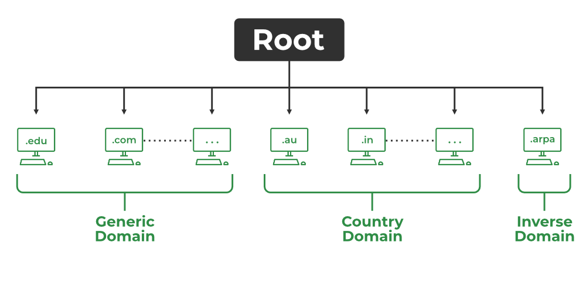
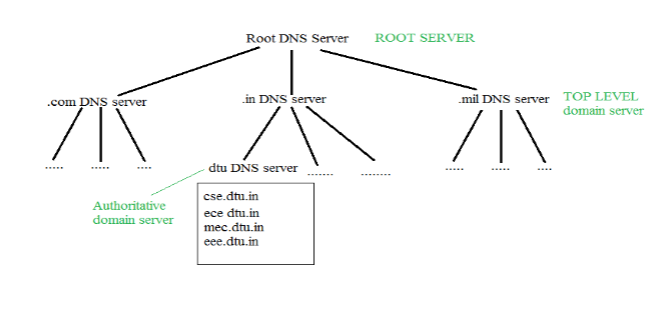
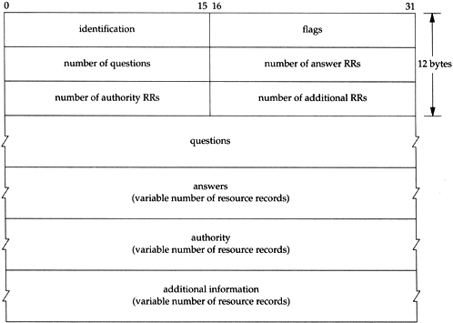

## DNS (RFC 1034/1035) ##
- Domain name server helps to resolve the host name to an address. It uses a hirechical naming scheam and distributed database of IP address and assosiated names.
- This not directly used by user it is used by another protocol to resolve the ip address by name.
- A browser, application or device called the DNS client, issues a DNS request or DNS address lookup, providing a hostname such as “example.com”.
- The request is received by a DNS resolver, which is responsible for finding the correct IP address for that hostname. 
- The DNS resolver looks for a DNS name server that holds the IP address for the hostname in the DNS request.
- A domain name consists of one or more parts called labels, which are separated by dots. A label may contain up to 63 characters. 
- Client requests contain a name which is converted into an IP address known as a forward DNS lookups while requests containing an IP address which is converted into a name known as reverse DNS lookups.
- Query and reply both have same message format.
- If mail server and web server are same then DNS has to resolve it.

### DNS Servers Involved in Loading a Webpage
Upon loading the webpage, several DNS Servers are responsible for translating the domain name into the corresponding IP Address of the web server hosting the website. Here is the list of main DNS servers involved in loading a Webpage.

- Local DNS Resolver
- Root DNS Servers
- Top-Level Domain (TLD) DNS Servers
- Authoritative DNS Servers
- Web Server
### Types of DNS Queries
- `Recursive Query`: In this query, if the resolver is unable to find the record, in that case, DNS client wants the DNS Server will respond to the client in any way like with the requested source record or an error message.
- `Iterative Query`: Iterative Query is the query in which DNS Client wants the best answer possible from the DNS Server.
- `Non-Recursive Query`: Non-Recursive Query is the query that occurs when a DNS Resolver queries a DNS Server for some record that has access to it because of the record that exists in its cache.

### Types of Domain
There are various kinds of domain:

- `Generic domains`: 
    - .com(commercial), 
    - .edu(educational), 
    - .mil(military), 
    - .org(nonprofit organization), 
    - .net(similar to commercial) all these are generic domains.
- `Country domain`: .in (India) .us .uk
- `Inverse domain`: if we want to know what is the domain name of the website. Ip to domain name mapping. So DNS can provide both the mapping for example to find the IP addresses of geeksforgeeks.org then we have to type 

### Organization of Domain
It is very difficult to find out the IP address associated with a website because there are millions of websites and with all those websites we should be able to generate the IP address immediately, there should not be a lot of delays for that to happen organization of the database is very important.

- `DNS record`: Domain name, IP address what is the validity? what is the time to live? and all the information related to that domain name. These records are stored in a tree-like structure. 
- `Namespace`: Set of possible names, flat or hierarchical. The naming system maintains a collection of bindings of names to values – given a name, a resolution mechanism returns the corresponding value.
- `Name server`: It is an implementation of the resolution mechanism.

### DNS service ###
- Host name to IP address translation
- Host aliasing(host name might be very big so mapping to small name is aliasing) (canonical and alias name)
- mail server aliasing 
- load balancing: Repliacte web servers, set of IP address for one canonical name.

### DNS Caching
- DNS Caching can be simply termed as the process used by DNS Resolvers for storing the previously resolved information of DNS that contains domain names, and IP Addresses for some time. 
- The main principle of DNS Caching is to speed up the process of future DNS lookup and also help in reducing the overall time of DNS Resolution.

### DNS Frame Format

