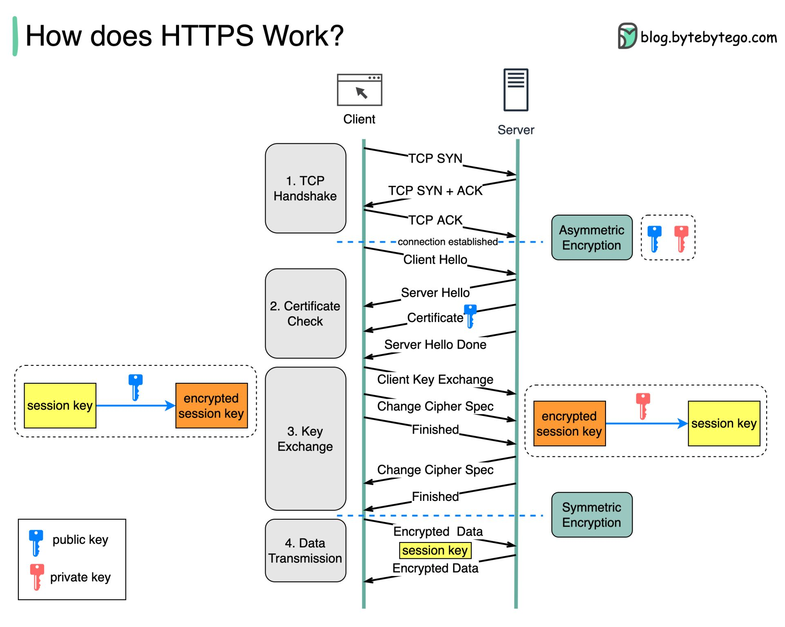
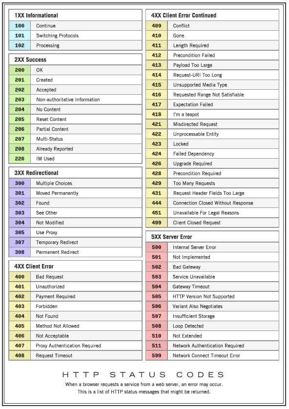

## HTTP ##
https://www.javatpoint.com/http-tutorial#:~:text=HTTP%20stands%20for%20Hypertext%20Transfer,is%20an%20application%2Dlevel%20protocol. 

- HTTP is an application-level protocol. The communication usually takes place through TCP/IP sockets, but any reliable transport can also be used.
- The standard (default) port for HTTP connection is 80, but other port can also be used.
- The first version of HTTP was HTTP/0.9, which was introduced in 1991.
- The latest version of HTTP is HTTP/3, which was published in September 2019. It is an alternative to its processor HTTP/2.
- HTTP is a protocol that is used to transfer the hypertext from the client end to the server end, but HTTP does not have any security.
-  Whenever a user opens their Web Browser, that means the user indirectly uses HTTP.

## HTTPS ##
- HTTPS stands for Hypertext Transfer Protocol Secure. 
- HTTPS has a secure transfer.
- It was developed by Netscape.
- HTTPS is used to encrypt or decrypt user HTTP page or 
- HTTP page requests that are returned by the webserver.
- HTTPS is first used in HTTP/1.1 and is defined in RFC 2616.
- In HTTPS, the standard port to transfer the information is 443.
- Using the HTTPS, sensitive information that we want to transfer from one user to another user can be done securely.
- HTTPS protocol uses HTTP on connection encrypted by SSL (Secure Socket Layer) or TLS (Transport Layer Security).
- HTTPS protects transmitted data from man-in-the-middle (MITM) attacks and eavesdropping.
- It is the default protocol for conduction financial transactions on the web.


### HTTP vs HTTPs ###

### Three important things about HTTP

- `Connectionless`: HTTP is connectionless. When the HTTP client opens the browser, the browser initiates an HTTP request. After making the request, the client disconnect from the server and wait for the response. When the response is ready, the server re-establish the connection again and delivers the response to the client, after which the client disconnects the connection. So both client and server know about each other during the current request and response only.
- `Media Independent`: HTTP is media independent. HTTP can deliver any sort of data, as long as the two computers can read it.
- `Stateless`: The HTTP is stateless. The client and server just know about each other just during the current request. If the connection is closed, and two computers want to connect again, they need to provide information to each other anew, and the connection is handled as the very first one.

## HTTP Methods
For HTTP/1.1, the set of common methods are defined below. This set can be expanded based on the requirements. The name of these methods is case sensitive, and they must be used in uppercase.
- `GET`: This method retrieves information from the given server using a given URI. GET request can retrieve the data. It can not apply other effects on the data.
- `HEAD`: This method is the same as the GET method. It is used to transfer the status line and header section only.
- `POST`: The POST request sends the data to the server. For example, file upload, customer information, etc. using the HTML forms.
- `PUT`: The PUT method is used to replace all the current representations of the target resource with the uploaded content.
- `DELETE`: The DELETE method is used to remove all the current representations of the target resource, which is given by URI.
- `CONNECT`: This method establishes a tunnel to the server, which is identified by a given URI.
- `OPTIONS`: This method describes the options of communication for the target resource.

### GET  method
This method is used to retrieve data from a web server using the specifying parameters in the URL portion of the request. This is the main method that is used for document retrieval. The use of the GET method to fetch first.htm is as follows

```html
#Eg GET request

GET /first.htm HTTP/1.1  
User-Agent: Mozilla/69.0 (compatible; MSIE5.01; Windows 10)  
Host: www.javatpoint.com  
Accept-Language: en-us  
Accept-Encoding: gzip, deflate  
Connection: Keep-Alive  
```
```html
# Response 

HTTP/1.1 200 OK  
Date: Wed, 4 Dec 2019 5:15:40 GMT  
Server: Apache/2.4. 41 (Win32)  
Last-Modified: Mon, 2 Dec 2019 15:40:30 GMT  
ETag: "34aa387-d-1568eb00"  
Vary: Authorization,Accept  
Accept-Ranges: bytes  
Content-Length: 55  
Content-Type: text/html  
Connection: Closed
```  

### HEAD Method
This method is the same as the GET method. But in the HEAD method, the server replies with a response line and headers without entity-body. The use of HEAD method to fetch header information about first.htm is as follows:
```html
HEAD /first.htm HTTP/1.1  
User-Agent: Mozilla/69.0 (compatible; MSIE5.01; Windows 10)  
Host: www.javatpoint.com  
Accept-Language: en-us  
Accept-Encoding: gzip, deflate  
Connection: Keep-Alive  
```
```
HTTP/1.1 200 OK  
Date: Wed, 4 Dec 2019 5:15:40 GMT  
Server: Apache/2.4. 41 (Win32)  
Last-Modified: Mon, 2 Dec 2019 15:40:30 GMT  
ETag: "34aa387-d-1568eb00"  
Vary: Authorization,Accept  
Accept-Ranges: bytes  
Content-Length: 55  
Content-Type: text/html  
Connection: Closed 
```
### HTTP Error code



### HTTP Connections
- Non-Persistent
- Persistent

Difference between Persistent and Non-Persistent Connections

