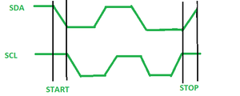
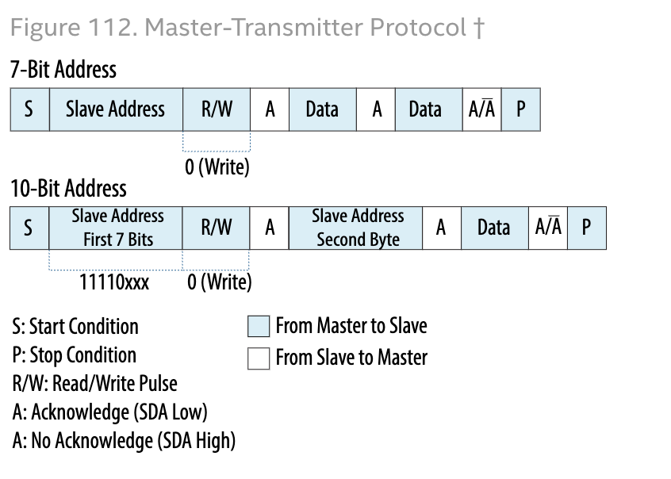
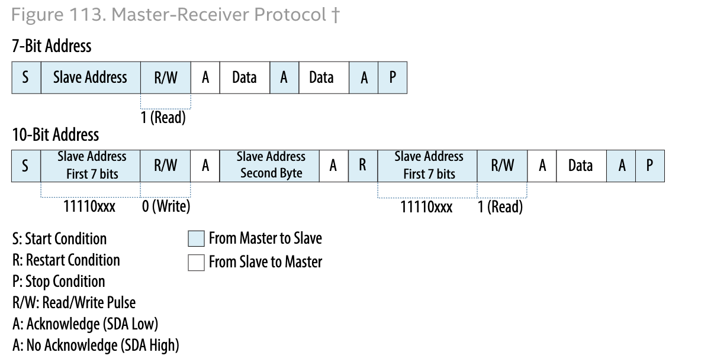

### I2C ###
- I2C stands for Inter-Integrated Circuit. 
- It is a bus interface connection protocol incorporated into devices for serial communication. 
- It was originally designed by Philips Semiconductor in 1982. Recently, it is a widely used protocol for short-distance communication. 
- It is also known as Two Wired Interface(TWI).
- I2C is multi master bus topology.
- One who initiate data transfer called master and other one is slave.
- Each byte followed by an ack bit.
- It supports 7-bit and 10-bit addressing.
- Serial Data (SDA) – Transfer of data takes place through this pin.
- Serial Clock (SCL) – It carries the clock signal.
- According to I2C protocols, the data line cannot change when the clock line is high, it can change only when the clock line is low.
- Stable data during high clock
- Data changes during low clock.
- 7 bit address, 1 bit direction (R/w)
- master may generate repeated start and address another device.


### MODE
- Master mode
- Slave mode

### Data Transfer 
The data is transmitted in the form of packets which comprises 9 bits. The sequence of these bits are
- Start Condition – 1 bit
- Slave Address – 8 bit
- Acknowledge – 1 bit

### Start and Stop Conditions

- START and STOP can be generated by keeping the SCL line high and changing the level of SDA. 
- To generate `START` condition the SDA is changed from high to low while keeping the SCL high. 
- To generate `STOP` condition SDA goes from low to high while keeping the SCL high, as shown in the figure below.

```cpp
void start(void){
    SDA = 1;
    SCL = 1;
    -nop(); -nop();
    SDA = 0;
    -nop(); -nop();
    SCL = 0;
}

void stop(void){
    SDA = 0;
    -nop(); -nop();
    SCL = 1;
    -nop(); -nop();
    SDA = 1;
}
```
### Master Tranmitter


### Master Receiver

```cpp
// Write Data at memory location
void write_BYTE(U8 addr, U8 data){
    start();

    write_I2c(0xA0);
    write_I2c(addr);
    write_I2c(data);

    stop();
}
void write_I2c(U8 data){
    U8 i;
    for(int i=0; i<8; i++){
        SDA = (data & 0x80) ? 1:0;
        SCL = 1; SCL = 0;
        data = data <<1;
    }

    SCL = 1;
    -nop(); -nop();
    SCL = 0;
}
```
```cpp
// read data from memory location
U8 read_BYTE(U8 addr){
    U8 data;

    start(); //----
    
    write_I2C(0xA0);
    write_I2C(addr);
    start(); //----
    data = Read_I2C(NO_ACK);
    
    stop();  //----
    return data;
}

U8 Read_I2C(bit ACK_BIT){
    U8 data = 0;
    SDA = 1;

    for(int i=0; i<8; i++){
        SCL = 1
        data = data << 1;
        data = data | SDA;
        SCL = 0;
    }

    if(ACK_BIT == 1)
        SDA = 0;
    else
        SDA = 1;

    SCL = 1;
    -nop(); -nop();
    SCL = 0;
    
}
```

