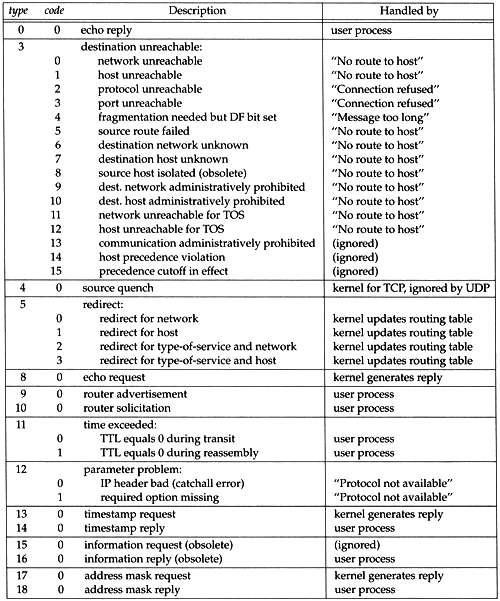
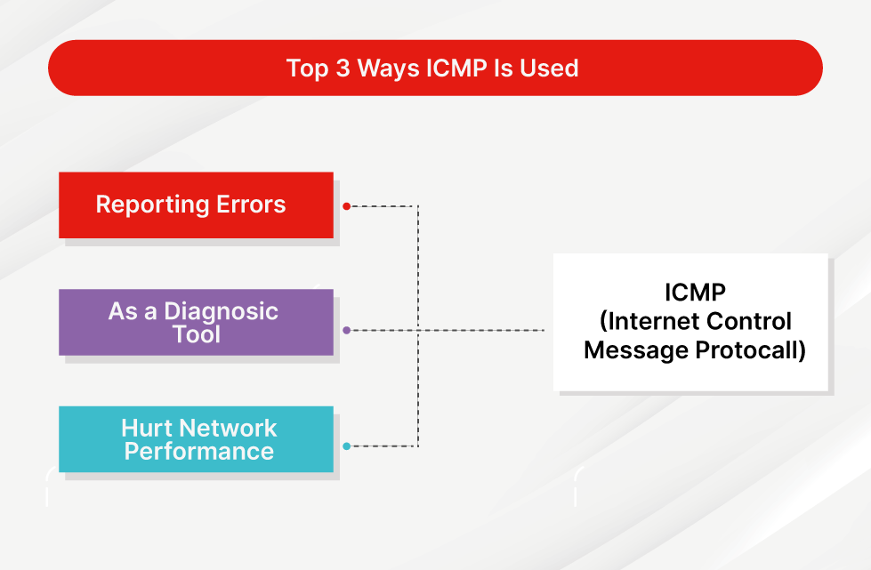

## ICMP ##
- This works on n/w layer protocol
- It is a supporting protocol in an internet protocol suite.
- It is used by hosts and routers to communicate the error and operational information for e.g. that the request service not available or host or router could not be reached.
- The Internet Control Message Protocol (ICMP) is a protocol that devices within a network use to communicate problems with data transmission. In this ICMP definition, one of the primary ways in which ICMP is used is to determine if data is getting to its destination and at the right time. 
- ICMP packets are combined into IPV4, IPV6 packets it is b/w transport layer and n/w layer.
- Error reporting: unreachanble host, network, port, protocol.
- Echo request/reply (used by ping)

- `Type(8)`: ICMP type messsage type of control message.
- `Code(8)`: ICMP sub type.
- `Checksum(16)`: Error checking data calculated from the ICMP header and data.
- `Rest of header(32)`: Content vary based on the ICMP type and code.
- `Data`: ICMP error message contain a data section that include a copy of entire IPV4 header plus atleast first 8 bytes of data from the IPv4 packet that caused the error message. The maximum length of ICMP error message is 576 bytes.

### ICMP type and code

### USE
- The number one use of ICMP is for reporting errors. Anytime two devices are connected through the internet, ICMP can be used to create errors that can go from the receiving device to the sending device if some of the data did not arrive as expected.
- Another common use of ICMP is as a diagnostic tool to assess a network’s performance. Both traceroute and ping use ICMP.
- The traceroute also tells you how much time it took for the data to go from one device to another. Each time data goes between routers, the trip is referred to as a hop. The information revealed by the traceroute can be used to figure out which devices along the route are causing delays.
- ICMP is also used to hurt network performance. This is done using an ICMP flood, a Smurf attack, and a ping of death attacks that overwhelms a device on the network and prevent normal functionality.
 

### How Is ICMP Used in DDoS Attacks?
In a DDoS attack, ICMP is commonly used in a few different ways: through an ICMP flood attack, a ping of death attack, or a Smurf attack.

- `ICMP Flood Attack`
In an ICMP flood attack, the attacker tries to send so many pings that the device being targeted cannot handle all the ICMP echo request packets. Because each packet requires processing and a response, this drains the device’s resources, preventing legitimate users from being served by the device.

- `Ping of Death`
A Ping-of-Death attack involves an attacker sending an extremely large ping to a device that cannot handle pings of that size. The machine may then crash or freeze up. The packet of data is fragmented as it heads toward the target, but during the reassembly process, it is put back together. When it reaches the target, there is a buffer overflow, causing the device to malfunction. Ping-of-death attacks are more of a danger for older equipment within the network.

- `Smurf Attack`
In a Smurf attack, the attacker transmits an ICMP packet that has a spoofed or faked IP address. When the equipment on the network replies, each reply gets sent to the spoofed IP address, and the target is flooded with a ton of ICMP packets. This kind of attack is also typically only a problem for older equipment.
