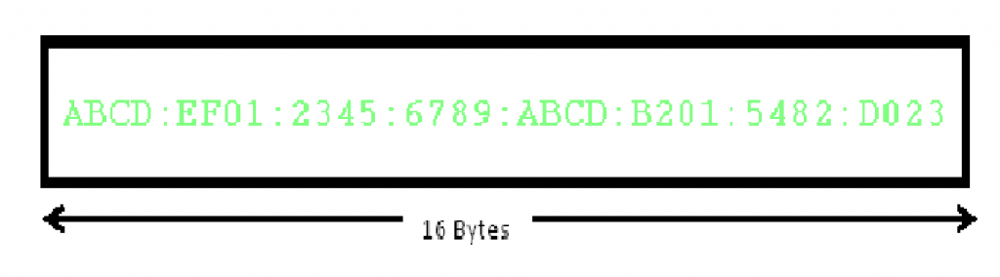

### IPV6 ###
- IPv6 or Internet Protocol Version 6 is a network layer protocol that allows communication to take place over the network. IPv6 was designed by Internet Engineering Task Force (IETF) in December 1998 with the purpose of superseding the IPv4 due to the global exponentially growing internet users.
-  It's designed to supply IP addressing and additional security to support the predicted growth of connected devices in IoT, manufacturing, and emerging areas like autonomous driving.
- IPv6 is a 128-bits address having an address space of 2128, which is way bigger than IPv4. IPv6 use Hexa-Decimal format separated by colon (:)

### Components in Address format :   
- There are 8 groups and each group represents 2 Bytes (16-bits). 
- Each Hex-Digit is of 4 bits (1 nibble)
- Delimiter used – colon (:)

### Need for IPv6
The Main reason of IPv6 was the address depletion as the need for electronic devices rose quickly when Internet Of Things (IOT) came into picture after the 1980s & other reasons are related to the slowness of the process due to some unnecessary processing, the need for new options, support for multimedia, and the desperate need for security. IPv6 protocol responds to the above issues using the following main changes in the protocol:

- `Large address space`
An IPv6 address is 128 bits long .compared with the 32 bit address of IPv4, this is a huge(2 raised 96 times) increases in the address space.
- `Better header format`
IPv6 uses a new  header format in which options are separated from the base header and inserted, when needed, between the base header and the upper layer data . This simplifies and speeds up the routing process because most of the options do not need to be checked by routers.
- `New options`
IPv6 has new options to allow for additional functionalities.

- `Allowance for extension`
IPv6 is designed to allow the extension of the protocol if required by new technologies or applications.

- `Support for resource allocation`
In IPv6,the type of service field has been removed, but two new fields , traffic class and flow label have been added to enables the source to request special handling of the packet . this mechanism can be used to support traffic such as real-time audio and video.

- `Support for more security`
The encryption and authentication options in IPv6 provide confidentiality and integrity of the packet.

### Addressing methods
- `Unicast` Unicast Address identifies a single network interface. A packet sent to a unicast address is delivered to the interface identified by that address. 
- `Multicast` Multicast Address is used by multiple hosts, called as groups, acquires a multicast destination address. These hosts need not be geographically together. If any packet is sent to this multicast address, it will be distributed to all interfaces corresponding to that multicast address. And every node is configured in the same way. In simple words, one data packet is sent to multiple destinations simultaneously.
- `Anycast` Anycast Address is assigned to a group of interfaces. Any packet sent to an anycast address will be delivered to only one member interface (mostly nearest host possible). 

### Advantages of IPv6
1. `Realtime Data Transmission `: Realtime data transmission refers to the process of transmitting data in a very fast manner or immediately. Example : Live streaming services such as cricket matches, or other tournament that are streamed on web exactly as soon as it happens with a maximum delay of 5-6 seconds.   

2. `IPv6 supports authentication`: Verifying that the data received by the receiver from the sender is exactly what the sender sent and came through the sender only not from any third party. Example : Matching the hash value of both the messages for verification is also done by IPv6.

3. `IPv6 performs Encryption`: Ipv6  can encrypt the message at network layer even if the protocols of application layer at user level didn’t encrypt the message which is a major advantage as it takes care of encryption.

4. `Faster processing at Router`: Routers are able to process data packets of Ipv6 much faster due to smaller Base header of fixed size – 40 bytes which helps in decreasing processing time resulting in more efficient packet transmission. Whereas in Ipv4, we have to calculate the length of header which lies between 20-60 bytes.

### Disadvantages of IPv6
- `Conversion`: Due to widespread present usage of IPv4 it will take a long period to completely shift to IPv6.
- `Communication`: IPv4 and IPv6 machines cannot communicate directly with each other. They need an intermediate technology to make that possible.

### Reference
https://www.geeksforgeeks.org/internet-protocol-version-6-ipv6/
https://en.wikipedia.org/wiki/IPv6 