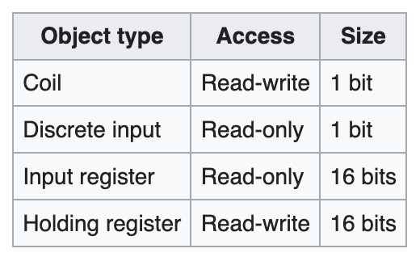
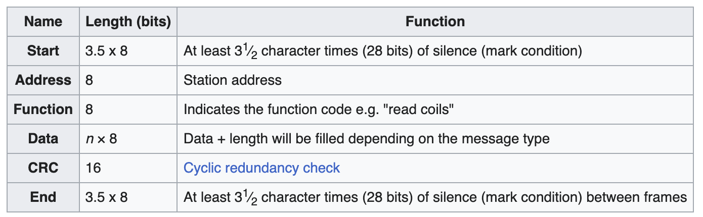
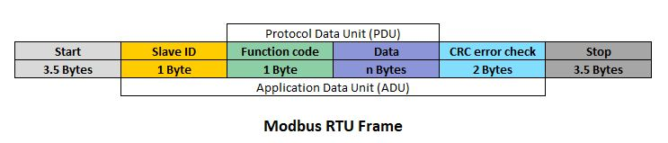
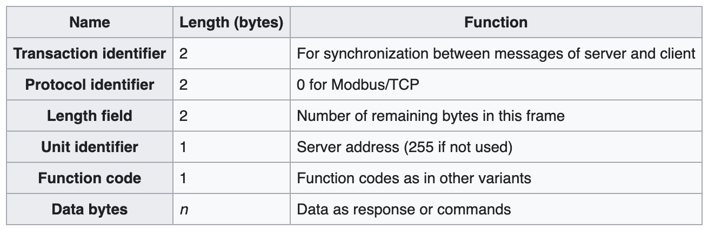
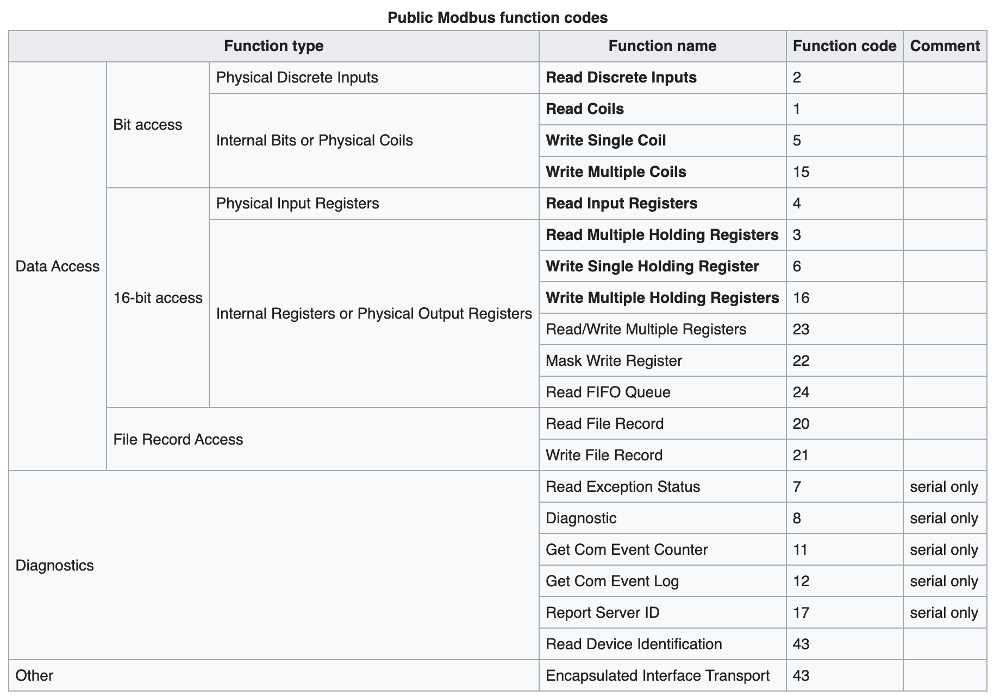
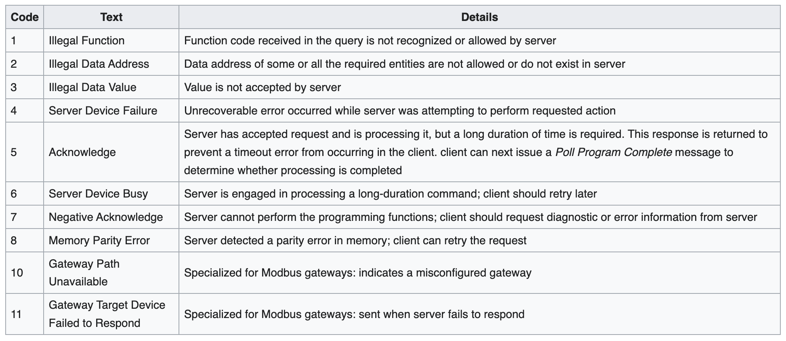

## MODBUS ##
- Modbus is a data communications protocol originally published by Modicon (now Schneider Electric) in 1979 for use with its programmable logic controllers (PLCs). 
- Modbus has become a de facto standard communication protocol and is now a commonly available means of connecting industrial electronic devices.
- Modbus is often used to connect a plant/system supervisory computer with a remote terminal unit (RTU) in supervisory control and data acquisition (SCADA) systems. 

## Modbus object types
The following object types may be provided by a Modbus server to a Modbus client device:

## Modbus RTU (Remote Terminal Unit) 
- It is used in serial communication, and is the most common implementation available for Modbus. 
- Modbus RTU makes use of a compact, binary representation of the data for protocol communication. 
- The RTU format follows the commands/data with a cyclic redundancy check checksum as an error check mechanism to ensure the reliability of data. 
- A Modbus RTU message must be transmitted continuously without inter-character hesitations. Modbus messages are framed (separated) by idle (silent) periods.
### RTU Frame format

## Modbus TCP/IP or Modbus TCP 
- A Modbus variant used for communications over TCP/IP networks, connecting over port 502. 
- It does not require a checksum calculation, as lower layers already provide checksum protection.
### Modbus TCP frame format

## Modbus over UDP 
Some have experimented with using Modbus over UDP on IP networks, which removes the overhead of TCP.

## Commands
Modbus commands can instruct a Modbus device to:

- Change the value in one of its registers, by write to Coil or Holding register
send back one or more contained values, by read from Coil or Holding register
read a physical input port, by read from Discrete Input or Input register   

### Functions and commands
Prominent conceptual entities in a Modbus server include the following:
- `Coils`: readable and writeable, 1 bit (off/on)
- `Discrete Inputs`: read-only, 1 bit (off/on)
- `Input Registers`: read-only measurements and statuses, 16 bits (0–65,535)
- `Holding Registers`: readable and writeable configuration values, 16 bits (0–65,535)

### Address range

- coils numbers start with 0 and span from `0`0001 to `0`9999,
- discrete input numbers start with 1 and span from `1`0001 to `1`9999,
- holding register numbers start with 4 and span from `4`0001 to `4`9999.

### Function code

### Exception responses

### Entity numbers and addresses
The Modbus Organization mentions the following in the Modbus Application Protocol v1.1b:[7]

The Modbus application protocol defines the PDU addressing rules: 
- In a PDU, each data item is addressed from 0 to 65535.
- It also defines a MODBUS data model composed of four blocks that comprise several elements numbered from 1 to n.
- In the Modbus data model, each element within a data block is numbered from 1 to n.

- coils numbers start with 0 and span from 00001 to 09999,
- discrete input numbers start with 1 and span from 10001 to 19999
- holding register numbers start with 4 and span from 40001 to 49999.
- For data communications, the entity location (1 to 9,999) is translated into a 0-based entity address (0 to 9,998) by subtracting 1. For example, in order to read holding registers starting at number 40001, the data frame will contain function code 3 (as seen above) and address 0. For holding registers starting at number 40100, the address will be 99.

This limits the number of addresses to 9,999 for each entity. A de facto standard extends this to 65,536[14] by adding one digit to the previous list:

- coil numbers span from 000001 to 065536,
- discrete input numbers span from 100001 to 165536,
- input register numbers span from 300001 to 365536,
- holding register numbers span from 400001 to 465536.
- When using extended referencing, all number references must have exactly 6 digits to avoid confusion between coils and other entities. For example, to distinguish between holding register #40001 and coil #40001, if coil #40001 is the target, it must appear as #040001.

Another way to note the data addresses is to use the hexadecimal value, which clarifies the use of the four digits in the traditional convention mentioned previously.

- coil numbers span from 0x0000 to 0xFFFF
- discrete input numbers span from 1x0000 to 1xFFFF
- input register numbers span from 3x0000 to 3xFFFF
- holding register numbers span from 4x0000 to 4xFFFF

The advantage of this notation is that the same numbers are found when decoding Modbus packets.