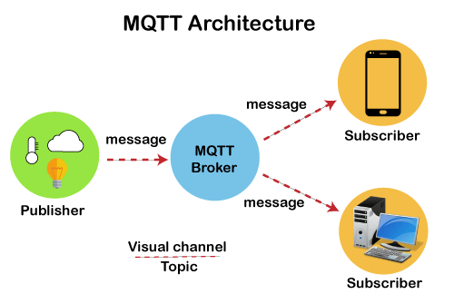
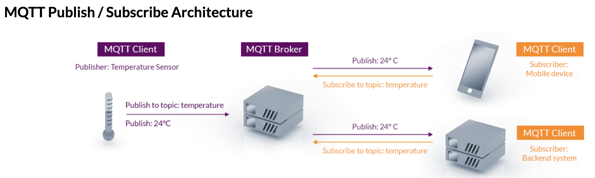
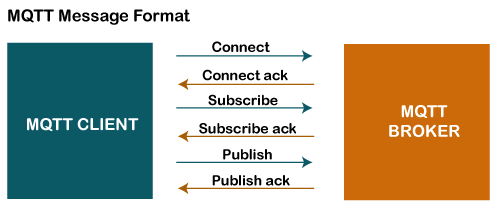
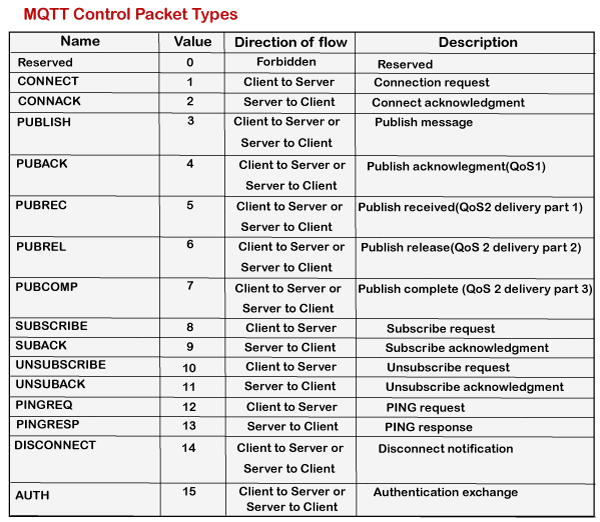
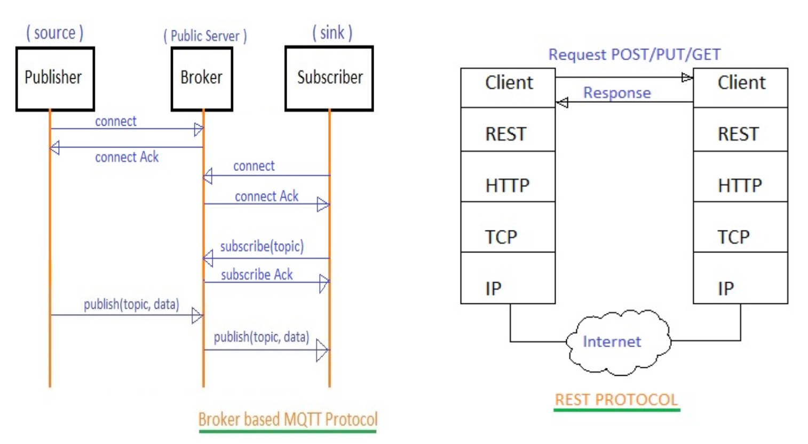

## MQTT ##
https://www.javatpoint.com/mqtt-protocol
- MQTT stands for Message Queuing Telemetry Transport. - MQTT is a machine to machine internet of things connectivity protocol. 
- It is an extremely lightweight and publish-subscribe messaging transport protocol. 
- This protocol is useful for the connection with the remote location where the bandwidth is a premium. 
- It is a publish and subscribe system where we can publish and receive the messages as a client. 
- It makes it easy for communication between multiple devices. 
- It is a simple messaging protocol designed for the constrained devices and with low bandwidth, so it's a perfect solution for the internet of things applications.
- The default unencrypted MQTT port is `1883`. The encrypted port is `8883`.
- MQTT sends connection credentials in plain text format and does not include any measures for security or authentication. This can be provided by using TLS to encrypt and protect the transferred information against interception, modification or forgery.
- MQTT relies on the TCP protocol for data transmission. A variant, MQTT-SN, is used over other transports such as UDP or Bluetooth.
- When a publishing client first connects to the broker, it can set up a default message to be sent to subscribers if the broker detects that the publishing client has unexpectedly disconnected from the broker.
- Clients only interact with a broker, but a system may contain several broker servers that exchange data based on their current subscribers' topics.

### MQTT Architecture
To understand the MQTT architecture, we first look at the components of the MQTT.

- Message
- Client
- Server or Broker
- TOPIC

### Message ###
The message is the data that is carried out by the protocol across the network for the application. When the message is transmitted over the network, then the message contains the following parameters:

- Payload data
- Quality of Service (QoS)
- Collection of Properties
- Topic Name

### MQTT Client

- In MQTT, the subscriber and publisher are the two roles of a client. 
- The clients subscribe to the topics to publish and receive messages. In simple words, we can say that if any program or device uses an MQTT, then that device is referred to as a client. 
- A device is a client if it opens the network connection to the server, publishes messages that other clients want to see, subscribes to the messages that it is interested in receiving, unsubscribes to the messages that it is not interested in receiving, and closes the network connection to the server.

In MQTT, the client performs two operations:

`Publish`: When the client sends the data to the server, then we call this operation as a publish.

`Subscribe`: When the client receives the data from the server, then we call this operation a subscription.

### MQTT Server or Broker

- The device or a program that allows the client to publish the messages and subscribe to the messages. 
- A server accepts the network connection from the client, accepts the messages from the client, processes the subscribe and unsubscribe requests, forwards the application messages to the client, and closes the network connection from the client.
- However, an MQTT broker can store a retained message that can be sent immediately upon a new MQTT subscription. In this case, the MQTT client will receive at least one message upon subscribing to the topic.

The main advantages of MQTT broker are:

- Eliminates vulnerable and insecure client connections, if configured to
- Can easily scale from a single device to thousands
- Manages and tracks all client connection states, including security credentials and certificates, if configured to
- Reduced network strain without compromising the security, if configured to (cellular or satellite network)

### MQTT TOPIC

The label provided to the message is checked against the subscription known by the server is known as TOPIC.

In MQTT, topic is UTF-8 string that the broker uses to filter messages for each individual connected client. Each topic consists of one or more different topic levels. Each topic level is separated by forward slash also called topic level separator. Both topics and levels are case-sensitive.

Example of topic – `home/kitchen/table `

MQTT Topics include two types of wildcards: 
1. Single Level: “+” 
    - home/+/table  
2. Multi-Level: “#” 
    - home/groundfloor/#  

### MQTT Message Format

The MQTT uses the command and the command acknowledgment format, which means that each command has an associated acknowledgment. As shown in the above figure that the connect command has connect acknowledgment, subscribe command has subscribe acknowledgment, and publish command has publish acknowledgment. This mechanism is similar to the handshaking mechanism as in TCP protocol.

### MQTT Control Packet Types

### MQTT QOS
Each connection to the broker can specify a QoS measure.
- `At most once` – the message is sent only once and the client and broker take no additional steps to acknowledge delivery (fire and forget).
- `At least once` – the message is re-tried by the sender multiple times until acknowledgement is received (acknowledged delivery).
- `Exactly once` – the sender and receiver engage in a two-level handshake to ensure only one copy of the message is received (assured delivery).
This field does not affect handling of the underlying TCP data transmissions; it is only used between MQTT senders and receivers.

### MQTT vs Rest

### mosquitto_pub example
`mosquitto_pub -h localhost -t kitchen/coffeemaker -m "on" -q 1`

- -h – the host to connect to
- -t – the topic of a message
- -m – the message
- -q – the quality of service

`mosquitto_pub -h localhost -t kitchen/sensor/temperature -m 22 -q 2`

### mosquitto_sub example
- mosquitto_sub -h localhost -t kitchen/coffeemaker -q 1
- mosquitto_sub -t kitchen/sensors/+ -q 2

