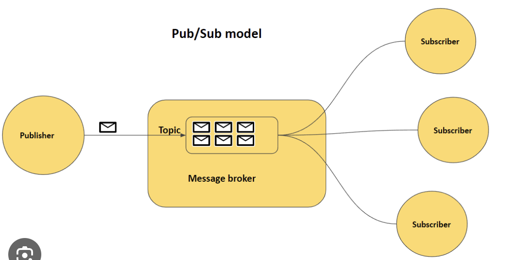

## What is Pub-Sub Model 

- The publish-subscribe (pub/sub) model is a messaging paradigm that allows services to communicate `asynchronously`, without needing to know the identity of the sender or receiver. 
- It's a design pattern that's used to implement event-driven architectures and real-time messaging systems.
- Pub/sub is used for streaming analytics and data integration pipelines to load and distribute data. It can also be used as a messaging-oriented middleware for service integration or as a queue to parallelize tasks.
