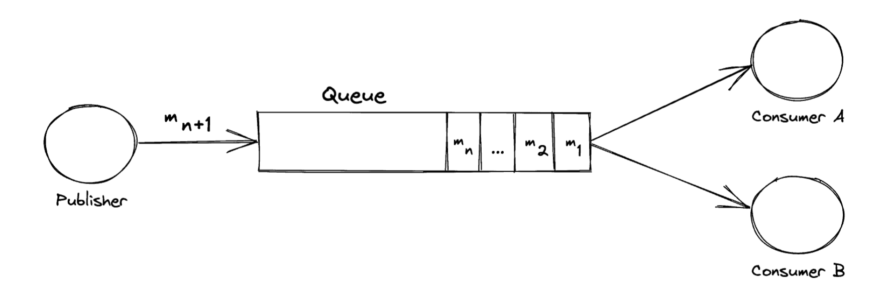
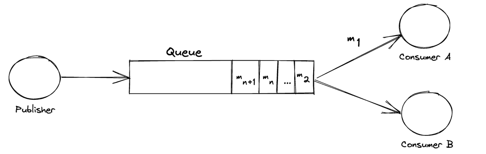
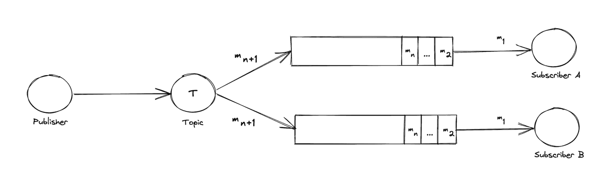

## Message Queue
Message queues consist of a publishing service and multiple consumer services that communicate via a queue. This communication is typically one way where the publisher will issue commands to the consumers. The publishing service will typically put a message on a queue or exchange and a single consumer service will consume this message and perform an action based on this.

Consider the following exchange:

From this, we can see a Publisher service that is putting a message ‘m n+1’ onto the queue. In addition, we can also see multiple messages already in existence on the queue waiting to be consumed. On the right-hand side, we have 2 consuming services ‘A’ and ‘B’ that is listening to the queue for messages.

Let’s now consider the same exchange after some time:

First, we can see that the Publisher’s message has been pushed to the tail of the queue. Next, the important part to consider is the right-hand side of the image. We can see that consumer ‘A’ has read the message ‘m 1’ and, as such, it is no longer available in the queue for the other service ‘B’ to consume.

in a pub-sub architecture we want all our consuming (subscribing) applications to get at least 1 copy of the message that our publisher posts to an exchange.

