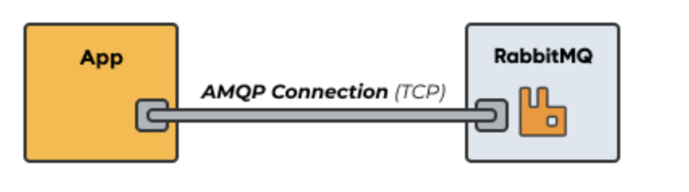

 ## AMQP 
 - AMQP includes a set of standards that control the entire messaging process in AMQP message brokers, 
 like RabbitMQ. It allows two parties to communicate by sending and receiving messages between them.

 - AMQP is created as an open standard protocol that allows messaging interoperability between systems, 
 regardless of message broker vendor or platform used; With AMQP, you can use whatever AMQP-compliant 
 client library you want, and any AMQP-compliant broker you want. Message clients using AMQP are completely agnostic. 

 -  It defines a set of messages capabilities which must be made available by an AMQP compliant server implementation (like RabbitMQ). 
 Including rules of how messages must be routed and stored within the broker to follow the AMQ Model. 

 

 - RabbitMQ is a messaging system that uses AMQP 0.9.1 which was released in 2008. RabbitMQ currently supports the latest version of AMQP, 1.0, through a plugin.

 ### The Advanced Message Queuing Protocol 
 - Advanced Message Queuing Protocol (AMQP) is an application layer protocol that focuses on process-to-process communication across IP networks. An encoding schema and a set of procedures allow for two different servers to communicate regardless of the technology used. 
 - Overall, the goal of AMQP is to enable message passing through broker services over TCP/IP connections. AMQP is considered a compact protocol, since it’s a binary protocol, meaning that everything sent over AMQP is binary data.

 ## RabbitMQ Reference
 https://www.rabbitmq.com/amqp-0-9-1-reference

##  Components of AMQP 

### `Message Queue`:
A queue acts as a buffer that stores messages that are consumed later. A queue can also be declared with a number of attributes during creation.For instance, it can be marked as durable, auto-delete and exclusive, where exclusive means that it can be used by only one connection and this queue will be deleted when that connection closes. 

### Exchanges and Exchange Types:
A channel routes messages to a queue depending on the exchange type and bindings between the exchange and the queue.
For a queue to receive messages, it must be bound to at least one exchange. 
AMQP 0.9.1 brokers should provide four exchange types:
- direct exchange
- fanout exchange
- topic exchange
- header exchange
https://medium.com/trendyol-tech/rabbitmq-exchange-types-d7e1f51ec825

### Binding
A binding is a relation between a queue and an exchange consisting of a set of rules that the exchange uses (among other things) to route messages to queues. 

### Connection 
it is a network connection between your application and the AMQP broker, e.g. a TCP/IP socket connection. 

### Channel
A channel is a virtual connection inside a connection, between two AMQP peers. Message publishing or consuming to or from a queue is performed over a channel (AMQP). A channel is multiplexed, one single connection can have multiple channels. 
