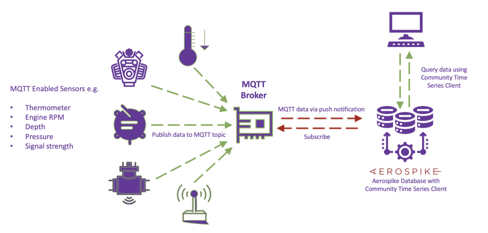
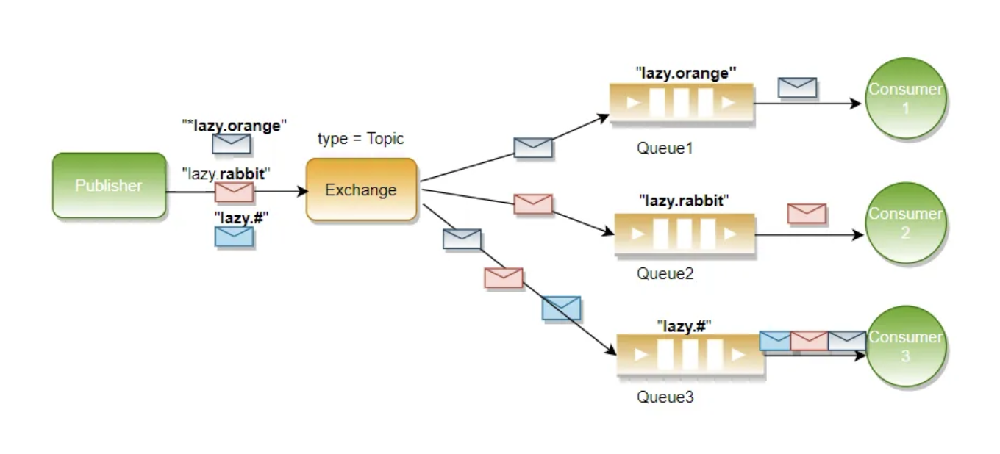
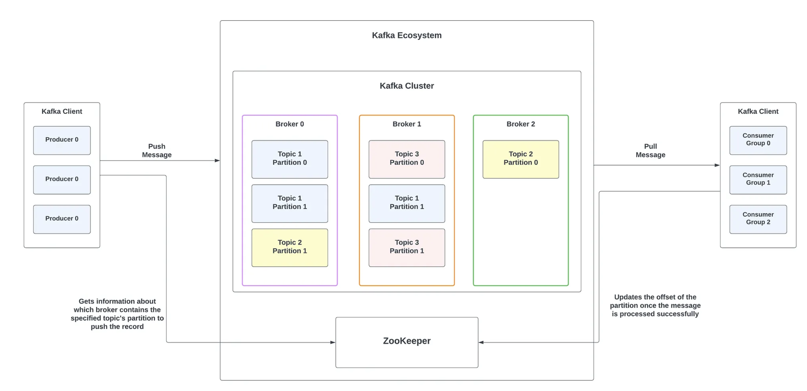
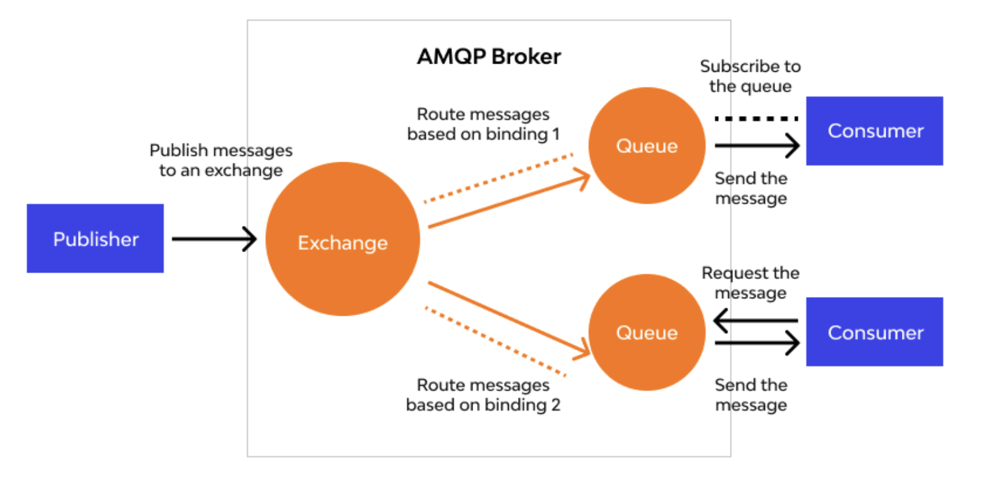

# Pub/Sub Models and Protocols

The Pub/Sub (Publisher/Subscriber) model is implemented using various protocols and technologies, each suited to different use cases and environments. This document lists some popular Pub/Sub models and protocols.

## 1. MQTT (Message Queuing Telemetry Transport)
- **Description**: A lightweight messaging protocol designed for constrained devices and low-bandwidth, high-latency networks.
- **Use Cases**: IoT (Internet of Things), sensor networks, mobile applications.
- **Features**: 
  - Lightweight and efficient.
  - Supports Quality of Service (QoS) levels.
  - Retained messages and last will and testament (LWT).

## 2. RabbitMQ (with Pub/Sub)
- **Description**: A message broker that supports multiple messaging patterns, including Pub/Sub.
- **Use Cases**: Enterprise messaging, microservices communication, event-driven architectures.
- **Features**:
  - Supports multiple messaging protocols (AMQP, MQTT, STOMP).
  - Flexible routing and exchange types.
  - High availability and clustering.

## 3. Apache Kafka
- **Description**: A distributed streaming platform that can handle high-throughput, fault-tolerant, and scalable message processing.
- **Use Cases**: Real-time data pipelines, event sourcing, log aggregation, stream processing.
- **Features**:
  - High throughput and low latency.
  - Distributed and fault-tolerant.
  - Supports stream processing via Kafka Streams.
  - Reference: https://medium.com/@abhirup.acharya009/kafka-103-data-management-and-persistence-within-kafka-22d6d338d9c2 

## Apache Qupid
- **Description**: Apache Qpid is based on the Advanced Message Queuing Protocol (AMQP) and uses a messaging-queue model. Apache Kafka is a distributed pub-sub messaging system that uses a broker-based architecture. 
- **Use Cases**: Apache Kafka is well-suited for handling high volumes of real-time streaming data, while Apache Qpid is uniquely suited for embedding messaging capabilities into existing software.

## 4. Google Cloud Pub/Sub
- **Description**: A fully-managed real-time messaging service provided by Google Cloud Platform.
- **Use Cases**: Event-driven architectures, real-time analytics, log processing.
- **Features**:
  - Fully managed and scalable.
  - Global distribution.
  - Integrated with other Google Cloud services.

## 5. Amazon SNS (Simple Notification Service)
- **Description**: A fully-managed messaging service provided by AWS that supports Pub/Sub messaging.
- **Use Cases**: Mobile push notifications, email notifications, event-driven architectures.
- **Features**:
  - Fully managed and scalable.
  - Supports multiple protocols (HTTP/S, email, SMS, Lambda).
  - Integrated with other AWS services.

## 6. Apache Pulsar
- **Description**: A distributed Pub/Sub messaging system originally developed by Yahoo, now an Apache project.
- **Use Cases**: Real-time analytics, data pipelines, event streaming.
- **Features**:
  - Multi-tenancy and geo-replication.
  - High throughput and low latency.
  - Supports both Pub/Sub and queueing semantics.

## 7. Redis Pub/Sub
- **Description**: A lightweight Pub/Sub messaging feature built into the Redis in-memory data structure store.
- **Use Cases**: Real-time messaging, notifications, inter-process communication.
- **Features**:
  - Simple and fast.
  - Integrated with Redis data structures.
  - Suitable for small to medium-scale applications.

## 8. NATS
- **Description**: A lightweight, high-performance messaging system designed for cloud-native applications.
- **Use Cases**: Microservices communication, IoT, real-time messaging.
- **Features**:
  - Lightweight and easy to deploy.
  - High performance and low latency.
  - Supports clustering and fault tolerance.

## 9. ZeroMQ (ØMQ)
- **Description**: A high-performance asynchronous messaging library that supports various messaging patterns, including Pub/Sub.
- **Use Cases**: High-performance trading systems, distributed applications, real-time analytics.
- **Features**:
  - Lightweight and fast.
  - Supports multiple messaging patterns.
  - No broker required (peer-to-peer).

## 10. Microsoft Azure Service Bus
- **Description**: A fully-managed enterprise message broker provided by Microsoft Azure.
- **Use Cases**: Enterprise messaging, hybrid cloud applications, event-driven architectures.
- **Features**:
  - Fully managed and scalable.
  - Supports multiple messaging patterns (queues, topics).
  - Integrated with other Azure services.