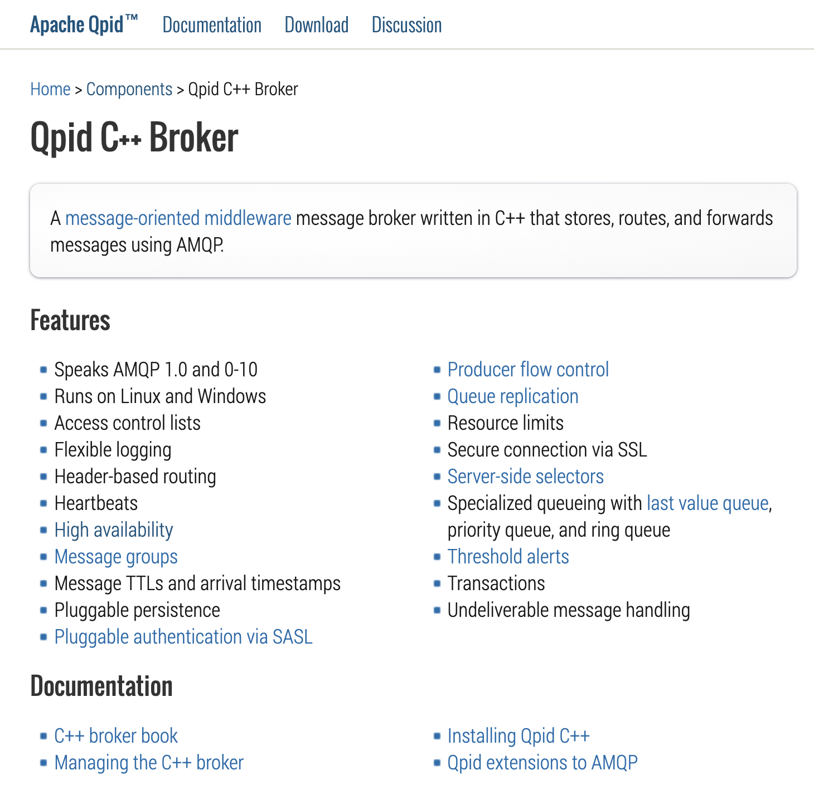

https://qpid.apache.org/components/cpp-broker/index.html



# Apache Qpid

Apache Qpid is a messaging system that implements the Advanced Message Queuing Protocol (AMQP). It is part of the Apache Software Foundation and provides a range of messaging solutions, including message brokers, client libraries, and tools for building messaging applications. Apache Qpid aims to provide reliable, scalable, and interoperable messaging solutions for various use cases.

## Key Components of Apache Qpid

1. **Qpid Broker-J**:
   - A Java-based message broker that implements AMQP 1.0, 0-10, 0-9, and 0-8 protocols.
   - Provides features such as message routing, persistence, transactions, and security.
   - Suitable for enterprise messaging applications requiring high reliability and scalability.

2. **Qpid Dispatch Router**:
   - A high-performance AMQP 1.0 message router.
   - Routes messages between AMQP endpoints with low latency and high throughput.
   - Supports advanced routing features such as link routing, message routing, and connection routing.

3. **Qpid Proton**:
   - A lightweight messaging library that provides AMQP 1.0 support for various languages, including C, C++, Java, Python, and others.
   - Enables the development of AMQP clients and applications.
   - Provides a flexible and efficient API for building messaging solutions.

4. **Qpid JMS**:
   - A Java Message Service (JMS) client that supports AMQP 1.0.
   - Allows Java applications to use AMQP messaging with a familiar JMS API.
   - Integrates with Java EE and Spring applications for enterprise messaging.

5. **Qpid C++ Broker**:
   - A C++ based message broker that implements AMQP 1.0 and 0-10 protocols.
   - Provides high performance and low latency messaging.
   - Suitable for applications requiring a lightweight and efficient message broker.

## Use Cases for Apache Qpid

- **Enterprise Messaging**: Apache Qpid provides reliable and scalable messaging solutions for enterprise applications, enabling communication between different systems and services.
- **IoT and M2M Communication**: Qpid Dispatch Router and Qpid Proton can be used to build efficient and scalable messaging solutions for IoT and machine-to-machine (M2M) communication.
- **Real-time Data Processing**: Apache Qpid can be used to build real-time data processing pipelines, enabling the collection, processing, and analysis of data in real-time.
- **Microservices Architecture**: Qpid Broker-J and Qpid JMS can be used to implement messaging patterns in microservices architectures, enabling decoupled communication between services.


# Apache Qpid Suite

Apache Qpid is a suite of messaging tools that implement the Advanced Message Queuing Protocol (AMQP). It provides a range of messaging solutions, including message brokers, client libraries, and tools for building messaging applications. Below is an overview of the Apache Qpid suite and examples of how to use its components in C++.

## Overview of Apache Qpid Suite

1. **Qpid Broker-J**: A Java-based message broker that implements AMQP 1.0, 0-10, 0-9, and 0-8 protocols.
2. **Qpid Dispatch Router**: A high-performance AMQP 1.0 message router.
3. **Qpid Proton**: A lightweight messaging library that provides AMQP 1.0 support for various languages, including C, C++, Java, Python, and others.
4. **Qpid JMS**: A Java Message Service (JMS) client that supports AMQP 1.0.
5. **Qpid C++ Broker**: A C++ based message broker that implements AMQP 1.0 and 0-10 protocols.

## Using Qpid Proton C++ for Publish-Subscribe

Qpid Proton is a lightweight messaging library that provides AMQP 1.0 support. Below are examples of how to use Qpid Proton C++ to implement publish-subscribe messaging.

### Prerequisites

1. **Install Qpid Proton**: Follow the installation instructions on the [Qpid Proton GitHub page](https://github.com/apache/qpid-proton).
2. **Set Up a Qpid Broker**: Ensure you have a Qpid broker running. You can use Qpid Broker-J or Qpid C++ Broker.

### Publisher Example

```cpp
#include <proton/container.hpp>
#include <proton/message.hpp>
#include <proton/messenger.hpp>
#include <proton/tracker.hpp>
#include <iostream>

class Publisher : public proton::messaging_handler {
public:
    void on_container_start(proton::container &c) override {
        proton::connection conn = c.connect("amqp://localhost:5672");
        sender_ = conn.open_sender("example-topic");
    }

    void on_sendable(proton::sender &s) override {
        proton::message msg("Hello, World!");
        s.send(msg);
        std::cout << "Message sent: " << msg.body() << std::endl;
    }

private:
    proton::sender sender_;
};

int main(int argc, char **argv) {
    Publisher publisher;
    proton::container(publisher).run();
    return 0;
}
```

### Subscriber Example

```cpp
#include <proton/container.hpp>
#include <proton/message.hpp>
#include <proton/messenger.hpp>
#include <proton/tracker.hpp>
#include <iostream>

class Subscriber : public proton::messaging_handler {
public:
    void on_container_start(proton::container &c) override {
        proton::connection conn = c.connect("amqp://localhost:5672");
        conn.open_receiver("example-topic");
    }

    void on_message(proton::delivery &d, proton::message &msg) override {
        std::cout << "Message received: " << msg.body() << std::endl;
    }
};

int main(int argc, char **argv) {
    Subscriber subscriber;
    proton::container(subscriber).run();
    return 0;
}
```
---

# Apache Qpid Suite: Subscription and Publish API Design using Qpid Java Library

This guide provides a detailed overview of how to design and implement subscription and publish APIs using the Apache Qpid suite with the Qpid Java library.

## Prerequisites

1. **Install Qpid Broker-J**: Ensure you have Qpid Broker-J installed and running. You can find installation instructions on the [Qpid Broker-J documentation page](https://qpid.apache.org/components/broker-j/index.html).
2. **Set Up a Qpid Broker**: Ensure you have a Qpid broker running.

## API Design

### Endpoints

- **Subscribe to a Topic**: Allows clients to subscribe to a specific topic.
- **Unsubscribe from a Topic**: Allows clients to unsubscribe from a specific topic.
- **Publish a Message**: Allows publishers to send messages to a topic.

### Example API Endpoints

```plaintext
POST /api/subscribe
POST /api/unsubscribe
POST /api/publish
```

- `Publisher API`: The publisher API example demonstrates how to create a JMS producer, configure it, and send messages to a Qpid topic.
- `Subscriber API`: The subscriber API example demonstrates how to create a JMS consumer, configure it, subscribe to a topic, and consume messages from the topic.
- `RESTful API`: The RESTful API example demonstrates how to expose the publish and subscribe functionalities using Spring Boot.


## Implementation

### Dependencies

Add the necessary dependencies to your `pom.xml` file for a Spring Boot project.

```xml
<dependencies>
    <dependency>
        <groupId>org.springframework.boot</groupId>
        <artifactId>spring-boot-starter-web</artifactId>
    </dependency>
    <dependency>
        <groupId>org.apache.qpid</groupId>
        <artifactId>qpid-jms-client</artifactId>
        <version>0.59.0</version>
    </dependency>
</dependencies>
```


## Publisher API

### Publisher Service

Define a service to handle message publishing.

```java
package com.example.qpidpublisher.service;

import org.apache.qpid.jms.JmsConnectionFactory;
import org.springframework.beans.factory.annotation.Value;
import org.springframework.stereotype.Service;

import javax.jms.Connection;
import javax.jms.JMSException;
import javax.jms.MessageProducer;
import javax.jms.Session;
import javax.jms.TextMessage;
import javax.jms.Topic;

@Service
public class PublisherService {

    @Value("${qpid.broker-url}")
    private String brokerUrl;

    public void publishMessage(String topicName, String message) throws JMSException {
        JmsConnectionFactory factory = new JmsConnectionFactory(brokerUrl);
        try (Connection connection = factory.createConnection()) {
            Session session = connection.createSession(false, Session.AUTO_ACKNOWLEDGE);
            Topic topic = session.createTopic(topicName);
            MessageProducer producer = session.createProducer(topic);
            TextMessage textMessage = session.createTextMessage(message);
            producer.send(textMessage);
            System.out.println("Message sent: " + message);
        }
    }
}
```
### Publisher Controller
Create a controller to expose the publish API.

```java
package com.example.qpidpublisher.controller;

import com.example.qpidpublisher.service.PublisherService;
import org.springframework.beans.factory.annotation.Autowired;
import org.springframework.web.bind.annotation.*;

import javax.jms.JMSException;

@RestController
@RequestMapping("/api")
public class PublisherController {

    @Autowired
    private PublisherService publisherService;

    @PostMapping("/publish")
    public String publishMessage(@RequestParam String topic, @RequestParam String message) {
        try {
            publisherService.publishMessage(topic, message);
            return "Message published";
        } catch (JMSException e) {
            e.printStackTrace();
            return "Failed to publish message";
        }
    }
}
```

## Subscriber API
### Subscriber Service
Define a service to handle message subscriptions.

```java
package com.example.qpidsubscriber.service;

import org.apache.qpid.jms.JmsConnectionFactory;
import org.springframework.beans.factory.annotation.Value;
import org.springframework.stereotype.Service;

import javax.annotation.PostConstruct;
import javax.jms.Connection;
import javax.jms.JMSException;
import javax.jms.Message;
import javax.jms.MessageConsumer;
import javax.jms.Session;
import javax.jms.TextMessage;
import javax.jms.Topic;

@Service
public class SubscriberService {

    @Value("${qpid.broker-url}")
    private String brokerUrl;

    @PostConstruct
    public void subscribeToTopic() throws JMSException {
        JmsConnectionFactory factory = new JmsConnectionFactory(brokerUrl);
        Connection connection = factory.createConnection();
        connection.start();
        Session session = connection.createSession(false, Session.AUTO_ACKNOWLEDGE);
        Topic topic = session.createTopic("example-topic");
        MessageConsumer consumer = session.createConsumer(topic);
        consumer.setMessageListener(message -> {
            if (message instanceof TextMessage) {
                try {
                    String text = ((TextMessage) message).getText();
                    System.out.println("Message received: " + text);
                } catch (JMSException e) {
                    e.printStackTrace();
                }
            }
        });
    }
}

```
### Subscriber Controller
Create a controller to expose the subscribe API.

```java
package com.example.qpidsubscriber.controller;

import com.example.qpidsubscriber.service.SubscriberService;
import org.springframework.beans.factory.annotation.Autowired;
import org.springframework.web.bind.annotation.*;

import javax.jms.JMSException;

@RestController
@RequestMapping("/api")
public class SubscriberController {

    @Autowired
    private SubscriberService subscriberService;

    @PostMapping("/subscribe")
    public String subscribeToTopic(@RequestParam String topic) {
        try {
            subscriberService.subscribeToTopic(topic);
            return "Subscribed to topic";
        } catch (JMSException e) {
            e.printStackTrace();
            return "Failed to subscribe to topic";
        }
    }
}
```