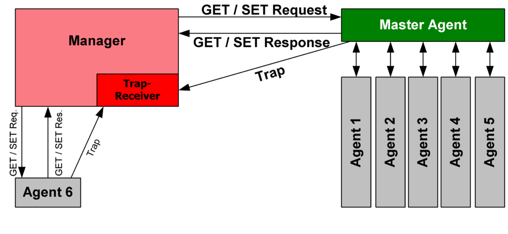

## SNMP (RFC 3411–3418) ##
- Simple Network Management Protocol (SNMP) 
- SNMP is an application layer protocol that uses UDP port number 161/162.SNMP is used to monitor the network, detect network faults, and sometimes even used to configure remote devices.

- The SNMP agent receives requests on UDP port 161. The manager may send requests from any available source port to port 161 in the agent. The agent response is sent back to the source port on the manager. 
- The manager receives notifications (Traps and InformRequests) on port 162. The agent may generate notifications from any available port. 
- When used with Transport Layer Security or Datagram Transport Layer Security, requests are received on port 10161 and notifications are sent to port 10162.

### SNMP message format 
- SNMPv1 specifies five core protocol data units (PDUs). Two other PDUs, GetBulkRequest and InformRequest were added in SNMPv2 and the Report PDU was added in SNMPv3. All SNMP PDUs are constructed as follows:

### SNMP components 
- `SNMP Manager` 
It is a centralized system used to monitor network. It is also known as Network Management Station (NMS) 
 
- `SNMP agent`
It is a software management software module installed on a managed device. Managed devices can be network devices like PC, routers, switches, servers, etc. 
 
- `Management Information Base`
MIB consists of information on resources that are to be managed. This information is organized hierarchically. It consists of objects instances which are essentially variables.  

### SNMP versions 

- `SNMPv1`
It uses community strings for authentication and uses UDP only. Eg.
 
- `SNMPv2c` 
It uses community strings for authentication. It uses UDP but can be configured to use TCP. 
 
- `SNMPv3` 
It uses Hash-based MAC with MD5 or SHA for authentication and DES-56 for privacy. This version uses TCP. Therefore, the conclusion is the higher the version of SNMP, the more secure it will be. 

### SNMP messages 
- `GetRequest` -
SNMP manager sends this message to request data from the SNMP agent. It is simply used to retrieve data from SNMP agents. In response to this, the SNMP agent responds with the requested value through a response message. 
 
- `GetNextRequest` – 
This message can be sent to discover what data is available on an SNMP agent. The SNMP manager can request data continuously until no more data is left. In this way, the SNMP manager can take knowledge of all the available data on SNMP agents. 
 
- `GetBulkRequest` – 
This message is used to retrieve large data at once by the SNMP manager from the SNMP agent. It is introduced in SNMPv2c. 
 
- `SetRequest` – 
It is used by the SNMP manager to set the value of an object instance on the SNMP agent. 
 
- `Response` – 
It is a message sent from the agent upon a request from the manager. When sent in response to Get messages, it will contain the data requested. When sent in response to the Set message, it will contain the newly set value as confirmation that the value has been set. 
 
- `Trap` – 
These are the message sent by the agent without being requested by the manager. It is sent when a fault has occurred. 
 
- `InformRequest` – 
It was introduced in SNMPv2c, used to identify if the trap message has been received by the manager or not. The agents can be configured to send trap message continuously until it receives an Inform message. It is the same as a trap but adds an acknowledgement that the trap doesn’t provide. 

### SNMP security levels
These are used in only SNMPv3. There are 3 security levels namely: 
- `noAuthNoPriv` – 
This (no authentication, no privacy) security level uses a community string for authentication and no encryption for privacy. 
 
- `authNopriv` – This security level (authentication, no privacy) uses HMAC with Md5 for authentication and no encryption is used for privacy. 
 
- `authPriv` – This security level (authentication, privacy) uses HMAC with Md5 or SHA for authentication and encryption uses the DES-56 algorithm. 

### Strength of SNMP:
1. It is simple to implement.
2. Agents are widely implemented.
3. Agent level overhead is minimal. 
4. It is robust and extensible.
5. Polling approach is good for LAN based managed object.
6. It offers the best direct manager agent interface.
7. SNMP meet a critical need.

### Limitation of SNMP:
1. It is too simple and does not scale well.
2. There is no object orietned data view.
3. It has no standard control definition. 
4. It has many implementation specific (private MIB) extensions. 
5. It has high communication overhead due to polling

### SNMP command

### Community String Types
There are actually three community strings for SNMPv1-v2c-speaking devices:

- `SNMP Read-only community string` - enables a remote device to retrieve "read-only" information from a device. Intermapper uses this information from devices on its maps.
- `SNMP Read-Write community string` - used in requests for information from a device and to modify settings on that device. Intermapper does not use the read-write community string, since it never attempts to modify any settings on its devices.
- `SNMP Trap community string` - included when a device sends SNMP Traps to Intermapper. Intermapper accepts any SNMP Trap community string.

By convention, most SNMPv1-v2c equipment ships from the factory with a read-only community string set to "public". It is standard practice for network managers to change all the community strings so that outsiders cannot see information about the internal network. (In addition, network managers may employ firewalls to block any SNMP traffic to ports 161 and 162 on the internal network.)