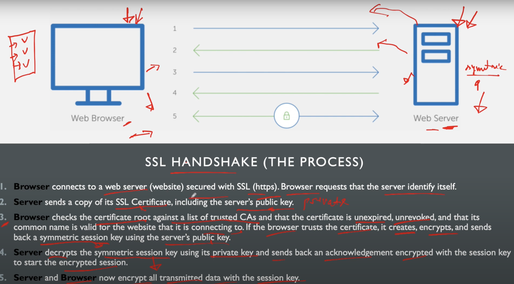
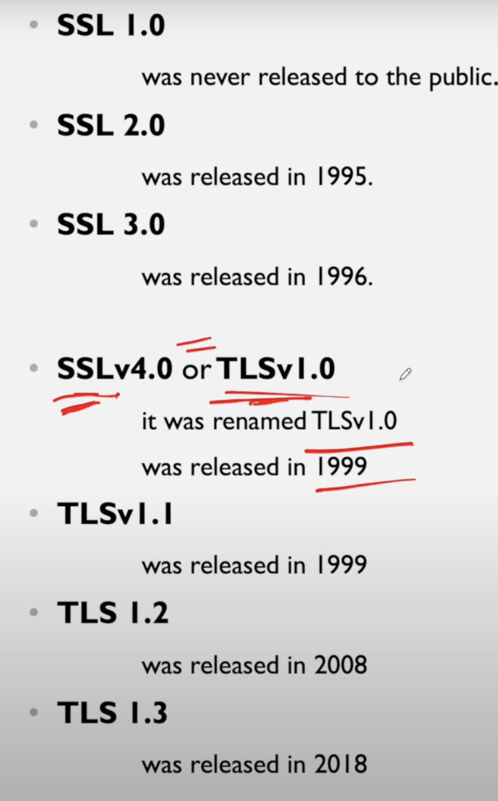
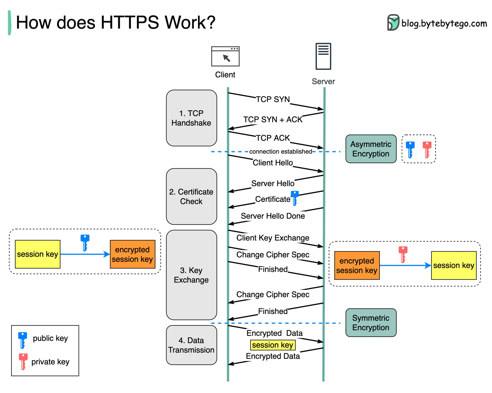

### what is SSL communication
- In below diagram only one way certificate is exchanged (server to client)
- In Some case 2 way certificate exchange is also supported.x

### What is Open SSL
- OpenSSL is an open-source software library that provides cryptographic functions and protocols for secure communication over computer networks. It implements the Secure Sockets Layer (SSL) and Transport Layer Security (TLS) protocols, which are commonly used to secure internet communications, including web browsing, email, instant messaging, and virtual private networks (VPNs).

- OpenSSL offers a wide range of cryptographic functions, including encryption, decryption, digital signatures, certificate management, and random number generation. It is widely used in various software applications, operating systems, and network devices to provide secure communication and data protection.

- Overall, OpenSSL plays a crucial role in ensuring the confidentiality, integrity, and authenticity of sensitive data transmitted over networks.

### HTTPS 

### Why do we need TLS or SSL if IPsec also provide the security
- TLS (Transport Layer Security) and IPsec (Internet Protocol Security) are both protocols used to provide security for network communication, but they operate at different layers of the networking stack and serve different purposes:

- TLS operates at the transport layer (Layer 4) of the OSI model. It is primarily used to secure end-to-end communication between applications running on hosts over the Internet. TLS is commonly used to secure protocols like HTTPS, SMTPS, IMAPS, and others. It provides encryption, authentication, and integrity protection for the data exchanged between client and server applications.

- IPsec operates at the network layer (Layer 3) of the OSI model. It is designed to secure IP packets as they are transmitted over the network. IPsec can be used to secure communication between network devices such as routers, firewalls, and VPN gateways. It provides encryption, authentication, and integrity protection for IP packets at the network layer.

- While TLS is more commonly used for securing application-level communication, IPsec is often used to secure communication between network infrastructure devices or to create secure tunnels between networks. Both TLS and IPsec have their own strengths and use cases, and they can be used together in a complementary manner to provide end-to-end security for network communication.

### PKI
- PKI (Public Key Infrastructure) certificate handling involves the management of digital certificates within a PKI framework. 
- This includes tasks such as issuing, revoking, and validating certificates, as well as managing the associated public and private keys. 
- PKI certificate handling is crucial for ensuring the security and integrity of online communications, as it enables the secure exchange of information over networks by verifying the identities of parties involved and encrypting data transmissions.

### Difference b/w SSL and TLS
LS (Transport Layer Security) and SSL (Secure Sockets Layer) are cryptographic protocols designed to provide secure communication over a computer network. Although they serve the same purpose, there are several key differences between them:

#### Historical Context
- SSL: Developed by Netscape in the mid-1990s, SSL went through several versions, with SSL 3.0 being the last version. It was the first widely adopted protocol for securing web traffic.
- TLS: TLS 1.0 was introduced in 1999 as an upgrade to SSL 3.0, addressing some security flaws and improving upon the protocol. It was standardized by the Internet Engineering Task Force (IETF). Since then, TLS has gone through several versions (1.1, 1.2, and 1.3), with each version introducing improvements in security and performance.
#### Security
- SSL: Early versions of SSL (1.0, 2.0) had significant security vulnerabilities. SSL 3.0, while an improvement, also has vulnerabilities like the POODLE (Padding Oracle On Downgraded Legacy Encryption) attack.
- TLS: Each new version of TLS has enhanced security features and has deprecated older, less secure cryptographic algorithms. TLS 1.2 and especially TLS 1.3 have significantly improved security measures, making them much more secure than SSL 3.0.
#### Performance
- TLS 1.3: Offers a streamlined handshake process compared to earlier versions of SSL/TLS. This results in faster connection times and improved performance over the network.
#### Algorithm Support
- SSL: Supported a limited set of cryptographic algorithms.
- TLS: Supports a wider range of more secure cryptographic algorithms. TLS 1.3, for example, removes support for older, less secure algorithms entirely and mandates the use of forward secrecy.
#### Adoption
- SSL: No longer considered secure and has been deprecated by most browsers and tech standards. It’s not recommended for use.
- TLS: The current standard for securing internet connections. TLS 1.2 and TLS 1.3 are widely adopted and recommended for securing web traffic.
#### Compatibility
- SSL: Due to its deprecation, SSL 3.0 is incompatible with many modern systems and security policies.
- TLS: Has broad compatibility with modern web browsers, servers, and other internet infrastructure. However, very old browsers or systems may not support the latest versions of TLS.
#### Naming and Usage
Despite the technical shift from SSL to TLS, many people continue to use the term "SSL" colloquially when referring to TLS, especially in the context of "SSL certificates" which are, in fact, used for TLS.
In summary, while SSL laid the groundwork for secure communications on the internet, TLS has taken the lead in providing a secure, efficient, and flexible protocol for encrypted communication. The continued development of TLS ensures that it evolves to meet the security challenges of modern internet use.

