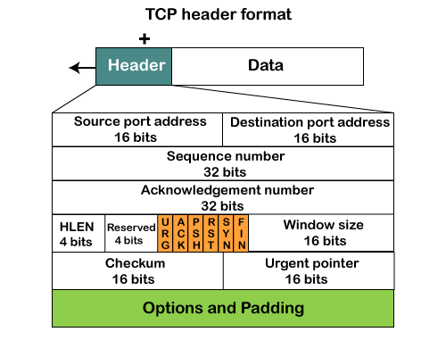
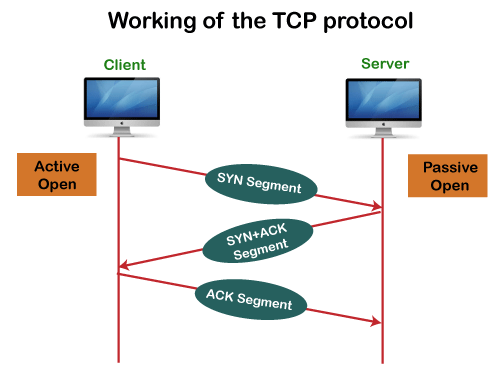
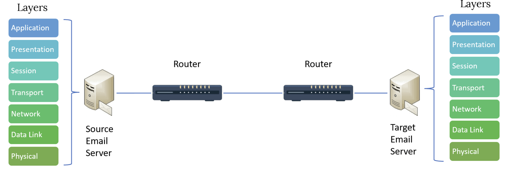
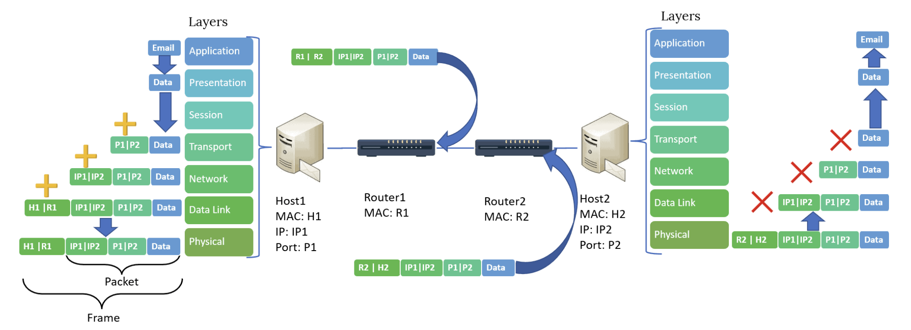
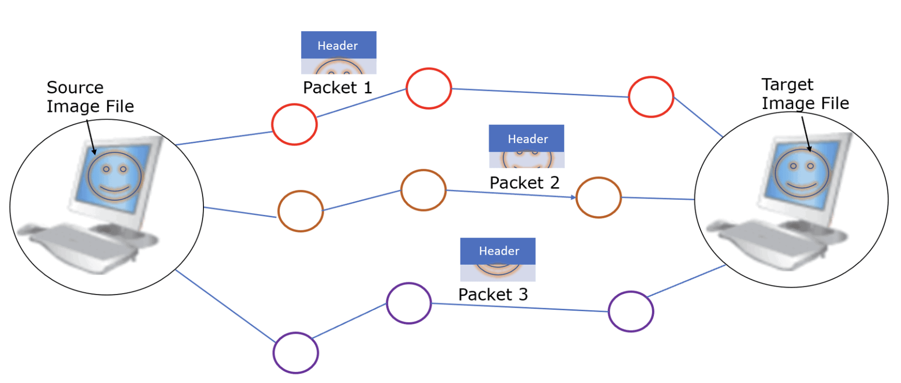
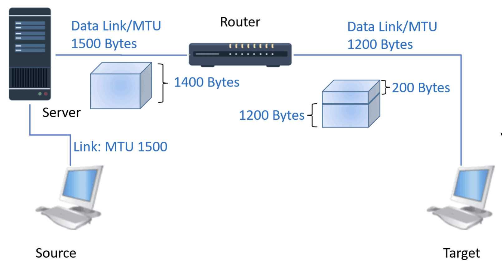

## TCP ##
source: https://www.javatpoint.com/tcp
- TCP stands for Transmission Control Protocol. 
- It is a transport layer protocol that facilitates the transmission of packets from source to destination. 
- It is a connection-oriented protocol that means it establishes the connection prior to the communication that occurs between the computing devices in a network. 
- This protocol is used with an IP protocol, so together, they are referred to as a TCP/IP.
- The minimum size of 20 bytes and maximum of 60 bytes, allowing for up to 40 bytes of options in the header. 
- The maximum size of a TCP packet is 64K (65535 bytes). Generally, the packet size gets restricted by the Maximum Transmission Unit (MTU) of network resources. MTU is the maximum size of the data transfer limit set by hardware in a network. The packet size should never exceed MTU. 
- `MTU`: The internet’s transmission control protocol (TCP) uses the MTU to determine the maximum size of each packet in any transmission. MTU is usually associated with the Ethernet protocol, where a `1500-byte` packet is the largest allowed.

- The main functionality of the TCP is to take the data from the application layer. Then it divides the data into a several packets, provides numbering to these packets, and finally transmits these packets to the destination. The TCP, on the other side, will reassemble the packets and transmits them to the application layer. 
- As we know that TCP is a connection-oriented protocol, so the connection will remain established until the communication is not completed between the sender and the receiver.

- `Source port`: It defines the port of the application, which is sending the data. So, this field contains the source port address, which is 16 bits.
- `Destination port`: It defines the port of the application on the receiving side. So, this field contains the destination port address, which is 16 bits.
- `Sequence number`: This field contains the sequence number of data bytes in a particular session.
- `Acknowledgment number`: When the ACK flag is set, then this contains the next sequence number of the data byte and works as an acknowledgment for the previous data received. For example, if the receiver receives the segment number 'x', then it responds 'x+1' as an acknowledgment number.
- `HLEN`: It specifies the length of the header indicated by the 4-byte words in the header. The size of the header lies between 20 and 60 bytes. Therefore, the value of this field would lie between 5 and 15.
- `Reserved`: It is a 4-bit field reserved for future use, and by default, all are set to zero.
- `Flags`
There are six control bits or flags:
    - `URG`: It represents an urgent pointer. If it is set, then the data is processed urgently.
    - `ACK`: If the ACK is set to 0, then it means that the data packet does not contain an acknowledgment.
    - `PSH`: If this field is set, then it requests the receiving device to push the data to the receiving application without buffering it.
    - `RST`: If it is set, then it requests to restart a connection.
    - `SYN`: It is used to establish a connection between the hosts.
    - `FIN`: It is used to release a connection, and no further data exchange will happen.
- `Window size`
    It is a 16-bit field. It contains the size of data that the receiver can accept. This field is used for the flow control between the sender and receiver and also determines the amount of buffer allocated by the receiver for a segment. The value of this field is determined by the receiver.
- `Checksum`
    It is a 16-bit field. This field is optional in UDP, but in the case of TCP/IP, this field is mandatory.
- `Urgent pointer`
    It is a pointer that points to the urgent data byte if the URG flag is set to 1. It defines a value that will be added to the sequence number to get the sequence number of the last urgent byte.
- `Options`
    It provides additional options. The optional field is represented in 32-bits. If this field contains the data less than 32-bit, then padding is required to obtain the remaining bits.

### Hnadshake ###
In TCP, the connection is established by using three-way handshaking. 
- The client sends the segment with its sequence number.
- The server, in return, sends its segment with its own sequence number as well as the acknowledgement sequence, which is one more than the client sequence number. 
- When the client receives the acknowledgment of its segment, then it sends the acknowledgment to the server. 

### Advantages 
- It provides a connection-oriented reliable service, which means that it guarantees the delivery of data packets. If the data packet is lost across the network, then the TCP will resend the lost packets.
- It provides a flow control mechanism using a sliding window protocol.
- It provides error detection by using checksum and error control by using Go Back or ARP protocol.
- It eliminates the congestion by using a network congestion avoidance algorithm that includes various schemes such as additive increase/multiplicative decrease (AIMD), slow start, and congestion window.
### Disadvantage
- It increases a large amount of overhead as each segment gets its own TCP header, so fragmentation by the router increases the overhead.

### Features
- Transport Layer Protocol
- Reliable
- Order of the data is maintained
- Connection-oriented
- Full duplex
- Stream-oriented

## Mail Communication using TCP Example
https://www.baeldung.com/cs/tcp-max-packet-size#:~:text=The%20maximum%20size%20of%20a,by%20hardware%20in%20a%20network.
### 1.MTU
- Transmission Control Protocol (TCP) is helpful to send a file or message over a connected network. 
- Each file gets divided into packets at the sender network. The packets get merged on arrival at the receiving network. The maximum size of a TCP packet is 64K (65535 bytes).
- Generally, the packet size gets restricted by the Maximum Transmission Unit (MTU) of network resources. MTU is the maximum size of the data transfer limit set by hardware in a network. The packet size should never exceed MTU.

### 2.TCP Connection
- TCP connection uses TCP, one of the core protocols in the internet protocol suite, and offers a dependable protocol for digital communication. 
- TCP receives messages from a network resource such as a server, router, switches, splits them into packets, and finally forwards them to the target network resource. Almost all connections involving the internet uses a TCP connection.  Let’s take the example of email communication to understand TCP communication: 

 
- A. In the Application Layer, the email client uses SMTP protocol to communicate with the email server when we send an email. 
- P. The Presentation Layer converts our mail into ASCII and images. 
- S. The Session Layer establishes and maintains the connection with the target server. 
- T. The Transport Layer splits the message into multiple packets and adds port information of both source and destination servers. 
- N. The Network Layer defines the routing path of packets by adding corresponding IP addresses. It is interesting that even if each packet is travelling for the same target, the route they use to travel may be different. 
- D. Data Link Layer prepares the packet to transfer over the Ethernet, and the Physical Layer eventually transmits the frame over the physical connection like LAN cable, WiFi, or broadband. The following figure explains the above process:

### 3. Frame & Packet
- Digital data exchange within a computer network uses frames and packets. The main difference between frame and packet is that frame is the serial collection of bits, and a packet is the fragmented data encapsulated in a frame. 
- A packet is a single data unit within the Network Layer in the OSI model. Each packet generally includes a header and a payload. The header has the port & IP address of the source and destination network device.
- The data or message content is the payload.  For example, when we transfer an image file, the file is divided into several packets. The packets contain parts of the image that travel separately. The packets get rejoined by the receiving network device to reconstruct the image file. In the end, they get combined to retrieve the same image file:

### 4. Why Packet Size Is Important
- The packet loss rate is dependent on the packet size. 
- The large is the packet size, the more probability of packet loss. 
- The packet size causes different impacts on the communication network parameters like the packet loss rate and the throughput.
- We must keep the packet size below MTU for better TCP connection performance. The maximum packet size should be in the range of 1500 bytes (broadband) and 576 bytes (dial-up). A router can get the MTU of the target connection from the interface configuration information.
#### 4.1 Advantages
The advantages of packet-based TCP communication are the following:
- Efficiently use of the bandwidth of a network.
- Variable packet sizes are used based on the communications standard. 
- Each packet travels independently based on the optimal network route.
- Require no dedicated channel for routing packets but use any available network path connecting to the destination network.
- Configure packet size using the feature of an operating system.
- A small packet size can give better network latency

#### 4.2. Disadvantages
The disadvantages of a packet-based TCP connection are the following:
- Configuring the packet size higher than the MTU can lead to jabbering.
- A  small packet size may result in slow transmission.
When the maximum packet size exceeds the network’s physical MTU, it impacts performance. 

### 5. Fragmentation of Packets for Different MTUs 
Let’s assume a source device using TCP communication that sends an IP packet over the network. The packet size must be smaller than the MTU of the target and intermediary network. This restriction is by the network data link layer and hardware MTUs. So what happens if the packet is larger than the MTU of the intermediary network or target device???

The answer is to halve the packet further into pieces, and `this process is known as fragmentation`. The individual pieces are fragments that are then rejoined at the target network to retrieve the complete packet. However, depending on the type of IP protocol, such as IPv4 and IPv6 following conditions may occur:

`IPv4`: When the Don’t Fragment (DF) flag is active, the fragmentation of the packet is not possible. If DF status is inactive, the router can split a packet into fragments. The target device can rejoin the fragments later. It will return the packet to the source network without fragmentation.
`IPv6`: Packets can’t get fragmented by routers and returned to the source network.
Let’s now see how fragmentation works. The following figure shows a  source data link or MTU of 1500 Bytes and the target MTU of 1200 Bytes. Considering fragmentation is allowed, the packet size of 1400 Bytes gets divided into 1200 Bytes and 200 Bytes:

We must be wondering what happens to the original packet during fragmentation? They get discarded, and the data within them gets fragmented.

### 5.1. Advantages
Reducing overheads.
No overhead of `Path MTU Discovery (PMTUD).`
### 5.2. Disadvantages
- Loss of a fragment may require resending the packet and initiating the fragmentation again.
- The first fragment only contains the header that may lead to issues with the devices that depend on inspecting the headers.
Fragmentation may need reordering, particularly if few packets are only fragmented.

### 6. Importance of MTU
- MTU is a unit of estimation indicating the maximum size of a data bundle that a network resource can acknowledge effectively. It’s the most important parameter that the other networks should know for establishing a TCP connection. 
- A larger MTU supports more data to fit within lesser packets, resulting in faster and improved transmission performance. However, if an error occurs in communication, the packet takes longer to re-transmit. 
- A smaller MTU can improve network latency.

