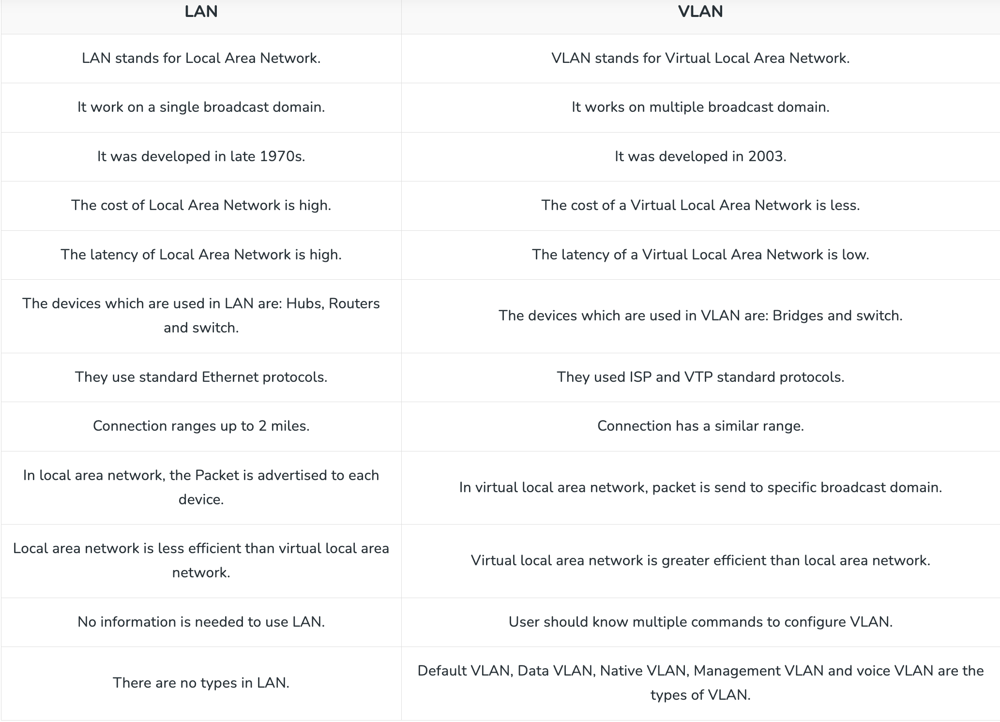

### QA Link: 
- https://www.interviewbit.com/networking-interview-questions/
- https://www.shiksha.com/online-courses/articles/networking-interview-questions-answers/
- https://www.ambitionbox.com/skills/networking-interview-questions
- https://www.simplilearn.com/network-engineer-interview-questions-article 

### "google.com" when you type in your browser what happend behind
When you type "google.com" into your web browser and press Enter, several steps occur behind the scenes to resolve the domain name and load the website. Here's an overview of the process:

- `DNS Resolution`: Your web browser first checks its cache to see if it already has the IP address for "google.com". If not, it sends a DNS (Domain Name System) query to your operating system.
Your operating system checks its DNS resolver cache to see if it has the IP address for "google.com". If not, it sends a DNS query to a DNS server.

- `DNS Server Lookup`: The DNS server receives the DNS query and checks its records to find the IP address associated with "google.com".
If the DNS server has the IP address cached, it returns the IP address to your operating system. Otherwise, it forwards the query to other DNS servers until it finds the IP address or reaches the authoritative DNS server for "google.com".

- `DNS Response`: Once the DNS resolver has the IP address for "google.com", it returns the IP address to your operating system.
Your operating system caches the IP address for future use and forwards it to your web browser.

- `Establishing Connection`: Your web browser uses the IP address obtained from DNS to establish a TCP (Transmission Control Protocol) connection to the Google server.
The browser sends an HTTP (Hypertext Transfer Protocol) request to the Google server, specifying the page or resource it wants to retrieve.

- `Server Processing`: The Google server receives the HTTP request and processes it. It may fetch the requested webpage or resource from its storage, generate dynamic content, or perform other operations as needed.

- `Response`: The Google server sends an HTTP response back to your web browser, containing the requested webpage or resource. Your web browser receives the HTTP response and begins rendering the webpage for display.

- `Page Rendering`: Your web browser parses the HTML, CSS, and JavaScript content received in the HTTP response and renders the webpage on your screen.
It may also fetch additional resources (such as images, scripts, or stylesheets) referenced in the webpage to complete the rendering process.

Overall, this sequence of steps involves DNS resolution, establishing a connection to the server, sending and processing HTTP requests and responses, and finally rendering the webpage for the user to view.

### What happens when you enter google.com in the web browser?

Below are the steps that are being followed:

- Check the browser cache first if the content is fresh and present in cache display the same.
- If not, the browser checks if the IP of the URL is present in the cache (browser and OS) if not then request the OS to do a DNS lookup using UDP to get the corresponding IP address of the URL from the DNS server to establish a new TCP connection.
- A new TCP connection is set between the browser and the server using three-way handshaking.
- An HTTP request is sent to the server using the TCP connection.
- The web servers running on the Servers handle the incoming HTTP request and send the HTTP response.
- The browser process the HTTP response sent by the server and may close the TCP connection or reuse the same for future requests.
- If the response data is cacheable then browsers cache the same.
- Browser decodes the response and renders the content.

### what is diffrence b/w routing policy and firewall policy

Routing policy and firewall policy are both crucial aspects of network configuration, but they serve different purposes and operate at different layers of the network stack. Here's a brief overview of the differences between routing policy and firewall policy:

#### Routing Policy:
- `Purpose`: Routing policy determines how network traffic is directed within a network or between different networks. It defines rules and preferences for selecting the best path for packets to reach their destination.

- `Layer`: Routing policy operates at the network layer (Layer 3) of the OSI model.

- `Functionality`: Routing policies control the flow of traffic based on factors such as network topology, routing protocols, and traffic engineering requirements. They determine which routes are advertised to neighboring routers, influence route selection decisions, and implement policies like load balancing, traffic prioritization, and route filtering.

#### Firewall Policy:
- `Purpose`: Firewall policy governs the flow of network traffic based on security criteria. It determines which packets are allowed to pass through the firewall and which are blocked or filtered based on predefined rules.

- `Layer`: Firewall policy operates at the network layer (Layer 3) or higher layers of the OSI model, depending on the type of firewall and the features it supports.

- `Functionality`: Firewall policies enforce security measures to protect the network from unauthorized access, malicious attacks, and unwanted traffic. They define rules for permitting or denying traffic based on factors such as source and destination IP addresses, ports, protocols, and application-level attributes. Firewall policies can implement stateful inspection, intrusion prevention, content filtering, and other security features to safeguard the network perimeter and internal resources.

In summary, routing policy focuses on optimizing network traffic flow and connectivity, while firewall policy focuses on enforcing security measures and controlling access to network resources. Both policies play complementary roles in network management and security, with routing policy handling traffic routing and optimization and firewall policy handling traffic filtering and security enforcement.

### What is ACL
ACL stands for Access Control List. It is a set of rules or configurations that specify which users or systems are granted access to resources and what actions they are allowed to perform on those resources. ACLs are commonly used in computer networks, operating systems, databases, and other IT systems to enforce security policies and control access to data and services.

In the context of networking, ACLs are often used in routers, switches, and firewalls to filter traffic based on various criteria such as source and destination IP addresses, port numbers, protocols, and other attributes. By configuring ACLs, network administrators can selectively permit or deny traffic, effectively controlling the flow of packets through the network and protecting against unauthorized access, malicious attacks, and other security threats.

ACLs can be implemented as either:

- `Standard ACLs`: These ACLs filter traffic based solely on the source IP address. They are relatively simple to configure but provide limited control over traffic filtering.
- `Extended ACLs`: These ACLs allow filtering based on multiple criteria such as source and destination IP addresses, port numbers, protocols, and other attributes. They offer more granular control over traffic filtering but are more complex to configure.
ACLs are an essential component of network security infrastructure and are widely used to enforce security policies, control network access, and protect sensitive data from unauthorized access or modification.

### ACL in Firewall
In a firewall, Access Control Lists (ACLs) are used to control the flow of network traffic by permitting or denying packets based on specified criteria. Here's how ACLs are used in firewalls:

- `Traffic Filtering`: ACLs in firewalls define rules that determine which packets are allowed to pass through the firewall and which are blocked. These rules are based on various criteria such as:

    - Source and destination IP addresses: ACLs can permit or deny traffic based on the IP addresses of the source and destination hosts.
    - Port numbers: ACLs can filter traffic based on TCP or UDP port numbers, allowing or blocking specific services or applications.
    - Protocol types: ACLs can specify the protocol type (e.g., TCP, UDP, ICMP) allowed to pass through the firewall.
    - Packet attributes: ACLs can consider other packet attributes such as packet size, time of day, or interface.
- `Traffic Inspection`: ACLs can be configured to inspect packets for specific patterns or characteristics. For example, ACLs can look for patterns indicative of malicious traffic, such as known attack signatures or suspicious payloads, and block such traffic accordingly.

- `Security Policies`: ACLs enforce security policies by permitting only authorized traffic to enter or leave the network while blocking unauthorized or potentially harmful traffic. This helps protect the network from various threats, including unauthorized access, denial-of-service attacks, and malware.

- `Granular Control`: ACLs provide granular control over traffic filtering, allowing network administrators to define specific rules tailored to their organization's security requirements. This enables administrators to enforce least privilege access, restrict access to sensitive resources, and comply with regulatory requirements.

Overall, ACLs play a crucial role in firewall configuration by providing a flexible and effective means of controlling network traffic and enforcing security policies to protect the network infrastructure and its assets.

### What is overlay n/w

An overlay network is a virtual network that spans multiple physical networks or hosts. It enables communication between containers running on different Docker hosts or nodes. Overlay networks are commonly used in Docker Swarm mode to facilitate communication between containers deployed across multiple hosts in a cluster.

Key characteristics of overlay networks include:

- `Transparent Communication`: Containers connected to an overlay network can communicate with each other as if they were on the same physical network, regardless of their actual physical location or host.

- `Encapsulation`: Overlay networks use encapsulation techniques such as VXLAN (Virtual Extensible LAN) to encapsulate container traffic and route it between hosts in the cluster.

- `Cross-Host Communication`: Containers on different hosts can communicate with each other seamlessly over the overlay network, allowing for distributed applications and services to be deployed across multiple hosts.

- `Secure Communication`: Overlay networks support encryption and authentication to ensure secure communication between containers running on different hosts.

- `Scalability`: Overlay networks are highly scalable and can accommodate large numbers of containers distributed across multiple hosts in a Docker Swarm cluster.

Overall, overlay networks play a crucial role in enabling communication between containers in distributed and multi-host Docker environments, making it easier to deploy and manage complex applications and microservices architectures.

### How TraceRoute works
Traceroute is a diagnostic tool used to trace the path that packets take from your local device to a destination server or website on the Internet. Here's how it works:

- `Sending Packets`: Traceroute sends a series of UDP or ICMP packets towards the destination server. These packets have increasingly large TTL (Time to Live) values starting from 1.

- `TTL Expiration`: Each packet is sent with a TTL value representing the maximum number of hops it can travel before being discarded. The TTL is initially set to 1 for the first packet.

- `Router Hop`: When a packet reaches a router, the TTL is decremented by one. If the TTL reaches zero, the router discards the packet and sends an ICMP Time Exceeded message back to the sender.

- `ICMP Response`: When the packet's TTL expires, the router sends an ICMP Time Exceeded message back to the sender, indicating that the packet was discarded due to TTL expiration. This message also contains information about the router that discarded the packet.

- `Recording Router`: Traceroute records the IP address of the router that sent the ICMP Time Exceeded message, as well as the round-trip time (RTT) for the packet.

- `Increasing TTL`: Traceroute repeats this process, sending packets with increasing TTL values. This allows it to trace the path taken by packets from your local device to the destination server.

- `Destination Reached`: Eventually, one of the packets reaches the destination server. When this happens, the server sends an ICMP Echo Reply message back to the sender.

- `Traceroute Completion`: Traceroute detects the ICMP Echo Reply from the destination server and prints out the list of routers traversed along with their IP addresses and RTT values.

By analyzing the output of traceroute, network administrators can identify the network hops (routers) that packets traverse to reach a destination, identify network bottlenecks or points of failure, and troubleshoot network connectivity issues.

### LAN vs VLAN

###  What are Unicasting, Anycasting, Multicasting and Broadcasting?

- `Unicasting`: If the message is sent to a single node from the source then it is known as unicasting. This is commonly used in networks to establish a new connection.
- `Anycasting`: If the message is sent to any of the nodes from the source then it is known as anycasting. It is mainly used to get the content from any of the servers in the Content Delivery System.
- `Multicasting`: If the message is sent to a subset of nodes from the source then it is known as multicasting. Used to send the same data to multiple receivers. 
- `Broadcasting`: If the message is sent to all the nodes in a network from a source then it is known as broadcasting. DHCP and ARP in the local network use broadcasting.

