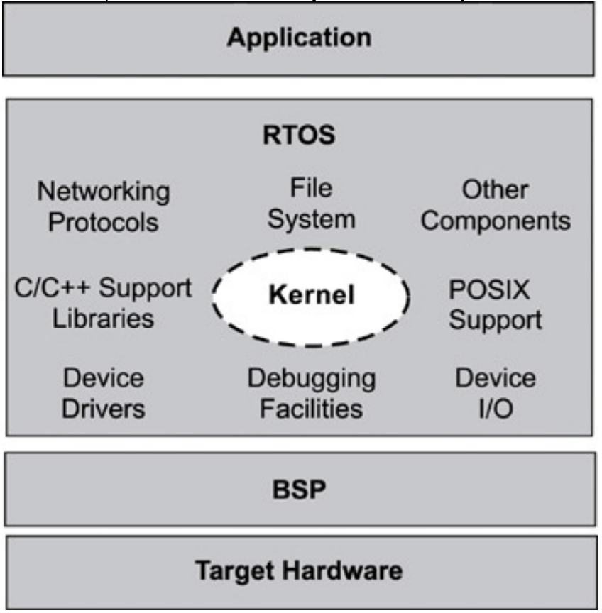
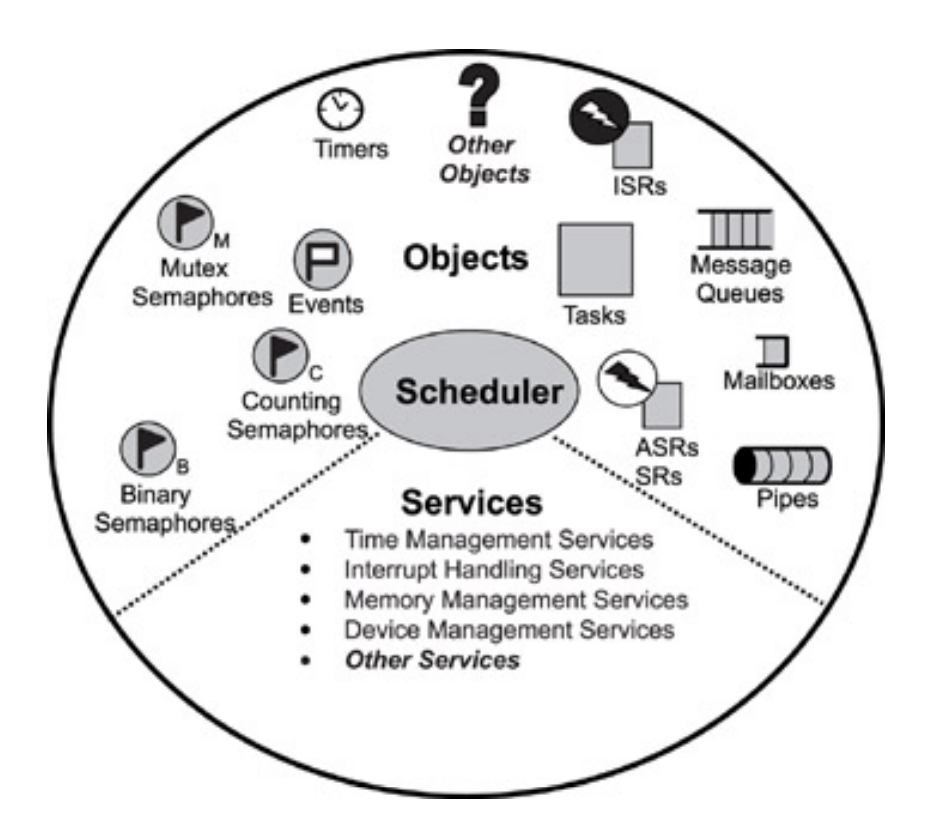
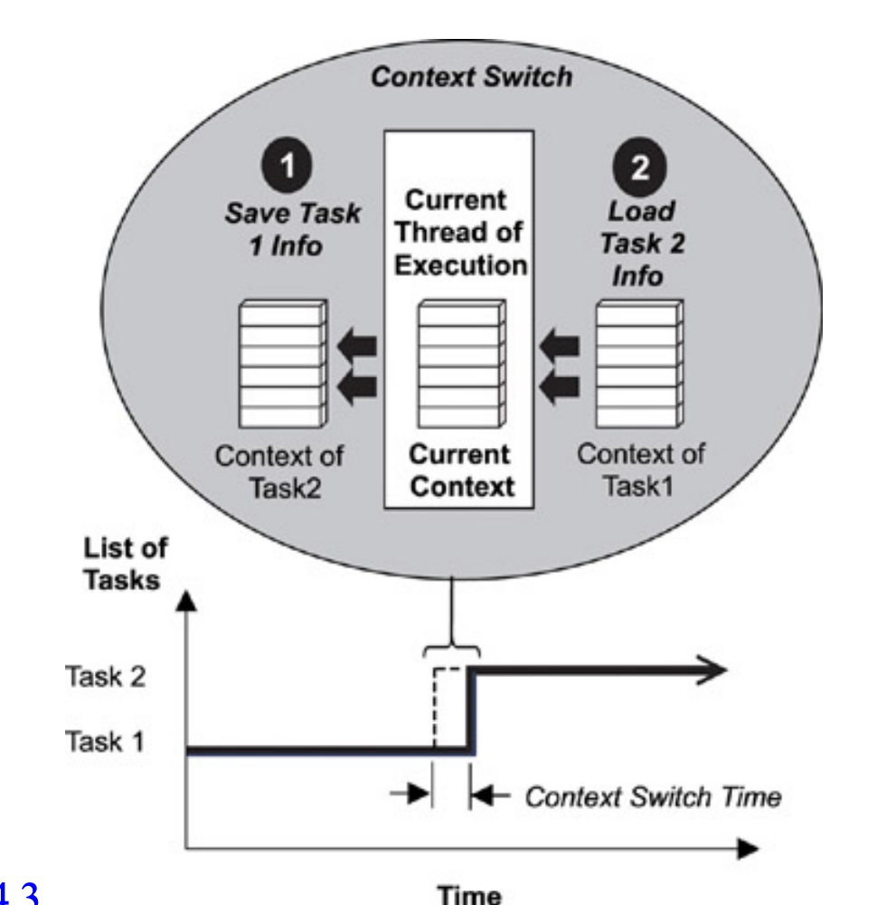
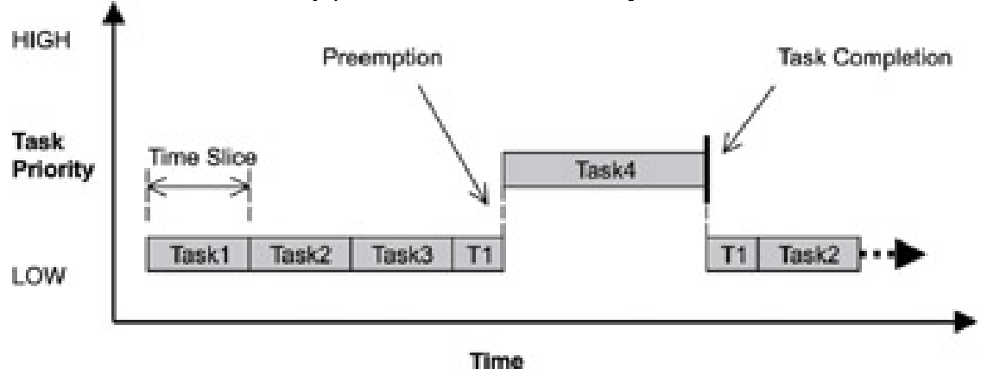
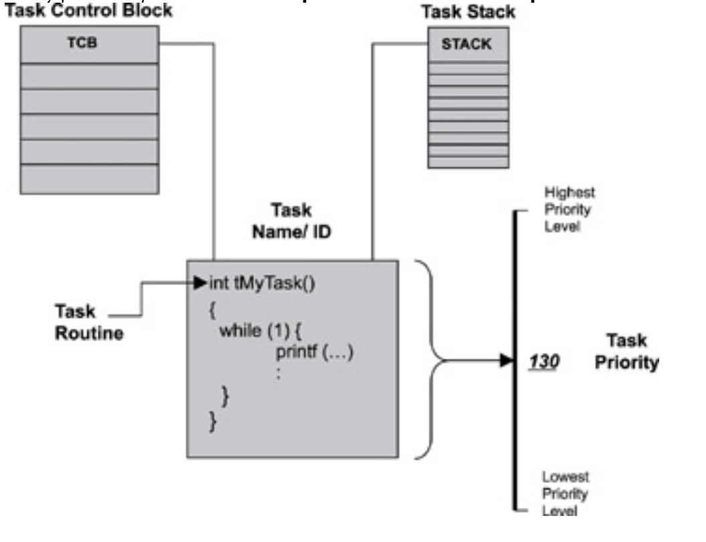
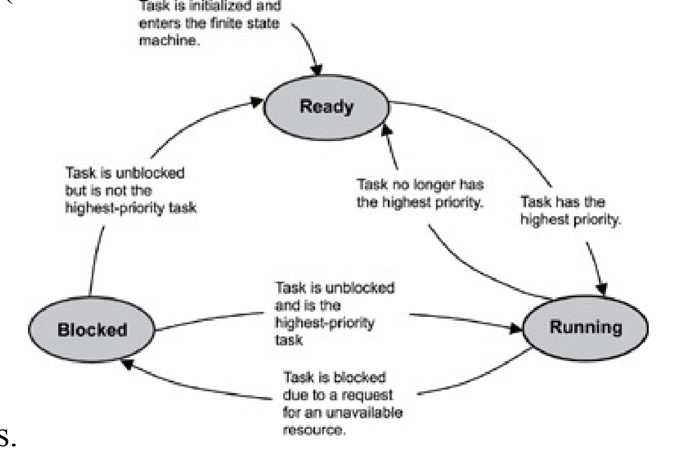
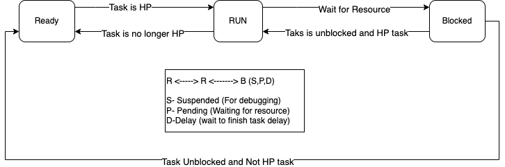
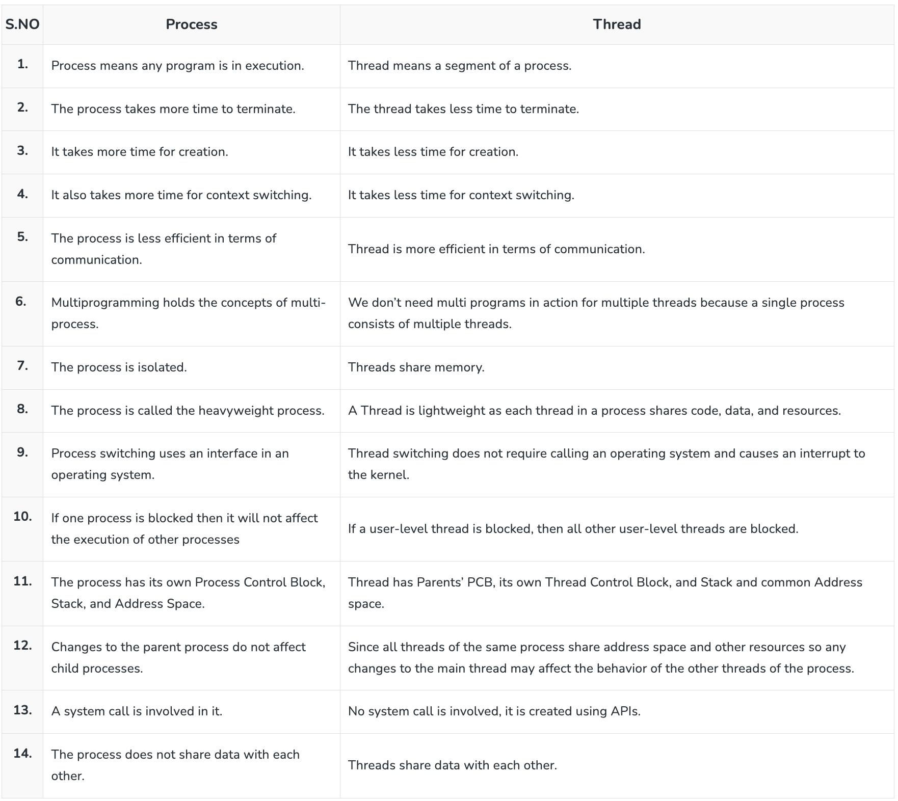
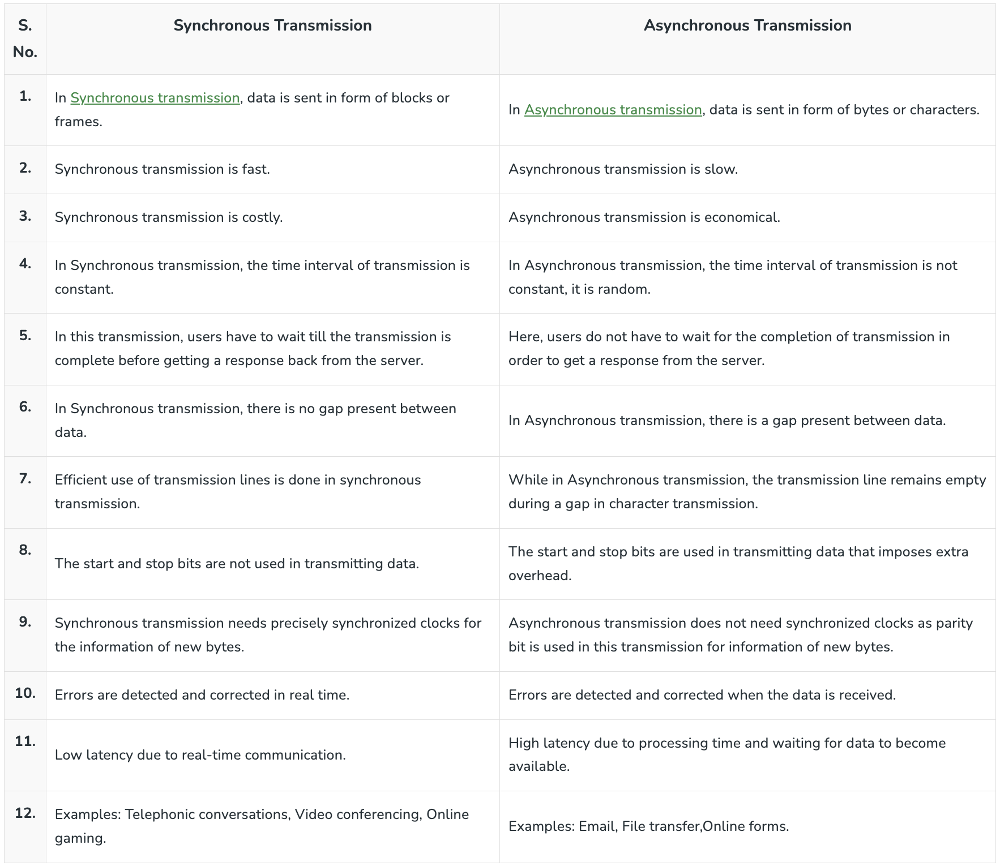

## RTOS
- A real-time operating system (RTOS) is a program that schedules execution in a timely manner, manages system
resources, and provides a consistent foundation for developing application code.
- Good RTOSes, therefore, are scalable in order to meet different sets of requirements for different applications. 
- RTOS can be a combination of various modules, including the kernel, a file system, networking protocol stacks, and other components required for a particular application


## RTOS Components
Most RTOS kernels contain the following components:

- `Scheduler`-is contained within each kernel and follows a set of algorithms that determines which task executes when. Some common examples of scheduling algorithms include round-robin and preemptive scheduling.

- `Objects`-are special kernel constructs that help developers create applications for real-time embedded
systems. Common kernel objects include tasks, semaphores, and message queues.

- `Services`-are operations that the kernel performs on an object or, generally operations such as timing,
interrupt handling, and resource management.




## 3 Scheduler

### 3.1 schedulable entities 
- A schedulable entity is a kernel object that can compete for execution time on a system, based on a predefined scheduling algorithm. Tasks and processes are all examples of schedulable entities found in most kernels.
- Note message queue and semaphores are not schedulable entities these are inter task communication objects used for synchcronization and communication.

### 3.2 multitasking: 
- Multitasking is the ability of the operating system to handle multiple activities within set deadlines. 

### 3.3 context switching
- A context switch occurs when the scheduler switches from one task to another. Every time a new task is created, the kernel also creates and maintains an associated task control block (TCB).


### 3.4 dispatcher 
- It is part of scheduler that perform context switching and change the flow of execution. At any time the flow of execution is passing through one of three area
    - through the task
    - throogh the ISR
    - through the kernal
-  When a task or ISR makes a system call, the flow of control passes to the kernel to execute one of the system routines provided by the kernel. When it is time to leave the kernel, the dispatcher is responsible for passing control to one of the tasks in the user's application. 
- It will not necessarily be the same task that made the system call. It is the scheduling algorithms of the scheduler that determines which task executes next. So It is the
dispatcher that does the actual work of context switching and passing execution control. 

### 3.5 scheduling algorithms

##### 3.5.1 preemptive priority-based scheduling
- most real-time kernels use preemptive priority-based
scheduling by default.
- Real-time kernels generally support 256 priority levels, in which 0 is the highest and 255 the lowest. Some
kernels appoint the priorities in reverse order, where 255 is the highest and 0 the lowest
- With a preemptive priority-based scheduler, each task has a priority, and the highest-priority task runs first. If a task with a priority higher than the current task becomes ready to run, the kernel immediately saves the current task s context in its TCB and switches to the higher-priority task.


##### 3.5.2 round-robin scheduling
- Round-robin scheduling provides each task an equal share of the CPU execution time. 
- Pure round-robin scheduling cannot satisfy real-time system requirements because in real-time systems, tasks perform work of
varying degrees of importance. Instead, preemptive priority-based scheduling can be augmented with round-robin scheduling which uses time slicing to achieve equal allocation of the CPU for tasks of the same priority.
- Newly added tasks of the same priority are placed at the end of the cycle, with their run-time counters initialized to 0.
- If a task in a round-robin cycle is preempted by a higher-priority task, its run-time count is saved and then
restored when the interrupted task is again eligible for execution.  


### 4. Kernel objects
Kernel objects are special constructs that are the building blocks for application development for real-time
embedded systems. The most common RTOS kernel objects are

#### 4.1 Tasks
Simple software applications are typically designed to run sequentially , one instruction at a time, in a pre-determined chain of instructions. However, this scheme is inappropriate for real-time embedded applications, which generally handle multiple inputs and outputs within tight time constraints. Real-time embedded software applications must be designed for concurrency.

Concurrent design requires developers to decompose an application into small, schedulable, and sequential
program units.

Most RTOS kernels provide task objects and task management
services to facilitate designing concurrency within an application. 

This chapter discusses the following topics:
- task definition 
- task states and scheduling 
- Semaphores
- Message Queues
- Pipes
- Event registers
- Signals
- Condition variables

### Defining a Task
- A task is an independent thread of execution that can compete with other concurrent tasks for processor execution time.developers decompose applications into multiple concurrent tasks to optimize the handling of inputs and outputs within set time constraints.
- A task is schedulable, the task is able to compete for execution time on a system, based on a predefined scheduling algorithm. 
- each task has an associated name, a unique ID, a priority (if part of a preemptive scheduling plan), a task control block (TCB), a stack, and a task routine


- When the kernel first starts, it creates its own set of system tasks and allocates the appropriate priority for each
from a set of reserved priority levels.
- The reserved priority levels refer to the priorities used internally by the RTOS for its system tasks.
- An application should avoid using these priority levels for its tasks because running application tasks at such level may affect the overall system performance or behavior.

Examples of system tasks include:
- initialization or startup task initializes the system and creates and starts system tasks,
- idle task uses up processor idle cycles when no other activity is present,
- logging task logs system messages,
- exception-handling task handles exceptions, and
- debug agent task allows debugging with a host debugger. Note that other system tasks might be created
during initialization, depending on what other components are included with the kernel.

### task state and scheduling
Whether it's a system task or an application task, at any time each task exists in one of a small number of states,
including `ready`, `running`, or `blocked`



Although kernels can define task-state groupings differently, generally three main states are used in most typical preemptive-scheduling kernels, including:
- `ready state`-the task is ready to run but cannot because a higher priority task is executing.
- `blocked state`-the task has requested a resource that is not available, has requested to wait until some
event occurs, or has delayed itself for some duration.
- `running state`-the task is the highest priority task and is running

Note some commercial kernels, such as the VxWorks kernel, define other, more granular states, such as
suspended, pended, and delayed. 

### Ready State 
- When a task is first created and made ready to run, the kernel puts it into the ready state. In this state, the task
actively competes with all other ready tasks for the processor's execution time. 
-  tasks in the ready state cannot move directly to the blocked state. A task first needs to run so it can make a blocking call, which is a call to a function that cannot immediately run to completion, thus putting the task in the blocked state. Ready tasks, therefore, can only move to the running state.
- Because many tasks might be in the ready state,
the kernel's scheduler uses the priority of each task to determine which task to move to the running state.

### Runnig State
- Task moves from running state to readyb statee when it is preempted by higher priority task. In this case preemted task is put in the appropriate priority based location in the task ready list and higher priority task is moved from ready to running task.

### Blocked state
- The possibility of blocked states is extremely important in real-time systems because without blocked states,
lower priority tasks could not run. If higher priority tasks are not designed to block, CPU starvation can result.
- CPU starvation occurs when higher priority tasks use all of the CPU execution time and lower priority tasks do
not get to run.
- A task can only move to the blocked state by making a blocking call, requesting that some blocking condition be
met. 

Examples of how blocking conditions are met include the following:
- a semaphore token (described later) for which a task is waiting is released,
- a message, on which the task is waiting, arrives in a message queue, or
- a time delay imposed on the task expires.

### Typical Task Operations
- creating and deleting tasks,
- controlling task scheduling, and
- obtaining task information.

### Typical Task Structure
When writing code for tasks, tasks are structured in one of two ways:
- run to completion, or
- endless loop.

### Run-to-Completion Tasks
This is most useful for initialization and start up. They typically run once when system first power on. The initialization task initialize the task application and create additional services, task are needed kernal object

```
CompletionTask ()
{
    Initialize application
    Create endless loop tasks
    Create kernel objects
    Delete or suspend this task
}
```
The application initialization task typically has a higher priority than the application tasks it creates so that its
initialization work is not preempted

### Endless-Loop Tasks
- The structure of an endless loop task can also contain
initialization code.when the task first runs, after which the task executes in an endless loop
- The critical part of the design of an endless-loop task is the one or more blocking calls within the body of the
loop. These blocking calls can result in the blocking of this endless-loop task, allowing lower priority tasks to
run.
```
EndlessLoopTask ()
{
    Initialization code
    Loop Forever
    {
        Body of loopMake one or more blocking calls
    }
}
```
### Process vs thread


### Synchronous vs Asyncronous


