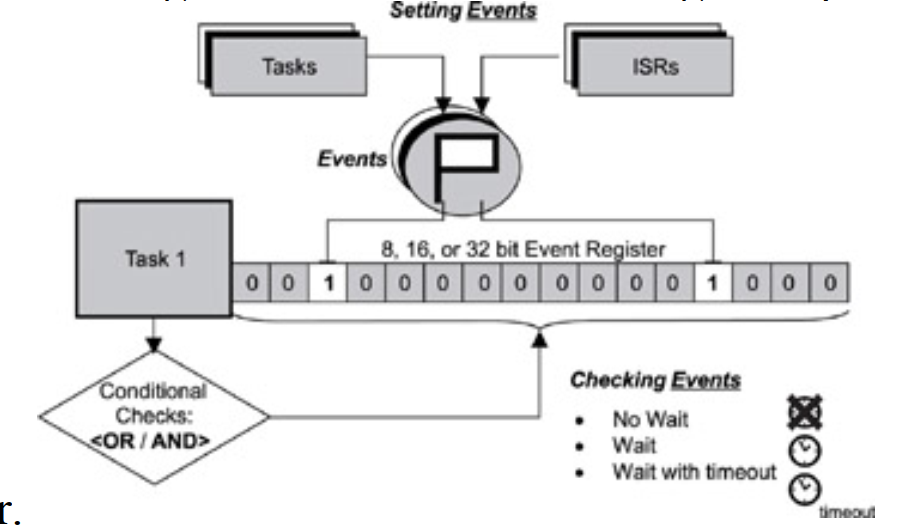

## Event Registers
- Some kernels provide a special register as part of each task's control block This register, called an event register, is an object belonging to a task and consists of a group of binary event flags used to track the occurrence of specific events. 
- event register can be 8-, 16-, or 32-bits wide, maybe even more. Each bit in the event register is
treated like a binary flag (also called an event flag) and can be either set or cleared.
- Through the event register, a task can check for the presence of particular events that can control its execution. 
- An external source, such as another task or an ISR, can set bits in the event register to inform the task that a particular event has occurred.
- Event in the event register are not queued. An event register can not count the occurence of the same event while it is pending, therefore the subsequent events are lost.

## Typical Uses of Event Registers
- Event registers are typically used for unidirectional activity synchronization. It is unidirectional because the
issuer of the receive operation determines when activity synchronization should take place. 
- Pending events in the event register do not change the execution state of the receiving task.
- No data is associated with an event when events are sent through the event register. Other mechanisms must be
used when data needs to be conveyed along with an event.This lack of associated data can sometimes create
difficulties
- Another difficulty in using an event register is that it does not have a built-in mechanism for identifying the
source of an event if multiple sources are possible. One way to overcome this problem is for a task to divide
the event bits in the event register into subsets.