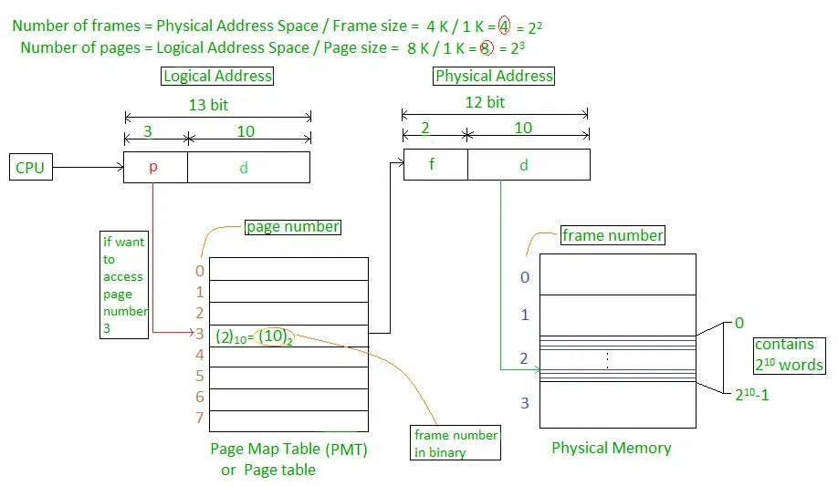
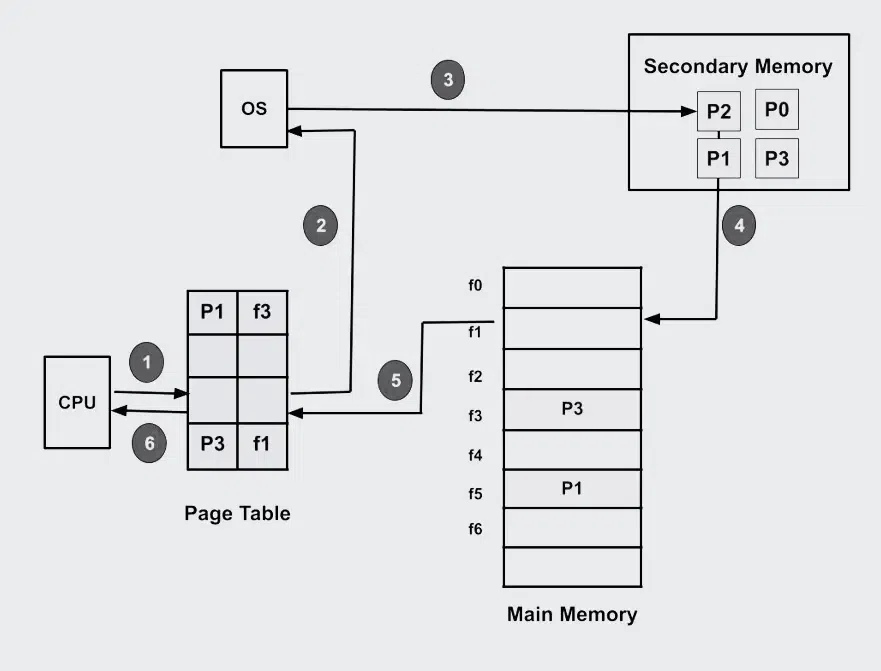
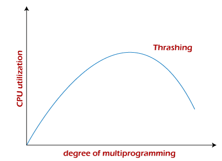
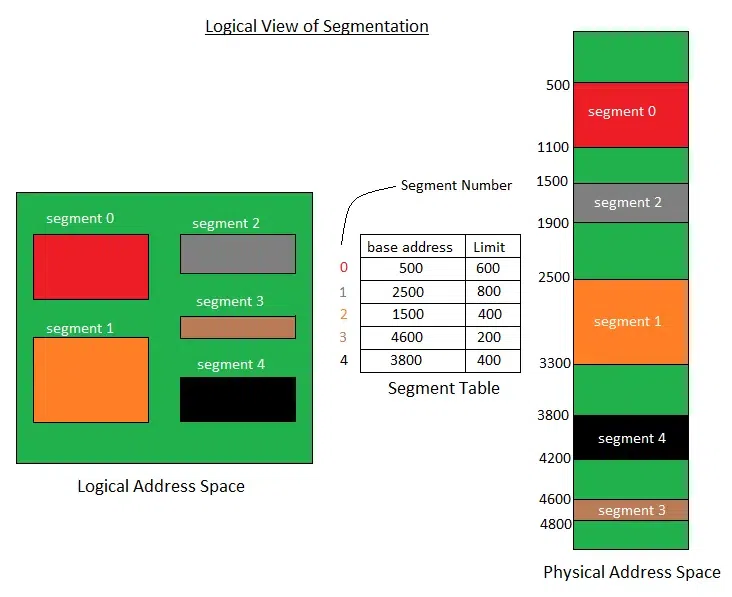

## Paging
- Paging is a memory management scheme that eliminates the need for a contiguous allocation of physical memory. This scheme permits the physical address space of a process to be non–contiguous.
- The process of retrieving processes in the form of pages from the secondary storage into the main memory is known as paging. 
- Physical memory is broken into fixed size block called frames
- logical memory also broken in to blocks called pages.
- When a process is to be executated its page are loaded into any available memory from the backing store.
- When a process requests memory, the operating system allocates one or more page frames to the process and maps the process’s logical pages to the physical page frames.
- The basic advantage of Paging is that it reduces external fragmentation, but it is not able to reduce internal fragmentation.

### Page Table
The mapping between logical pages and physical page frames is maintained by the page table, which is used by the memory management unit to translate logical addresses into physical addresses. The page table maps each logical page number to a physical page frame number.

### MMU Role
The mapping from virtual to physical address is done by the Memory Management Unit (MMU) which is a hardware device and this mapping is known as the paging technique.
- The Physical Address Space is conceptually divided into a number of fixed-size blocks, called frames.
- The Logical Address Space is also split into fixed-size blocks, called pages.
- Page Size = Frame Size

### Page number
The address generated by the CPU is divided into

### Page number(p): 
it is used to index into page table.
### Page offset(d): 
Number of bits required to represent a particular word in a page or page size of Logical Address Space or word number of a page or page offset.

### example

- Physical Address = 12 bits, then Physical Address Space = 4 K words
- Logical Address = 13 bits, then Logical Address Space = 8 K words
- Page size = frame size = 1 K words (assumption)

### Demand Paging
- Demand paging is a technique used in virtual memory systems where pages enter main memory only when requested or needed by the CPU.
- It is used in operating systems to improve memory usage and system performance.
- In demand paging, the operating system loads only the necessary pages of a program into memory at runtime, instead of loading the entire program into memory at the start.
- A `page fault` occurred when the program needed to access a page that is not currently in memory.

### Pure Demand Paging 
- It is a specific implementation of demand paging.The operating system only loads pages into memory when the program needs them. 

### Tharshing
- Thrashing is when the page fault and swapping happens very frequently at a higher rate, and then the operating system has to spend more time swapping these pages. This state in the operating system is known as thrashing. Because of thrashing, the CPU utilization is going to be reduced or negligible.
- If it is spending more time in paging then execution is called page thashing.

- It can be limited by 
    - Local replacement algorithm
    - Priority replacement algorithm
### Segmenation
- It is memory management scheme that supports the user view of memory. A logical address is a collection of segmenation each segment has a name and length. The address specify both the segment name and the offset within the segment. 
