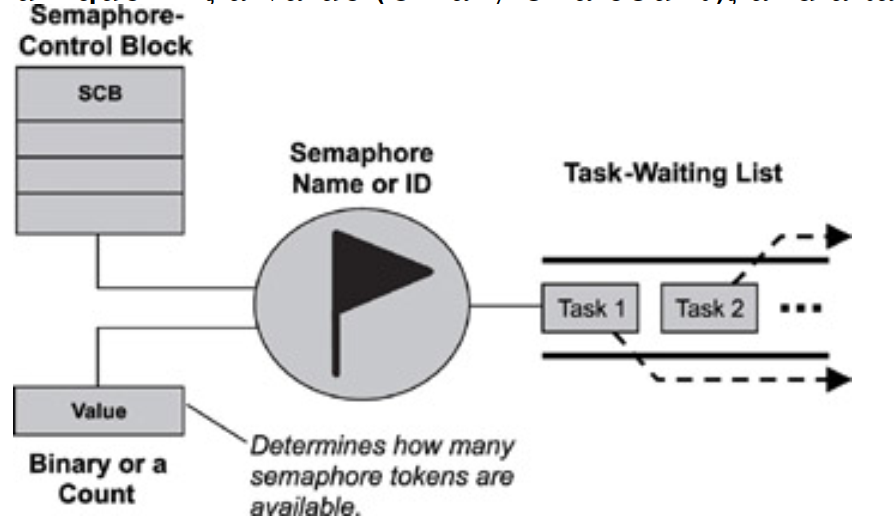
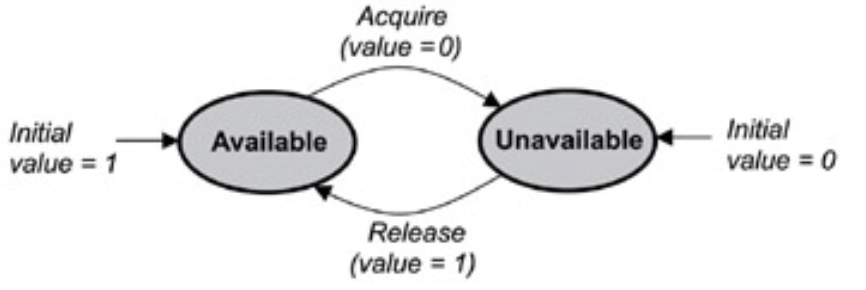
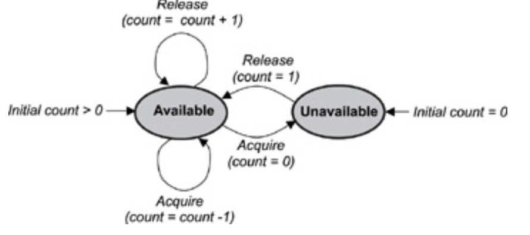
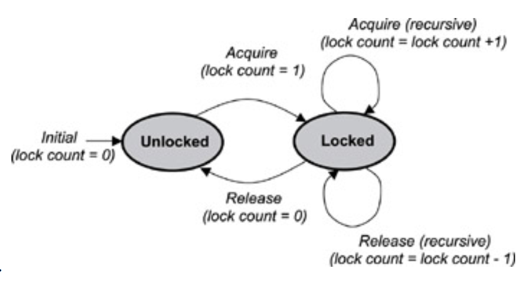

## Semaphore
- A semaphore (sometimes called a semaphore token) is a kernel object that one or more threads of execution
can acquire or release for the purposes of synchronization or mutual exclusion.
- When a semaphore is first created, the kernel assigns to it an associated semaphore control block (SCB), a
unique ID, a value (binary or a count), and a task-waiting list.


- A semaphore is like a key that allows a task to carry out some operation or to access a resource. If the task can
acquire the semaphore, it can carry out the intended operation or access the resource.
- A single semaphore can be acquired a finite number of times.
- The kernel tracks the number of times a semaphore has been acquired or released by maintaining a token count,
which is initialized to a value when the semaphore is created. As a task acquires the semaphore, the token count
is decremented; as a task releases the semaphore, the count is incremented.
- A kernel can support many different types of semaphores, including binary, counting, and mutual-exclusion
(mutex) semaphores.

### Binary Semaphores
A binary semaphore can have a value of either 0 or 1. When a binary semaphore s value is 0, the semaphore is
considered unavailable (or empty); when the value is 1, the binary semaphore is considered available (or full
). 
 - 0 -> unavailable
 - 1 -> available


### Counting Semaphores
A counting semaphore uses a count to allow it to be acquired or released multiple times. When creating a
counting semaphore, assign the semaphore a count that denotes the number of semaphore tokens it has initially.
If the initial count is 0, the counting semaphore is created in the unavailable state. If the count is greater than 0,
the semaphore is created in the available state, and the number of tokens it has equals its count,


### Mutex Semaphores
A mutual exclusion (mutex) semaphore is a special binary semaphore that supports ownership, recursive
access, task deletion safety, and one or more protocols for avoiding problems inherent to mutual exclusion.
- As opposed to the available and unavailable states in binary and counting semaphores, the states of a mutex are
unlocked or locked (0 or 1, respectively)
- A mutex is initially created in the unlocked state, in which it can be acquired by a task. After being acquired, the mutex moves to the locked state
- 0 -> unlocked
- 1 -> locked


- Depending on the implementation, a mutex can support additional features not found in binary or counting
semaphores. These key differentiating features include
    - ownership, 
    - recursive locking, 
    - task deletion safety, and
    - priority inversion avoidance protocols.

#### Mutex Ownership
- Ownership of a mutex is gained when a task first locks the mutex by acquiring it. Conversely, a task loses
ownership of the mutex when it unlocks it by releasing it. 
- When a task owns the mutex, it is not possible for any
other task to lock or unlock that mutex.
- Contrast this concept with the binary semaphore, which can be released by any task, even a task that did not originally acquire the semaphore.

#### Recursive Locking
- Many mutex implementations also support recursive locking, which allows the task that owns the mutex to acquire it multiple times in the locked state.
- when a recursive mutex is first locked, the kernel registers the task that locked it as the
owner of the mutex. On successive attempts, the kernel uses an internal lock count associated with the mutex to
track the number of times that the task currently owning the mutex has recursively acquired it. To properly
unlock the mutex, it must be released the same number of times

#### Task Deletion Safety
- Some mutex implementations also have built-in task deletion safety. 
- Premature task deletion is avoided by using task deletion locks when a task locks and unlocks a mutex. 
- Enabling this capability within a mutex ensures that while a task owns the mutex, the task cannot be deleted. Typically protection from premature deletion is enabled by setting the appropriate initialization options when creating the mutex

#### Priority Inversion Avoidance
- Priority inversion commonly happens in poorly designed real-time embedded applications. 
- Priority inversion occurs when a higher priority task is blocked and is waiting for a resource being used by a lower priority task, which has itself been preempted by an unrelated medium-priority task. In this situation, the higher priority task's priority level has effectively been inverted to the lower priority task s level.
- Two common protocols used for avoiding priority inversion include:
    - `priority inheritance protocol` ensures that the priority level of the lower priority task that has acquired the mutex is raised to that of the higher priority task that has requested the mutex when inversion happens. The priority of the raised task is lowered to its original value after the task releases the mutex that the higher priority task requires.
    - `ceiling priority protocol` ensures that the priority level of the task that acquires the mutex is automatically set to the highest priority of all possible tasks that might request that mutex when it is first acquired until it is released. When the mutex is released, the priority of the task is lowered to its original value.

### Typical Semaphore Use
Semaphores are useful either for synchronizing execution of multiple tasks or for coordinating access to a
shared resource. 

- wait-and-signal synchronization,
- multiple-task wait-and-signal synchronization,
- credit-tracking synchronization,
- single shared-resource-access synchronization,
- recursive shared-resource-access synchronization, and
- multiple shared-resource-access synchronization.

### Mutex vs Sempahore
- Mutex is mutual exclusion technique for synchronization while semaphore is a signaling mechanism.
- Use mutex where you want to allow piece of code (normally called critical section) to be executed by one thread at a time. Use semaphore to signal/notify about some event. For eg. for logging into onefile for multiple threads batter to use mutex for critical section of logging message.
- We can use priority for certain thread using sempahore.
- Mutex is an object while semaphre is an integer.
- Mutex uses lock() and unlock() call while semaphore uses wait() and signal() call.
- Mutex can be released by thread which has locked it but semphore can be released by any thread which actually did not acquire it.

```cpp
//mutex
while(1){
    lock(m1);
    /* critical section */
    unlock(m1);
}
```

```cpp
//semaphore
semaphore s1 = 0; // unavailable
semaphore s2 = 1; // available
void Thread1(){
    while(1){
        sem_wait(s1);
        /* critical section */
        sem_post(s2);
    }
}

void Thread2(){
    while(1){
        sem_wait(s2);
        /* critical section */
        sem_post(s1);
    }
}
// Thread 2 will be executed first
```
