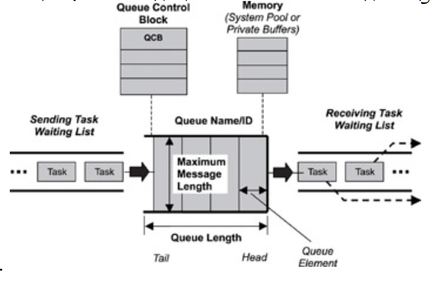
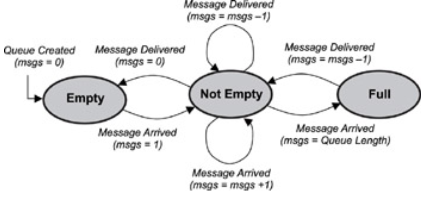

## Message Queue
To facilitate inter task data communication , kernal provide a message queue object and message queue management services.

### Defining Message Queues
- A message queue is a buffer-like object through which tasks and ISRs send and receive messages to
communicate and synchornize with data. 
- A message queue is like a pipeline. It temporarily holds messages from a sender until the intended receiver is ready to read them.
- This temporary buffering decouples a sending and
receiving task; that is, it frees the tasks from having to send and receive messages simultaneously.
- When a message queue is first created, it is assigned an 
    - associated queue control block (QCB), 
    - a message queue name, 
    - a unique ID, 
    - memory buffers, 
    - a queue length, 
    - a maximum message length,
    - one or more task-waiting lists

### message queue state
When a message queue is first created, the FSM is in the empty state. If a task attempts to receive messages from this
message queue while the queue is empty, the task blocks and, if it chooses to, is held on the message queue's
task-waiting list, in either a FIFO or priority-based order.

### Message Queue Storage
Different kernels store message queues in different locations in memory.

#### System Pools
- Using a system pool can be advantageous if it is certain that all message queues will never be filled to capacity
at the same time. 
- The advantage occurs because system pools typically save on memory use. 
- The downside is that a message queue with large messages can easily use most of the pooled memory, not leaving enough
memory for other message queues. 
- Indications that this problem is occurring include a message queue that is not full that starts rejecting messages sent to it or a full message queue that continues to accept more messages.

#### Private Buffers
- Using private buffers, on the other hand, requires enough reserved memory area for the full capacity of every
message queue that will be created. 
- This approach clearly uses up more memory; however, it also ensures that messages do not get overwritten and that room is available for all messages, resulting in better reliability than the pool approach.

### Typical Message Queue Use
The following are typical ways to use message queues within an application:
- non-interlocked, one-way data communication,
- interlocked, one-way data communication,
- interlocked, two-way data communication, and
- broadcast communication.