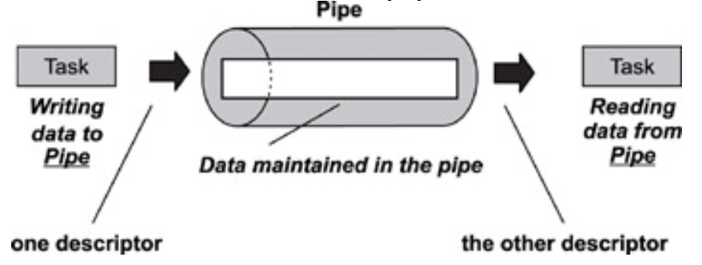
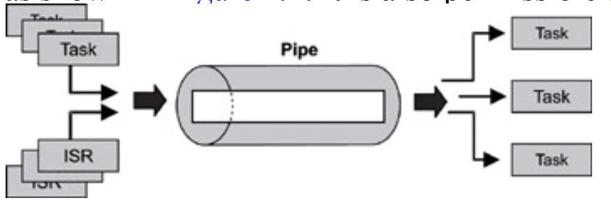
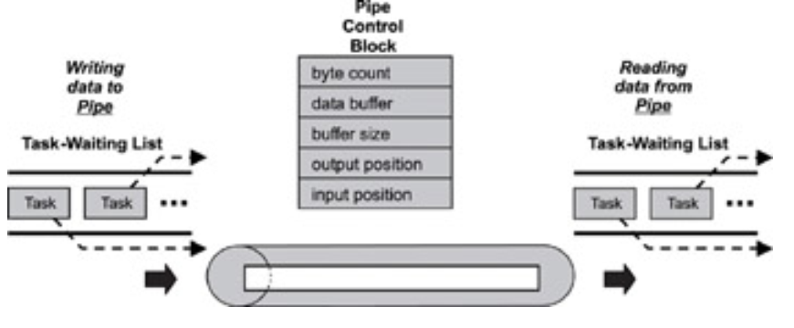
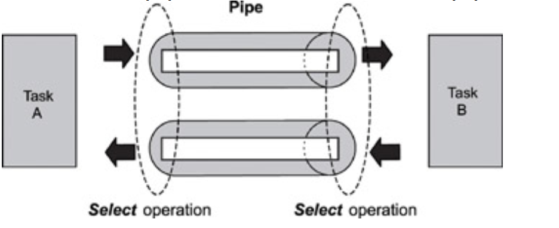

## Pipes
- Pipes are kernel objects that provide unstructured data exchange and facilitate synchronization among tasks. In a
traditional implementation, a pipe is a unidirectional data exchange facility
- Two descriptors, one for each end of the pipe (one end for reading and one for writing), are returned when the pipe
is created. 

- Data is written via one descriptor and read via the other. The data remains in the pipe as an unstructured byte stream. Data is read from the pipe in FIFO order.
- A pipe provides a simple data flow facility so that the reader becomes blocked when the pipe is empty, and the
writer becomes blocked when the pipe is full. Typically, a pipe is used to exchange data between a data-producing task and a data-consuming task

- Note that a pipe is conceptually similar to a message queue but with significant differences. For example, unlike
a message queue, a pipe does not store multiple messages. Instead, the data that it stores is not structured, but
consists of a stream of bytes.
    - Also, the data in a pipe cannot be prioritized;
    - the data flow is strictly first-in, first-out FIFO
    - pipes support the powerful select operation, and
    message queues do not.

### Pipe Control Blocks
- Pipes can be dynamically created or destroyed.
- PCB contains a kernel-allocated data buffer for the pipe s input and output operation.
- The size of this buffer is maintained in the control block and is fixed when the pipe is created; it cannot be altered at run time.
- The current data byte count, along with the current input and output position indicators, are part of the pipe control block.
- Input position specifies where the next write operation begins in the buffer. Similarly, the output position specifies where the next read operation begins.

### Named and Unnamed Pipes
- `named pipe` , also known as FIFO, has a name similar to a file name and appears in the file system as if it were a file or a device. Any task or ISR that needs to use the named pipe can reference it by name.
- `unnamed pipe` does not have a name and does not appear in the file system. It must be referenced by the descriptors that the kernel returns when the pipe is created, as explained in more detail in the following sections
- The pipe operation creates an unnamed pipe. This operation returns two descriptors to the calling task, and
subsequent calls reference these descriptors. One descriptor is used only for writing, and the other descriptor is
used only for reading
- Creating a named pipe is similar to creating a file; the specific call is implementation-dependent. Some
common names for such a call are mknod and mkfifo. Because a named pipe has a recognizable name in the file
system after it is created, the pipe can be opened using the open operation. The calling task must specify
whether it is opening the pipe for the read operation or for the write operation; it cannot be both

#### Read
- The read operation returns data from the pipe to the calling task. The task specifies how much data to read. The
task may choose to block waiting for the remaining data to arrive if the size specified exceeds what is available
in the pipe.  
- Data is removed from a pipe during this operation, making it unavailable to other readers. Therefore, unlike a message queue, a pipe cannot be used for broadcasting data to multiple reader tasks.

#### Write
The write operation appends new data to the existing byte stream in the pipe. The calling task specifies the amount of data to write into the pipe. The task may choose to block waiting for additional buffer space to become free when the amount to write exceeds the available space.

### Difference b/w message queue and pipe
- No message boundaries exist in a pipe because the data maintained in it is unstructured. 
- there are no message headers, it is
impossible to determine the original producer of the data bytes.
- data written to a pipe cannot be prioritized. Because each
byte of data in a pipe has the same priority
- Pipe can not be used for broadcast if message unlike message queue.

### Control Operation
`Fcntl - Provides control over the pipe descriptor`

- The Fcntl operation provides generic control over a pipe s descriptor using various commands, which control the behavior of the pipe operation. For example, a commonly implemented command is the non-blocking command. The command controls whether the calling task is blocked if a read operation is performed on an empty pipe or when a write operation is performed on a full pipe.

- The flush command removes all data from the pipe and clears all other conditions in the pipe to the same state as when the pipe was created. Sometimes a task can be preempted for too long, and when it finally gets to read data from the pipe, the data might no longer be useful. Therefore, the task can flush the data from the pipe and reset its state.

### Select Operation
`Select - Waits for conditions to occur on a pipe`

- The select operation allows a task to block and wait for a specified condition to occur on one or more pipes.

- The wait condition can be waiting for data to become available or waiting for data to be emptied from the
pipe(s).

- select call returns when data becomes available on either of the top two pipes.

- The same select call also returns when space for writing becomes available on the bottom pipe.

### Uses of Pipes
- it is mainly used for task-to-task or ISR-to-task data transfer, 
- Another common use of pipes is for inter-task synchronization.
